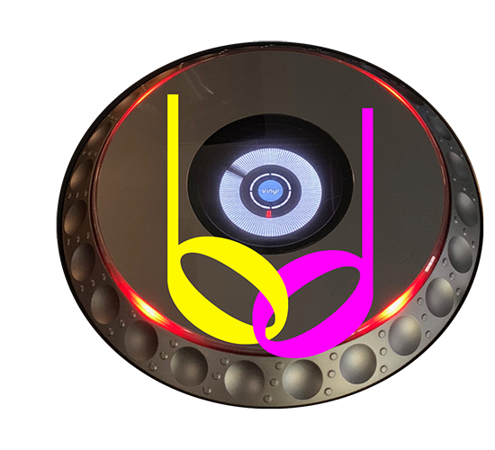
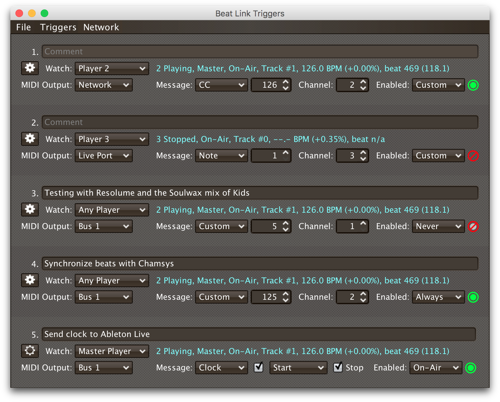
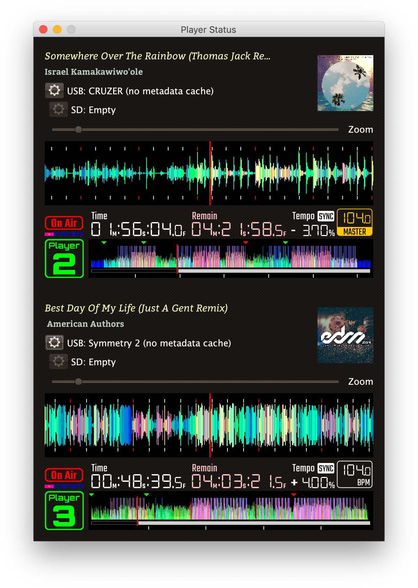
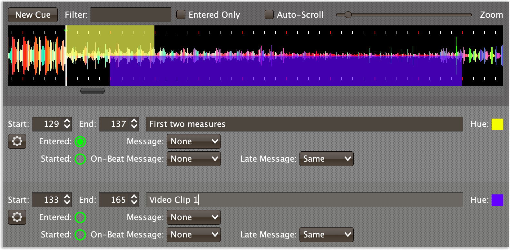
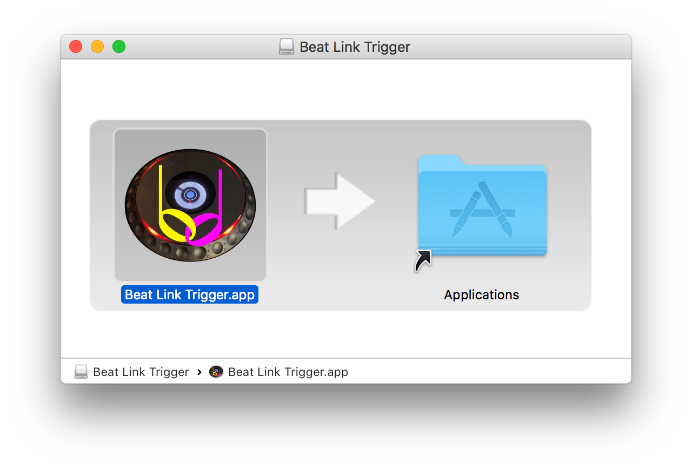
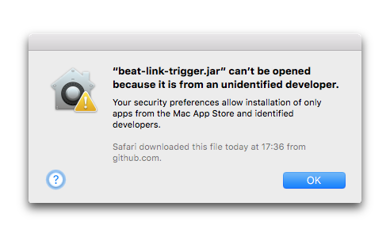
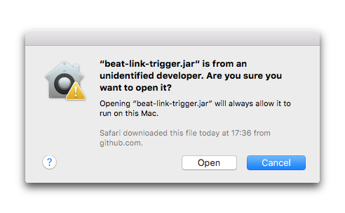

# beat-link-trigger

 

An integration environment for DJ performances focused on bridging
Pioneer DJ professional equipment to lighting, video, laser, and
digital audio workstation software. Created as a way to trigger MIDI
events when CDJs start playing tracks, play certain kinds of phrase,
reach particular beats, etc., it has grown in many interesting
directions thanks to requests from touring artists who wanted to do
new and interesting things in their shows. Built using
[beat-link](https://github.com/Deep-Symmetry/beat-link#beat-link).

> ”It's a shame Pioneer doesn't support this project, even
> unofficially. It's such a huge value add for them. When I was
> looking to buy my XDJ-XZ, lots of people were trying to sell me nice
> Denon gear but I'm locked into Pioneer because of BLT despite Denon
> being just as good if not a little better feature-wise.“
>
> —[Nicholas Maddix](http://maddix.it) on the project Gitter channel
> (where we discussed the project before we moved to the [Zulip
> stream](https://deep-symmetry.zulipchat.com/#narrow/stream/275322-beat-link-trigger)).

There is more description and a video in a [DJ TechTools
article](http://djtechtools.com/2017/07/19/decoding-pioneer-pro-link-connect-cdjs-ableton-link/),
too!

But the most important thing you need to read, after skimming the
introduction below, is the [:notebook: user
guide](https://blt-guide.deepsymmetry.org/).

> :construction: **New Hardware Support In Progress**: We have finally
> been able to obtain a pair of CDJ-3000s, so version 7.3 and later
> can work productively with them without warnings or issues, even
> when they are configured as player 5 and 6, and we can now take
> advantage of the high-precision position updates they send, to have
> rock-solid tracking of their playback position even when jumping or
> looping inside beats or playing backwards.
>
> Also, people who own the Opus Quad have contributed significant
> research and code in order to allow us to try to support this
> hardware in version 8.0 and later, with the help of metadata
> archives created from the USBs being used.
>
> If you can do any testing with this new hardware, please help us
> confirm this and let us know on the Zulip channel (see the next
> section below), sharing your discoveries and log files there. Please
> don't open issues until discussing your discoveries and concerns
> with the community there, and arriving at consensus that an issue is
> the appropriate next stop.
>
> We are not sure yet, but this may also be a step towards working
> with the XDJ-AZ.

## Getting Help

Deep Symmetry&rsquo;s projects are generously sponsored with hosting
by <a href="https://zulip.com">Zulip</a>, an open-source modern team
chat app designed to keep both live and asynchronous conversations
organized. Thanks to them, you can <a
href="https://deep-symmetry.zulipchat.com/#narrow/stream/275322-beat-link-trigger">chat
with our community</a>, ask questions, get inspiration, and share your
own ideas.

## Usage

Download the latest disk image (`.dmg`) installer for the Mac, `.msi`
installer for 64-bit Windows, or executable `.jar` file for other
platforms, from the
[releases](https://github.com/Deep-Symmetry/beat-link-trigger/releases/latest)
page. Double-click an installed native app bundle to run it. If that
doesn't work, or if you are using the executable `.jar` file, [see
below](#startup-issues).

A trigger window will open, in which you can choose the players you
want to watch, the kind of MIDI message to send when they start and
stop, and when the triggers are enabled:

There is also an
[interface](https://blt-guide.deepsymmetry.org/beat-link-trigger/Players.html)
for monitoring the status of each player found on the network, which
you can access by choosing `Show Player Status` in the `Network` menu:

And starting with version 0.5.0, there is a [Show
interface](https://blt-guide.deepsymmetry.org/beat-link-trigger/Shows.html)
with which you can paint cues on track beat grids, to automate away
the complexities of manually managing triggers.

### Going Further

**This page is just a quick introduction!** Please see the the full
[:notebook: user guide](https://blt-guide.deepsymmetry.org/)
for many more details, including:

* How to configure Triggers
* How to use Expressions
* Working with title/artist metadata
* Working with Ableton Link
* Integration examples

And much more... and hopefully you will soon be coming up with
interesting integration projects of your own.

You can also find user-contributed examples and resources on the
[project Wiki](https://github.com/Deep-Symmetry/beat-link-trigger/wiki).
Once you have come up with your own great ways to use Beat Link
Trigger, please add a page or two the Wiki to share them with others!

### Contributing

First of all, we would *love* to hear from you! We have no way of
knowing who has discovered, explored, downloaded and tried Beat Link
Trigger. So if you have, please write a quick note on the [Zulip
stream](https://deep-symmetry.zulipchat.com/#narrow/stream/275322-beat-link-trigger)
to let us know! Even if it is only to explain why it didn&rsquo;t
quite work for you.

If you run into specific problems or have ideas of ways Beat Link
Trigger could be better, you can also [open an
Issue](https://github.com/Deep-Symmetry/beat-link-trigger/issues).

And if you think you've come up with new or better way to do
something, terrific! Please take a look at our [guidelines for
contributing](CONTRIBUTING.md) and we can't wait to hear from you!

> Please be mindful of our [Code of Conduct](CODE_OF_CONDUCT.md) to make
> sure everyone feels welcome in the community.

### Funding

Beat Link Trigger is, and will remain, completely free and
open-source. If it has helped you, taught you something, or pleased
you, let us know and share some of your discoveries and code as
described above. If you&rsquo;d like to financially support its ongoing
development, you are welcome (but by no means obligated) to donate to
offset the hundreds of hours of research, development, and writing
that have already been invested. Or perhaps to facilitate future
efforts, tools, toys, and time to explore.

 using Liberapay, or
 using PayPal

> If enough people jump on board, we may even be able to get a newer
> CDJ to experiment with, although that&rsquo;s an unlikely stretch goal.
> :grinning:

## Compatibility

This is in no way a sanctioned implementation of the protocols. It should be clear, but:

> [!WARNING]
> Use at your own risk! For example, there are reports that
> the XDJ-RX (and XDJ-RX2) crash when BLT starts, so don&rsquo;t use
> it with one on your network. As Pioneer themselves
> [explain](https://forums.pioneerdj.com/hc/en-us/community/posts/203113059-xdj-rx-as-single-deck-on-pro-dj-link-),
> the XDJ-RX does not actually implement the protocol:
>
> &ldquo;The LINK on the RX [and RX2] is ONLY for linking to rekordbox
> on your computer or a router with WiFi to connect rekordbox mobile.
> It can not exchange LINK data with other CDJs or DJMs.&rdquo;

While these techniques appear to work for us so far, there are many
gaps in our knowledge, and things could change at any time with new
releases of hardware or even firmware updates from Pioneer.

> [!CAUTION]
> You should also not expect to be able to run Beat Link Trigger, or
> any project like it, on the same machine that you are running
> rekordbox, because they will compete over access to network ports.
> Also, as noted above, the XDJ-RX and XDJ-RX2 do not support the full
> DJ Link protocol, and so will not work with software like this. And,
> of course, controllers which don't even have Link (Ethernet) jacks
> can't work either.

> [!IMPORTANT]
> :unamused: Pre-Nexus gear (hardware older than the CDJ-900 nexus) is
> missing many important features, so BLT's capabilities are very
> degraded when working with such gear: much less information is
> available, we can't infer playback position/time code, and the
> hardware completely lacks tempo Sync or Master capabilities, so
> beat-based triggers are impossible, as is synchronization with Ableton
> Link. You can see what tracks are loaded, and whether the player is
> playing, but little more.

> [!TIP]
> :white_check_mark: Beat Link Trigger seems to work great with Nexus
> gear and DJ-Link hardware released after that. It has been reported
> to work well with XDJ-1000 gear, and (starting with version 0.6.0)
> with the XDJ-XZ as well. Version 7.3 adds complete support for
> CDJ-3000 features. If you can try it with anything else, *please*
> let us know what you learn in the [Zulip
> stream](https://deep-symmetry.zulipchat.com/#narrow/stream/275322-beat-link-trigger),
> or if you have worked out actionable details about something that
> could be improved, [open an
> Issue](https://github.com/Deep-Symmetry/beat-link-trigger/issues) or
> submit a pull request so we can all improve our understanding
> together.
>
> :construction: We have added experimental support for the Opus Quad, which, despite not supporting a DJ-Link network, seems to communicate with rekordbox to support lighting in a way that will allow us to offer good support in Beat Link once we reorganize the code to support working that way.
Thanks to [@cprepos](https://github.com/cprepos) for doing most of this work!

If something isn&rsquo;t working with your hardware and you don&rsquo;t yet know
the details why, but are willing to learn a little and help figure it
out, look at the
[dysentery project](https://github.com/Deep-Symmetry/dysentery#dysentery),
which is where we are organizing the research tools and results which
made programs like Beat Link Trigger possible.

## Startup Issues

If you downloaded the `.jar` version and are using a recent Java
distribution, double-clicking doesn&rsquo;t open up the application,
so open a terminal window and run it from the command line:

    java -jar beat-link-trigger.jar

If that does not work, at least you will be able to see a detailed
report of what went wrong, which can help you troubleshoot the issue.

Make sure you have a current OpenJDK distribution installed (we build
releases with [Amazon Corretto
11](https://docs.aws.amazon.com/corretto/latest/corretto-11-ug/downloads-list.html)).

### Font-Related Bugs

If you see a long exception stack trace similar to the one
in
[this discussion](https://github.com/Deep-Symmetry/beat-link-trigger/issues/21) and
you have your computer language set to one that uses an alphabet which
is substantially different from English, you may be encountering what
seems to be a bug in the GUI library (or maybe even in Java itself).
Try setting your system language to US English, and see if that at
least lets you run the program.

### Mac Trust Confirmation

If you are on a Mac, your best option nowadays is to download the disk
image installer. It contains Beat Link Trigger packaged as a native
Mac application, with an embedded Java runtime, so you don&rsquo;t
need to worry about installing or managing Java if you don&rsquo;t use
it for other purposes. It is code-signed and notarized by Deep
Symmetry, so your Mac should be happy to install and run it without
complaint.

If you already have your own Java runtime installed and want to use
it, you can instead download the smaller executable `.jar` file, but
then the first time you try to launch the downloaded
jar file by double-clicking it you will see an error like this because
it is not a Mac-specific application:

You can fix that by control-clicking on the Jar and choosing
&ldquo;Open&rdquo; at the top of the contextual menu that pops up. You
will be asked to confirm that you really want to run it. Click the
&ldquo;Open&rdquo; button in that confirmation dialog, and from then
on, you will be able to run that copy by just double-clicking it.

> You will need to repeat this process for each version that you
> download. Also, current versions of OpenJDK no longer support
> launching Jar files by double-clicking, so you are better off
> switching to a native installer, or running via the command-line.

## Licenses

Copyright © 2016&ndash;2025 [Deep Symmetry, LLC](http://deepsymmetry.org)

Distributed under the [Eclipse Public License
2.0](https://opensource.org/licenses/EPL-2.0). By using this software
in any fashion, you are agreeing to be bound by the terms of this
license. You must not remove this notice, or any other, from this
software.

### Library Licenses

#### [Remote Tea](https://sourceforge.net/projects/remotetea/)

Used for communicating with the NFSv2 servers on players, licensed
 under the [GNU Library General Public License, version
 2](https://opensource.org/licenses/LGPL-2.0).

#### The [Kaitai Struct](http://kaitai.io) Java runtime

Used for parsing rekordbox exports and media analysis files, licensed
under the [MIT License](https://opensource.org/licenses/MIT).

#### [RSyntaxtTextArea](https://github.com/bobbylight/RSyntaxTextArea)

Used for editing Clojure expression code.

Copyright © 2019, Robert Futrell.
All rights reserved.

Redistribution and use in source and binary forms, with or without
modification, are permitted provided that the following conditions are met:

* Redistributions of source code must retain the above copyright
  notice, this list of conditions and the following disclaimer.
* Redistributions in binary form must reproduce the above copyright
  notice, this list of conditions and the following disclaimer in the
  documentation and/or other materials provided with the distribution.
* Neither the name of the author nor the names of its contributors may
  be used to endorse or promote products derived from this software
  without specific prior written permission.

THIS SOFTWARE IS PROVIDED BY THE COPYRIGHT HOLDERS AND CONTRIBUTORS "AS IS" AND
ANY EXPRESS OR IMPLIED WARRANTIES, INCLUDING, BUT NOT LIMITED TO, THE IMPLIED
WARRANTIES OF MERCHANTABILITY AND FITNESS FOR A PARTICULAR PURPOSE ARE
DISCLAIMED. IN NO EVENT SHALL <COPYRIGHT HOLDER> BE LIABLE FOR ANY
DIRECT, INDIRECT, INCIDENTAL, SPECIAL, EXEMPLARY, OR CONSEQUENTIAL DAMAGES
(INCLUDING, BUT NOT LIMITED TO, PROCUREMENT OF SUBSTITUTE GOODS OR SERVICES;
LOSS OF USE, DATA, OR PROFITS; OR BUSINESS INTERRUPTION) HOWEVER CAUSED AND
ON ANY THEORY OF LIABILITY, WHETHER IN CONTRACT, STRICT LIABILITY, OR TORT
(INCLUDING NEGLIGENCE OR OTHERWISE) ARISING IN ANY WAY OUT OF THE USE OF THIS
SOFTWARE, EVEN IF ADVISED OF THE POSSIBILITY OF SUCH DAMAGE.

#### [RSTAUI](https://github.com/bobbylight/RSTAUI)

Provides find/replace and other extended features to RSyntaxTextArea
when editing Clojure expression code.

Copyright © 2012, Robert Futrell.
All rights reserved.

Redistribution and use in source and binary forms, with or without
modification, are permitted provided that the following conditions are met:

* Redistributions of source code must retain the above copyright
  notice, this list of conditions and the following disclaimer.
* Redistributions in binary form must reproduce the above copyright
  notice, this list of conditions and the following disclaimer in the
  documentation and/or other materials provided with the distribution.
* Neither the name of the author nor the names of its contributors may
  be used to endorse or promote products derived from this software
  without specific prior written permission.

THIS SOFTWARE IS PROVIDED BY THE COPYRIGHT HOLDERS AND CONTRIBUTORS "AS IS" AND
ANY EXPRESS OR IMPLIED WARRANTIES, INCLUDING, BUT NOT LIMITED TO, THE IMPLIED
WARRANTIES OF MERCHANTABILITY AND FITNESS FOR A PARTICULAR PURPOSE ARE
DISCLAIMED. IN NO EVENT SHALL <COPYRIGHT HOLDER> BE LIABLE FOR ANY
DIRECT, INDIRECT, INCIDENTAL, SPECIAL, EXEMPLARY, OR CONSEQUENTIAL DAMAGES
(INCLUDING, BUT NOT LIMITED TO, PROCUREMENT OF SUBSTITUTE GOODS OR SERVICES;
LOSS OF USE, DATA, OR PROFITS; OR BUSINESS INTERRUPTION) HOWEVER CAUSED AND
ON ANY THEORY OF LIABILITY, WHETHER IN CONTRACT, STRICT LIABILITY, OR TORT
(INCLUDING NEGLIGENCE OR OTHERWISE) ARISING IN ANY WAY OUT OF THE USE OF THIS
SOFTWARE, EVEN IF ADVISED OF THE POSSIBILITY OF SUCH DAMAGE.

#### [inspector-jay](https://github.com/timmolderez/inspector-jay)

Supports inspection of the atoms that store local and global values
for trigger and show expressions.

Copyright © 2013-2015 Tim Molderez
All rights reserved.

Redistribution and use in source and binary forms, with or without
modification, are permitted provided that the following conditions are met:
    * Redistributions of source code must retain the above copyright
      notice, this list of conditions and the following disclaimer.
    * Redistributions in binary form must reproduce the above copyright
      notice, this list of conditions and the following disclaimer in the
      documentation and/or other materials provided with the distribution.
    * Neither the name of the inspector-jay developer team nor the
      names of its contributors may be used to endorse or promote products
      derived from this software without specific prior written permission.

THIS SOFTWARE IS PROVIDED BY THE COPYRIGHT HOLDERS AND CONTRIBUTORS "AS IS" AND
ANY EXPRESS OR IMPLIED WARRANTIES, INCLUDING, BUT NOT LIMITED TO, THE IMPLIED
WARRANTIES OF MERCHANTABILITY AND FITNESS FOR A PARTICULAR PURPOSE ARE
DISCLAIMED. IN NO EVENT SHALL THE INSPECTOR-JAY DEVELOPER TEAM BE LIABLE FOR ANY
DIRECT, INDIRECT, INCIDENTAL, SPECIAL, EXEMPLARY, OR CONSEQUENTIAL DAMAGES
(INCLUDING, BUT NOT LIMITED TO, PROCUREMENT OF SUBSTITUTE GOODS OR SERVICES;
LOSS OF USE, DATA, OR PROFITS; OR BUSINESS INTERRUPTION) HOWEVER CAUSED AND
ON ANY THEORY OF LIABILITY, WHETHER IN CONTRACT, STRICT LIABILITY, OR TORT
(INCLUDING NEGLIGENCE OR OTHERWISE) ARISING IN ANY WAY OUT OF THE USE OF THIS
SOFTWARE, EVEN IF ADVISED OF THE POSSIBILITY OF SUCH DAMAGE.

#### [radiance](https://github.com/kirill-grouchnikov/radiance)

Provides the cool dark look-and-feel for the graphical user interface.

Copyright © 2005-2019, Kirill Grouchnikov.
All rights reserved.

Redistribution and use in source and binary forms, with or without
modification, are permitted provided that the following conditions are met:

* Redistributions of source code must retain the above copyright notice, this
  list of conditions and the following disclaimer.

* Redistributions in binary form must reproduce the above copyright notice,
  this list of conditions and the following disclaimer in the documentation
  and/or other materials provided with the distribution.

* Neither the name of the copyright holder nor the names of its
  contributors may be used to endorse or promote products derived from
  this software without specific prior written permission.

THIS SOFTWARE IS PROVIDED BY THE COPYRIGHT HOLDERS AND CONTRIBUTORS "AS IS"
AND ANY EXPRESS OR IMPLIED WARRANTIES, INCLUDING, BUT NOT LIMITED TO, THE
IMPLIED WARRANTIES OF MERCHANTABILITY AND FITNESS FOR A PARTICULAR PURPOSE ARE
DISCLAIMED. IN NO EVENT SHALL THE COPYRIGHT HOLDER OR CONTRIBUTORS BE LIABLE
FOR ANY DIRECT, INDIRECT, INCIDENTAL, SPECIAL, EXEMPLARY, OR CONSEQUENTIAL
DAMAGES (INCLUDING, BUT NOT LIMITED TO, PROCUREMENT OF SUBSTITUTE GOODS OR
SERVICES; LOSS OF USE, DATA, OR PROFITS; OR BUSINESS INTERRUPTION) HOWEVER
CAUSED AND ON ANY THEORY OF LIABILITY, WHETHER IN CONTRACT, STRICT LIABILITY,
OR TORT (INCLUDING NEGLIGENCE OR OTHERWISE) ARISING IN ANY WAY OUT OF THE USE
OF THIS SOFTWARE, EVEN IF ADVISED OF THE POSSIBILITY OF SUCH DAMAGE.

#### [Carabiner](https://github.com/Deep-Symmetry/carabiner)

The included copies of Carabiner are distributed under the [GNU
General Public License, version
2](https://opensource.org/licenses/GPL-2.0). A copy of the license can be found in
[gpl-2.0.md](https://github.com/Deep-Symmetry/beat-link-trigger/blob/master/gpl-2.0.md)
within this project.

#### [Antora](https://antora.org)

Used to build the [user guide](https://blt-guide.deepsymmetry.org/),
for embedding inside the application, and hosting on
[deepsymmetry.org](https://deepsymmetry.org). Antora is licensed under
the [Mozilla Public License Version
2.0](https://www.mozilla.org/en-US/MPL/2.0/) (MPL-2.0).
