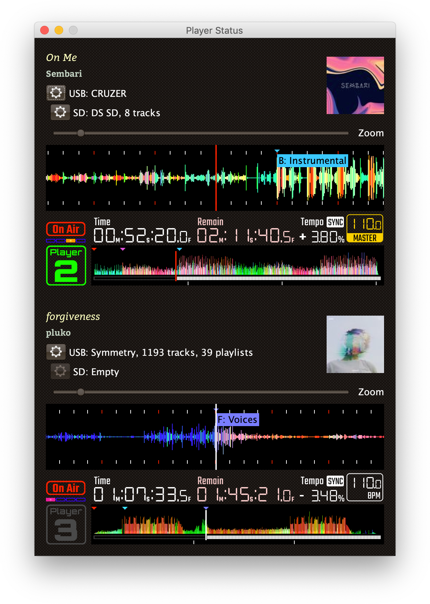

# beat-link-trigger

 

An application to trigger MIDI events when CDJs start playing tracks,
reach particular beats, or whatever else you can think of. Built
using [beat-link](https://github.com/Deep-Symmetry/beat-link#beat-link).
There is more description and a video in
a
[DJ TechTools article](http://djtechtools.com/2017/07/19/decoding-pioneer-pro-link-connect-cdjs-ableton-link/),
too!

## Usage

Download the latest disk image (`.dmg`) installer for the Mac, `.msi`
installer for 64-bit Windows, or executable `.jar` file for other
platforms, from the
[releases](https://github.com/Deep-Symmetry/beat-link-trigger/releases)
page and double-click it to run it. If that doesn&rsquo;t work, [see
below](#startup-issues).

A trigger window will open, in which you can choose the players you
want to watch, the kind of MIDI message to send when they start and
stop, and when the triggers are enabled:

There is also an
[interface](https://deepsymmetry.org/beatlink/trigger/guide/beat-link-trigger/Players.html)
for monitoring the status of each player found on the network, which
you can access by choosing `Show Player Status` in the `Network` menu:

And starting with version 0.5.0, there is a [Show
interface](https://deepsymmetry.org/beatlink/trigger/guide/beat-link-trigger/Shows.html)
with which you can paint cues on track beat grids, to automate away
the complexities of manually managing triggers.

### Going Further

**This page is just a quick introduction!** Please see the the full
[:notebook: user guide](https://deepsymmetry.org/beatlink/trigger/guide/)
for many more details, including:

* How to configure Triggers
* How to use Expressions
* Working with title/artist metadata
* Working with Ableton Link
* Integration examples

And much more... and hopefully you will soon be coming up with
interesting integration projects of your own.

You can also find user-contributed examples and resources on the
[project Wiki](https://github.com/Deep-Symmetry/beat-link-trigger/wiki).
Once you have come up with your own great ways to use Beat Link
Trigger, please add a page or two the Wiki to share them with others!

### Contributing

First of all, we would *love* to hear from you! We have no way of
knowing who has discovered, explored, downloaded and tried Beat Link
Trigger. So if you have, please write a quick note on the [Gitter chat
room](https://gitter.im/brunchboy/beat-link-trigger) to let us know!
Even if it is only to explain why it didn&rsquo;t quite work for you.

If you run into specific problems or have ideas of ways Beat Link
Trigger could be better, you can also [open an
Issue](https://github.com/Deep-Symmetry/beat-link-trigger/issues).

And if you think you've come up with new or better way to do
something, terrific! Please take a look at our [guidelines for
contributing](CONTRIBUTING.md) and we can't wait to hear from you!

> Please be mindful of our [Code of Conduct](CODE_OF_CONDUCT.md) to make
> sure everyone feels welcome in the community.

### Funding

Beat Link Trigger is, and will remain, completely free and
open-source. If it has helped you, taught you something, or pleased
you, let us know and share some of your discoveries and code as
described above. If you&rsquo;d like to financially support its ongoing
development, you are welcome (but by no means obligated) to donate to
offset the hundreds of hours of research, development, and writing
that have already been invested. Or perhaps to facilitate future
efforts, tools, toys, and time to explore.

 using Liberapay, or
 using PayPal

> If enough people jump on board, we may even be able to get a newer
> CDJ to experiment with, although that&rsquo;s an unlikely stretch goal.
> :grinning:

## Compatibility

This is in no way a sanctioned implementation of the protocols. It should be clear, but:

> :warning: Use at your own risk! For example, there are reports that
> the XDJ-RX crashes when BLT starts, so don&rsquo;t use it with one on your
> network. As Pioneer themselves
> [explain](https://forums.pioneerdj.com/hc/en-us/community/posts/203113059-xdj-rx-as-single-deck-on-pro-dj-link-),
> the XDJ-RX does not actually implement the protocol:
>
> &ldquo;The LINK on the RX is ONLY for linking to rekordbox on your
> computer or a router with WiFi to connect rekordbox mobile. It can
> not exchange LINK data with other CDJs or DJMs.&rdquo;

While these techniques appear to work for us so far, there are many
gaps in our knowledge, and things could change at any time with new
releases of hardware or even firmware updates from Pioneer.

You should also not expect to be able to run Beat Link Trigger, or any
project like it, on the same machine that you are running rekordbox,
because they will compete over access to network ports.

Beat Link Trigger seems to work great with CDJ-2000 Nexus gear, and
works fairly well (with less information available) with older
CDJ-2000s. It has also been reported to work with XDJ-1000 gear. If
you can try it with anything else, *please* let us know what you learn
in the
[Gitter chat room](https://gitter.im/brunchboy/beat-link-trigger), or
if you have worked out actionable details about something that could
be improved,
[open an Issue](https://github.com/Deep-Symmetry/beat-link-trigger/issues)
or submit a pull request so we can all improve our understanding
together.

If something isn&rsquo;t working with your hardware and you don&rsquo;t yet know
the details why, but are willing to learn a little and help figure it
out, look at the
[dysentery project](https://github.com/Deep-Symmetry/dysentery#dysentery),
which is where we are organizing the research tools and results which
made programs like Beat Link Trigger possible.

## Startup Issues

If you downloaded the `.jar` version and
double-clicking doesn&rsquo;t open up the application, make sure
you have a recent [Java SE runtime
environment](http://www.oracle.com/technetwork/java/javase/downloads/index.html)
installed, and try running it from the command line:

    java -jar beat-link-trigger.jar

If that does not work, at least you will be able to see a detailed
report of what went wrong, which can help you troubleshoot the issue.

### Font-Related Bugs

If you see a long exception stack trace similar to the one
in
[this discussion](https://github.com/Deep-Symmetry/beat-link-trigger/issues/21) and
you have your computer language set to one that uses an alphabet which
is substantially different from English, you may be encountering what
seems to be a bug in the GUI library (or maybe even in Java itself).
Try setting your system language to US English, and see if that at
least lets you run the program.

### Mac Trust Confirmation

If you are on a Mac, your best option nowadays is to download the
disk image installer. It contains Beat Link Trigger packaged
as a native Mac application, with an embedded Java 11 runtime,
so you don&rsquo;t need to worry about installing or managing Java if you
don&rsquo;t use it for other purposes. It is code-signed by Deep Symmetry,
so your Mac should be happy to install and run it without complaint.

If you already have your own Java runtime installed and want to use
it, you can instead download the smaller executable `.jar` file, but
then the first time you try to launch the downloaded
jar file by double-clicking it you will see an error like this because
it is not a Mac-specific application:

You can fix that by control-clicking on the Jar and choosing
&ldquo;Open&rdquo; at the top of the contextual menu that pops up. You
will be asked to confirm that you really want to run it. Click the
&ldquo;Open&rdquo; button in that confirmation dialog, and from then
on, you will be able to run that copy by just double-clicking it.

> You will need to repeat this process for each version that you
> download.

## Licenses

Copyright © 2016&ndash;2019 [Deep Symmetry, LLC](http://deepsymmetry.org)

Distributed under the
[Eclipse Public License 1.0](http://opensource.org/licenses/eclipse-1.0.php),
the same as Clojure. By using this software in any fashion, you are
agreeing to be bound by the terms of this license. You must not remove
this notice, or any other, from this software.

### Library Licenses

[Remote Tea](https://sourceforge.net/projects/remotetea/),
used for communicating with the NFSv2 servers on players,
is licensed under the [GNU Library General
Public License, version 2](https://opensource.org/licenses/LGPL-2.0).

The [Kaitai Struct](http://kaitai.io) Java runtime, used for parsing
rekordbox exports and media analysis files, is licensed under the
[MIT License](https://opensource.org/licenses/MIT).
