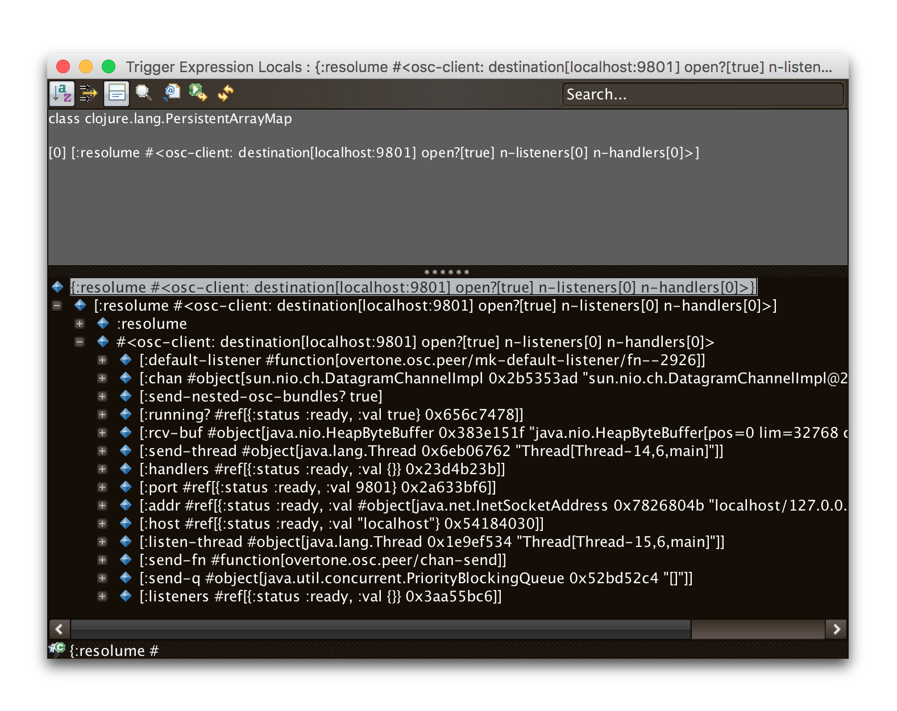

= Debugging
James Elliott <james@deepsymmetry.org>
:icons: font
:toc:
:experimental:
:toc-placement: preamble
:guide-top: v4

// Set up support for relative links on GitHub, and give it
// usable icons for admonitions, w00t! Add more conditions
// if you need to support other environments and extensions.
ifdef::env-github[]
:outfilesuffix: .adoc
:tip-caption: :bulb:
:note-caption: :information_source:
:important-caption: :heavy_exclamation_mark:
:caution-caption: :fire:
:warning-caption: :warning:
endif::env-github[]

// Render section header anchors in a GitHub-compatible way when
// building the embedded user guide.
ifndef::env-github[]
:idprefix:
:idseparator: -
endif::env-github[]

Tools to help figure out what is going on in your triggers, share
them between projects or with others, and log playlists.

== Overview

Beat Link Trigger offers a few mechanisms to help you understand how
your triggers are (or are not) working, and to save and restore
versions of them, or share them with friends and colleagues (or
on the https://gitter.im/brunchboy/beat-link-trigger[Gitter chat]
or https://github.com/brunchboy/beat-link-trigger/wiki[project Wiki]
to either get help from others, or share and show them off).
++++++

Help resources can be found in the menu:Help[] menu, along with an
embedded copy of this User Guide, which can be used even if you are
not connected to the Internet (although links to other sites will not
work in that case).


[[logs]]
== Logs

When Beat Link Trigger is running it reports events to a log file. As
noted above, this includes full stack traces for compilation problems
when you try to save an expression that isn't quite right. If a
problem occurs while trying to run your expression later, that will
end up in the log too. So it can be a useful place to look when things
are not working the way you expect. You can find the log file by choosing
menu:Help[Open Logs Folder].

Each time you launch Beat Link Trigger it creates a new log folder in
a temporary directory, so that they can be cleaned up automatically
sometime after it exits. It cycles through log files and limits their
maximum length, which can be important if an error is being logged
each time a packet comes in because of a problematic Enabled Filter
expression.

Even if things are not crashing, you might want to log your own
information to get a better understanding of what is happening inside
one of your expressions. Beat Link Trigger uses
https://github.com/ptaoussanis/timbre[timbre] to perform its logging,
and so can you.

For example, if you are trying to figure out exactly what you are
receiving in your Beat expression, you could add this as its first
line:

```clojure
(timbre/info "Received beat" status "master?" tempo-master?)
```

Suddenly your logs will be growing steadily, filling with lines like these:

```
2016-Jun-05 00:12:10 Alacrity.local INFO [beat-link-trigger.expressions:?] -
  Received beat Beat: Device 2, name: CDJ-2000nexus, pitch: +0.00%,
  track BPM: 126.0, effective BPM: 126.0, beat within bar: 4 master? true
2016-Jun-05 00:12:11 Alacrity.local INFO [beat-link-trigger.expressions:?] -
  Received beat Beat: Device 33, name: DJM-2000nexus, pitch: +0.00%,
  track BPM: 126.0, effective BPM: 126.0, beat within bar: 1 master? false
```

== Inspecting Locals and Globals

In addition to logging values to the log file, you can get a glimpse
at what your expressions are up to by opening an inspector window on
the Expression Globals or a particular trigger's Expression Locals.
The first is done by choosing menu:Triggers[Inspect Expression
Globals]. This opens a window showing you all the keys and values that
have been created in the `globals` atom shared by all triggers. Here
is what that looks like after the example code shown in the
<<Expressions#global-expressions,Global Expressions section>> has run:

image:assets/ExpressionGlobals.png[Expression Globals,872,462]

The inspector is a little messy, but right away you can see the three
keys we created, and the corresponding Java objects stored under them.
by clicking next to the blue diamond in the lower pane, you can expand
each entry and dive down into the fields and values that make it up,
which can be quite a powerful way to explore the objects.

Similarly, the locals for a trigger can be inspected by choosing
menu:Inspect Expression Locals[] from that trigger's context menu.
Here's the result of drilling down a little into the `:resolume` OSC
client object created in that example's trigger:



== Saving and Loading

The entire trigger configuration can be saved to a text file by
choosing menu:File[Save]. That file can be sent to another machine,
shared with a colleague, or just kept around for future use after you
are done with a different project. As you would expect, the Load
option replaces the current trigger configuration with one loaded from
a save file.

=== Exporting and Importing Triggers

As mentioned in the <<Triggers#context-menu,Context Menu>> section,
individual triggers can be exported on their own, and imported into
other trigger configurations.

[[writing-playlists]]
== Writing Playlists

If you are in a situation where it is important to keep detailed
records of the music being played (for example, a radio station that
needs to pay royalties), the built in Playlist Writer can help. It
builds on the ideas described in the
<<Matching#writing-a-playlist,Matching Tracks>> section to give you a
robust, convenient solution.

Start by choosing menu:File[Write Playlist]. This will bring up the
Playlist Writer window.


You can configure how long a track needs to be played for before it
gets included in the playlist and whether you want to ignore players
that are not reporting themselves as being on the air (very convenient
to ignore DJs pre-screening tracks, as long as you are using a DJM
mixer that supports this feature, and the players are configured and
connected properly).

Once everything is set the way you want it, click kbd:[Start] and you
will be prompted to choose where to save the file. Once you have done
that, the window updates to show you that the playlist is being written:


From this point on, all tracks that play longer than your configured
minimum time will be written to the playlist, in Comma-Separated Value
format (for convenient use in spreadsheet programs). The playlist will
include track titles, artists, albums (when this information is
available), as well as the player they were played on, the source
player and media type, when they started and stopped playing, and the
total time they played.

When you are done recording the playlist you can either click kbd:[Stop]
or close the window, and the file will be closed out.

== Learning More

****

* Continue to <<Integration#integration-examples,Integration Examples>>
* Return to <<{guide-top}#beat-link-trigger-user-guide,Top>>

****

// Once Git finally supports it, change this to: include::Footer.adoc[]
== License

+++<a href="http://deepsymmetry.org"></a>+++
Copyright © 2016&ndash;2018 http://deepsymmetry.org[Deep Symmetry, LLC]

Distributed under the
http://opensource.org/licenses/eclipse-1.0.php[Eclipse Public License
1.0], the same as Clojure. By using this software in any fashion, you
are agreeing to be bound by the terms of this license. You must not
remove this notice, or any other, from this software. A copy of the
license can be found in
https://github.com/brunchboy/beat-link-trigger/blob/master/LICENSE[LICENSE]
within this project.
