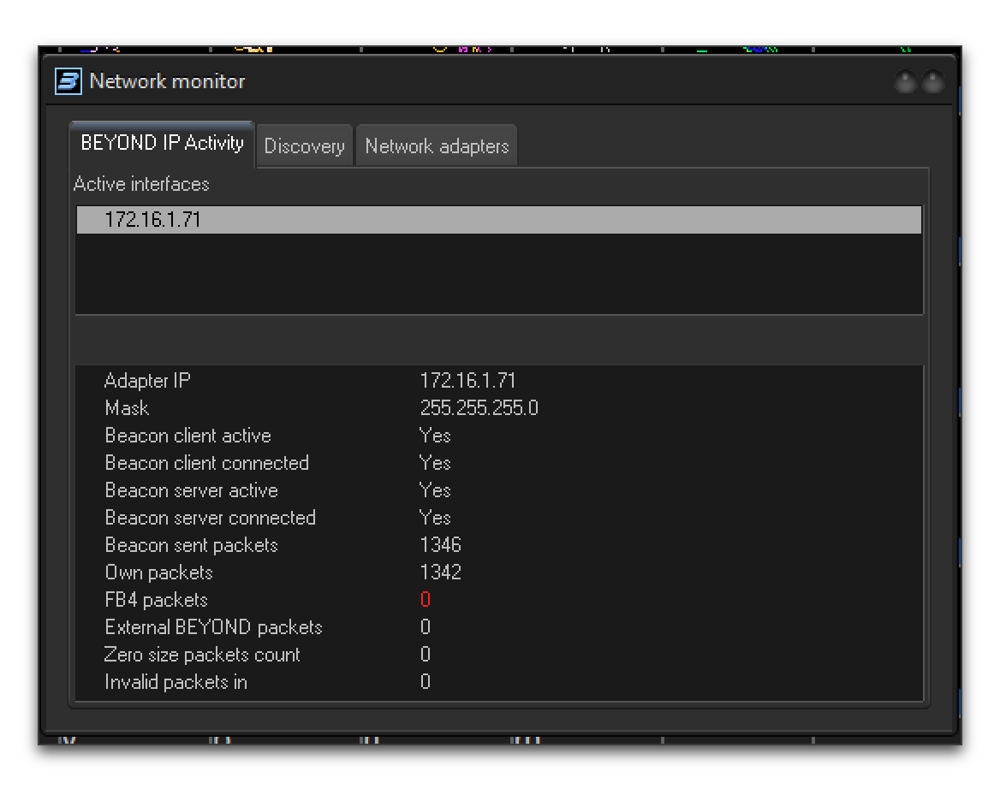
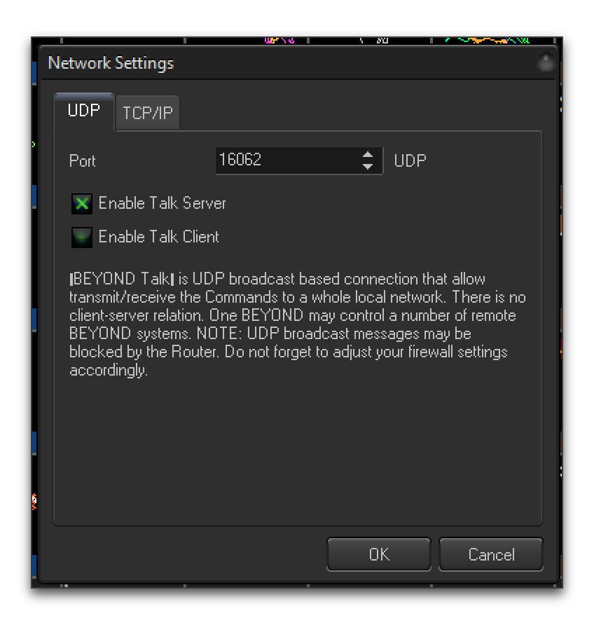
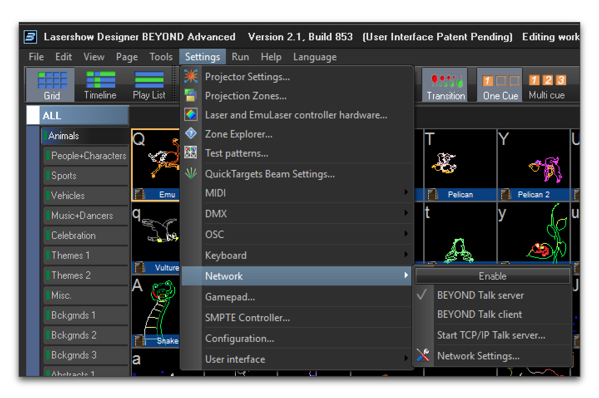
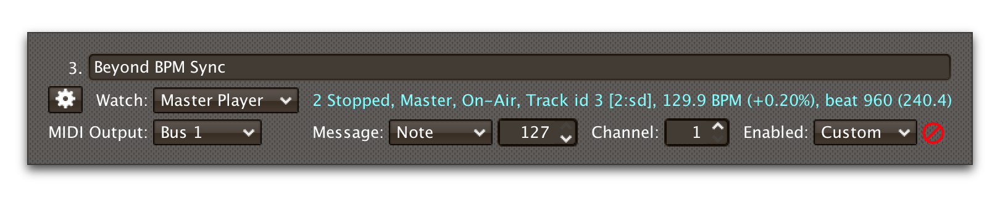
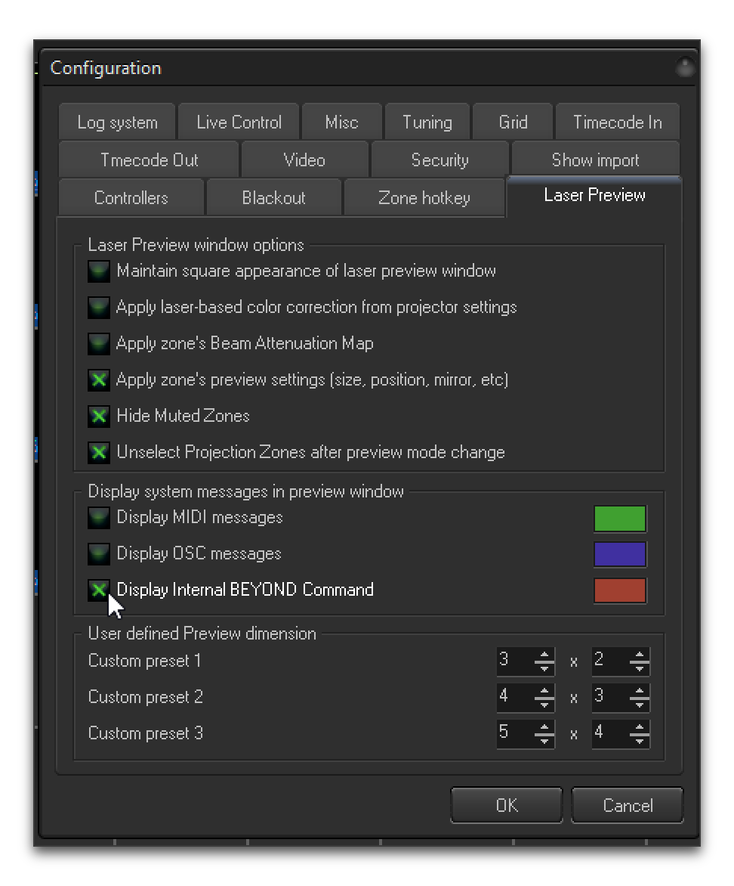
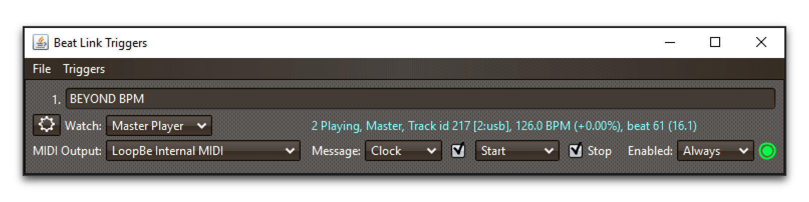
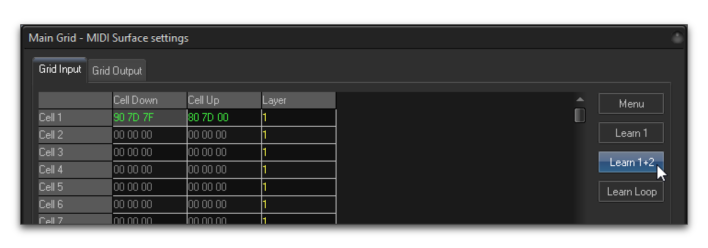
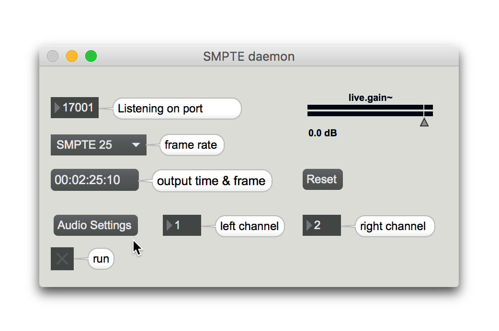

= Integration Examples
James Elliott <james@deepsymmetry.org>
:icons: font
:toc:
:experimental:
:toc-placement: preamble
:guide-top: README

// Set up support for relative links on GitHub, and give it
// usable icons for admonitions, w00t! Add more conditions
// if you need to support other environments and extensions.
ifdef::env-github[]
:outfilesuffix: .adoc
:tip-caption: :bulb:
:note-caption: :information_source:
:important-caption: :heavy_exclamation_mark:
:caution-caption: :fire:
:warning-caption: :warning:
endif::env-github[]

// Render section header anchors in a GitHub-compatible way when
// building the embedded user guide.
ifndef::env-github[]
:idprefix:
:idseparator: -
endif::env-github[]

Ways Beat Link Trigger has been used to run shows with other systems.

== Overview

When explaining the Beat Link Trigger interface and how to extend it
with custom expressions, we showed some examples of ways to integrate
other systems. This section builds on the concepts introduced there,
to demonstrate useful and practical integrations with systems we (or
our early adopters) use regularly.

== Pangolin BEYOND Advanced

http://pangolin.com/shop/lasershow-designer-beyond-advanced/#tab-description[Pangolin
BEYOND] is such flexible and powerful laser show software that Deep
Symmetry invested in a Windows virtual machine purely to be able to
use it to control our best laser projector. With an Advanced license,
you can send it PangoScript commands over the network to achieve a
deep level of integration with other systems. Here are some ways you
can use it with Beat Link Trigger.

TIP: This section shows how to achieve tight integration using the
PangoTalk UDP server, which requires BEYOND Advanced, but you can use
MIDI with BEYOND Essentials to get decent tempo tracking and basic cue
triggers, as described <<pangolin-beyond-essentials,below>>.

To begin with, in the Global Setup Expression, we tell Beat Link
Trigger how to communicate with BEYOND, by specifying the broadcast
address of the network interface it is listening on, and the port on
which the BEYOND Talk UDP server is listening. To determine these
things, you can choose menu:Tools[Network Monitor...] within BEYOND to
bring up a window like this:



By looking at the Adapter IP and Mask lines, we can determine that the
broadcast address we want to use to reach the BEYOND Talk server is
`172.16.1.255`.

TIP: In versions of BEYOND prior to 2.1, it was possible to send UDP
unicast messages directly to the Adapter IP address. however, starting
with version 2.1, you must actually send UDP broadcast packets to the
broadcast address of the subnet the server is attached to.

Then, make sure the BEYOND UDP Talk server is enabled
(menu:Settings[Network > Network Settings...]):



Choose a port that is not in use by anything else on your system (the
default of `16062` is likely fine), check the Enable Talk Server check
box, and click btn:[OK]. Make a note of the broadcast address and UDP
port it is listening on, and then make sure the talk server is fully
enabled by choosing menu:Settings[Network > BEYOND Talk server]:



TIP: In older versions of BEYOND, we sometimes had to quit and restart
the program after making these configuration changes in order for them
to take effect. That is probably no longer true, but we mention this
as a potential trouleshooting step. You can also test connectivity
using a tool like https://packetsender.com[Packet Sender] to send
commands like `SetBpm 123.4\r\n` as UDP packets to the broadcast
address and port you determined above, verifying that BEYOND's BPM
updates to the value that you sent. Packet Sender also has a Subnet
Calculator found at menu:Tools[Subnet Calculator] that can help you
determine the broadcast address.

Once you have the UDP Talk server up and working, edit Beat Link
Trigger's Global Setup expression to use the broadcast address and
port to define a new function, `beyond-command`, that your other
expressions will be able to use to send PangoScript commands to it:

```clojure
(let [beyond-address (InetSocketAddress. (InetAddress/getByName "172.16.1.255") 16062)
      send-socket (DatagramSocket.)]
   (defn beyond-command
     "Sends a PangoScript command to the configured BEYOND Talk server."
     [command]
     (let [payload (str command \return \newline)
           packet (DatagramPacket. (.getBytes payload) (.length payload) beyond-address)]
       (.send send-socket packet))))
```

TIP: Of course, replace the address and port in the first line with
the correct values to use for your BEYOND UDP Talk server.

With that in place, we are ready to integrate laser shows. First,
let's see how to have the tempo within BEYOND always precisely match
the tempo of your master player.

=== Laser Show Tempo Synchronization

Create a new Trigger in Beat Link Trigger (menu:Triggers[New Trigger])
and label it something like &ldquo;Beyond BPM Sync&rdquo; in the
Comment field. Configure it to Watch the Master Player, and give it a
Custom Enabled Filter:



The Enabled Filter editor will pop open, so you can paste in the
following code:

```clojure
(swap! locals update-in [:beyond-bpm]
       (fn [old-bpm]
         (when (not= effective-tempo old-bpm)
           (beyond-command (str "SetBpm " effective-tempo)))
         effective-tempo))
nil  ;; Never need to actually activate.
```

What this function will do is look at every status update packet that
is received from the Master Player, and see if the BPM being reported
is different from what we last told BEYOND to use (it tracks this in a
value stored in the trigger `locals` map under the key `:beyond-bpm`,
and the first time the expression is called, nothing will be found
there, so it will always start by sending the current BPM value to
BEYOND).

When the current tempo is different from what we have sent to BEYOND,
we use the `beyond-command` function that we defined in the Global
Setup expression to send a `SetBpm` command to BEYOND, containing the
current tempo at which the Master Player is playing. If there is no
difference, we send nothing, because BEYOND is already at the right
tempo. Either way, we record the current effective tempo in the
`locals` map for use when the next update packet is received.

Finally, the expression always returns `nil`, because there is never
any reason for it to be enabled. It is not actually triggering
anything in response to a particular track playing, it is simply
always keeping BEYOND's tempo tied to the master player. (For the same
reason, it doesn't matter what you choose in the MIDI Output, Message,
and Channel menus; they will never be sent.)

Once you have this expression saved, try playing a track on the Master
Player, adjust the pitch fader, and watch BEYOND smoothly and
precisely track the BPM of the music being played.

=== Triggering a Laser Cue

With this framework in place, it is very easy to have a laser cue
controlled by a trigger. Create another new Trigger, label it to
describe the cue you want it to control, and set it up to be activated
when an interesting track reaches an interesting beat, using the
techniques described above. The only thing you need to do different is
set the Message menu to Custom, so it will send its Activation message
to Beyond's Talk server rather than a MIDI message.

> Actually, you can map MIDI and OSC messages to BEYOND cues, so once
> you have the BPM sync working, feel free to go that route if you
> prefer. But since we already have a Talk server running, here is how
> to use it.

The easiest way to identify the proper PangoScript message to use to
refer to a particular cue is to take advantage of a special mode of
the BEYOND laser preview window that shows you all the internal
PangoScript messages it is sending itself when you interact with its
user interface. Choose menu:Settings[Configuration...] and click the
Laser Preview tab. Check the Display Internal BEYOND Command check
box, and click btn:[OK]:



One that is done, as you interact with the interface, you will see
small messages at the bottom left of the laser preview section showing
you the equivalent PangoScript command for what you just did:

image:assets/BeyondPreview.png[Beyond Laser Preview,336,282]

In this case, I just activated cue 16, 20 (cue 20 on page 16). So in
the trigger's Activation Expression editor, I would use the following:

```clojure
(beyond-command "StartCue 16,20")
```

And finally, adding the corresponding Deactivation Expression rounds
out the trigger:

```clojure
(beyond-command "StopCue 16,20")
```

With that in place, whenever this trigger activates, the specified
BEYOND laser cue will start, and whenever the trigger deactivates, so
will the laser cue. And when combined with the tempo synchronization
set up in the previous section, the cue will look great with the
music.

[[pangolin-beyond-essentials]]
== Pangolin BEYOND Essentials

To use the power of the PangoTalk UDP server, you need a BEYOND
Advanced license. But even with just BEYOND Essentials, you can use
MIDI mapping to achieve basic tempo synchronization and cue triggering
with Beat Link Trigger. Here are some pointers about how to do that.

=== MIDI and Windows

Because BEYOND Essentials runs on Windows, which has no built-in
support for routing MIDI between applications on the same machine or
over the network, you need to add some other software to allow Beat
Link Trigger to send MIDI to it.

Single Machine:: If you are running both programs on the same machine,
you can use http://www.nerds.de/en/loopbe1.html[LoopBe1] to create a
virtual MIDI port that Beat Link Trigger can use to send messages to
BEYOND Essentials.

Networked Machines:: If you want to run Beat Link Trigger on a
different machine than BEYOND Essentials, then you can use
http://www.tobias-erichsen.de/software/rtpmidi.html[rtpMIDI] to send
MIDI messages between them. (If both machines are Windows, you need to
install rtpMIDI on each one. If you are running Beat Link Trigger on a
Mac, it already has native Core MIDI network support, which rtpMIDI is
designed to be compatible with.)

See the documentation of LoopBe1 and/or rtpMIDI for instructions on
how to install, configure, and use it.

=== Connecting to BEYOND Essentials

Once the virtual or network MIDI port is available on the machine that
BEYOND is running on, you need to connect it as one of the MIDI
devices that BEYOND is watching. Open up the MIDI Devices settings by
choosing menu:Settings[MIDI>Device Settings...] Here, the new LoopBe
virtual port has been chosen for input and output as Device 1 within
Beyond:

image:assets/LoopBeDevice1.png[LoopBe Internal MIDI chosen for Device
1, 498, 612]

Click btn:[OK] and the device will be available as a source of MIDI
messages.

=== Tempo to BEYOND via MIDI

To enable Beat Link Trigger to adjust BEYOND's tempo using MIDI Clock
messages, right-click on the metronome at the top of the BEYOND
window, and click the btn:[Enable MIDI input to set BPM] button in the
contextual menu that appears:

image:assets/BeyondEnableBPM.png[Enabling MIDI to set BPM,404,579]

Once that is done, you can configure a Trigger in Beat Link Trigger to
send MIDI output to the device that BEYOND is listening to, and set
the Message menu to Clock, so it will send MIDI Clock messages to
communicate the current BPM:



++++++
Once that trigger activates, the BPM display in BEYOND will turn
yellow and will track the tempo of the track that activated the
trigger, although not quite as precisely as it can using the PangoTalk
server, since MIDI clock is a less direct way of communicating it.

If you don't want Beat Link Trigger to send Start or Stop messages
when the trigger activates and deactivates, you can uncheck the
corresponding check boxes in the trigger row. You may want to
experiment to see how BEYOND responds to them, or ask an expert in
BEYOND MIDI integration.

=== Triggering Laser Cues via MIDI

Once you have the MIDI connection established, getting cues to run
when triggers are active is fairly straightforward. You just have to
assign each trigger a unique MIDI Note or Controller number, and then
map that to the appropriate cue cell in BEYOND.

The screen capture below shows the addition of a basic MIDI Note
trigger to the clock trigger from the previous example. This new
trigger will send a MIDI Note On message for note 125 on channel 1
when the trigger activates, and the corresponding Note Off message
when it deactivates:

image:assets/BeyondMIDITrigger.png[Beyond MIDI Trigger,814,298]

To tie that to a cue cell in BEYOND, choose
menu:Settings[MIDI>"(device)" settings...], picking the name of the
device that you connected in order to receive MIDI messages from Beat
Link Trigger:

image:assets/BeyondPortSettings.png[Beyond MIDI Device Settings,574,449]

That will open a window that gives you access to a great many MIDI
mapping options, allowing you to cause BEYOND to react to incoming
MIDI events in different ways. For much more information about it, see
the BEYOND MIDI Settings manual section, accessible through
menu:Help[Documentation>Settings>MIDI settings]. In this example we'll
just take a quick look at mapping the first cue cell to respond to the
Beat Link Trigger we have just created. To do that, click the
btn:[Configure...] button for the Main Grid MIDI surface:

image:assets/BeyondMIDIMapping.png[Beyond MIDI Mapping,502,671]

This section allows you to set the MIDI messages which BEYOND will
interpret as a mouse down or mouse up event in each of the cue cells.
If you happen to know that the MIDI message we chose above corresponds
to the hexadecimal numbers `90 7d 7f` for the Note 125 On (with
velocity 127) and `80 7d 00` for the Note 125 Off, you could
double-click in those cells and enter the values directly. Far more
likely, you will select the Cell Down box for the cell you want the
trigger to affect, then click the btn:[Learn 1+2] button, and while
BEYOND is in Learn mode, activate and deactivate the trigger in Beat
Link Trigger. The Learn 1+2 command tells BEYOND to watch for the next
two MIDI events and enter them into the grid cells for you:



Once you have that mapping set up, whenever Beat Link Trigger reports
that the trigger is activated, BEYOND will act as though you have
clicked the mouse in the first cue cell, and when the trigger is
deactivated, BEYOND will act as though you have released the mouse. In
order to have cues end when triggers deactivate, you will want to put
BEYOND into Flash mode:

image:assets/BeyondFlashMode.png[Beyond Flash Cue Mode,706,206]

Alternately, if you want to leave it in the default Toggle mode, you
could use a custom Deactivation Expression in Beat Link Trigger to
send another Note On message when the trigger deactivates.

If you just jumped to this section to get a look at how to get BEYOND
to respond to CDJs, and you think it will be useful, you will want to
go back and read this entire user guide to get a better understanding
of how to make your triggers activate for just the portions of the
tracks that you want them to. And again, this barely scratches the
surface of MIDI mapping in BEYOND; see the BEYOND documentation and
Pangolin forums for more information about that.

== Chauvet ShowXpress Live (SweetLight, QuickDMX)

https://github.com/PouleR[PouleR] pointed out that
https://www.chauvetdj.com/showxpress/[this lighting control software],
which goes by several different names, can be configured to respond to
commands on a TCP socket, and asked for some help in figuring out how
to take advantage of that from Beat Link Trigger. I was happy to do
so, and it turns out to work quite well.

To enable this integration, make sure that **External control** is
turned on in the ShowXpress Live Preferences, and choose a password.
Quit and relaunch the application if this was not turned on when you
initially opened it.

image:assets/LiveExternalControl.png[ShowXpress Live Preferences,700,540]

Then paste this block of code into Beat Link Trigger's Global Setup
Expression:

```clojure
(defn live-response-handler
  "A loop that reads messages from ShowXpress Live and responds
  appropriately."
  []
  (try
    (loop [socket (get-in @globals [:live-connection :socket])]
      (when (and socket (not (.isClosed socket)))
        (let [buffer (byte-array 1024)
              input  (.getInputStream socket)
              n      (.read input buffer)]
          (when (pos? n)  ; We got data, so the socket has not yet been closed.
            (let [message (String. buffer 0 n "UTF-8")]
              (timbre/info "Received from ShowXpress Live:" message)
              (cond
                (= message "HELLO\r\n")
                (timbre/info "ShowXpress Live login successful.")

                (= message "BEAT_ON\r\n")
                (do (swap! globals assoc-in [:live-connection :beats-requested] true)
                    (timbre/info "Beat message request from ShowXpress Live recorded."))

                (= message "BEAT_OFF\r\n")
                (do (swap! globals assoc-in [:live-connection :beats-requested] false)
                    (timbre/info "Beat message request from ShowXpress Live removed."))

                (.startsWith message "ERROR")
                (timbre/warn "Error message from ShowXpress Live:" message)

                :else
                (timbre/info "Ignoring unrecognized ShowXpress message type.")))
            (recur (get-in @globals [:live-connection :socket]))))))
    (catch Throwable t
      (timbre/error t "Problem reading from ShowXpress Live, loop aborted."))))

(defn send-live-command
  "Sends a command message to ShowXpress Live."
  [message]
  (let [socket (get-in @globals [:live-connection :socket])]
    (if (and socket (not (.isClosed socket)))
      (.write (.getOutputStream socket) (.getBytes (str message "\r\n") "UTF-8"))
      (timbre/warn "Cannot write to ShowXpress Live, no open socket, discarding:" message))))

(defn set-live-tempo
  "Tells ShowXpress Live the current tempo if it is different than the
  value we last reported. Rounds to the nearest beat per minute
  because the protocol does not seem to accept any fractional values.
  The expected way to use this is to include the following in a
  trigger's Tracked Update Expression:

  `(when trigger-active? (set-live-tempo effective-tempo))`"
  [bpm]
  (let [bpm (Math/round bpm)]
    (when-not (= bpm (get-in @globals [:live-connection :bpm]))
      (send-live-command (str "BPM|" bpm))
      (swap! globals assoc-in [:live-connection :bpm] bpm)
      (timbre/info "ShowXpress Live tempo set to" bpm))))

(defn send-live-beat
  "Sends a beat command to ShowXpress Live if we have received a
  request to do so. The expected way to use this is to include the
  following in a trigger's Beat Expresssion:

  `(when trigger-active? (send-live-beat))`"
  []
  (when (get-in @globals [:live-connection :beats-requested])
    (send-live-command "BEAT")))

(defn send-button-press
  "Sends a BUTTON PRESS command to ShowXpress Live."
  [message]
    (send-live-command (str "BUTTON_PRESS|" message)))

(defn send-button-release
  "Sends a BUTTON RELEASE command to ShowXpress Live."
  [message]
    (send-live-command (str "BUTTON_RELEASE|" message)))

;; Attempt to connect to the Live external application port.
;; Edit the variable definitions below to reflect your setup.
(try
  (let [live-address    "127.0.0.1"
        live-port       7348
        live-password   "pw"
        connect-timeout 5000
        socket-address  (InetSocketAddress. live-address live-port)
        socket          (java.net.Socket.)]
    (.connect socket socket-address connect-timeout)
    (swap! globals assoc :live-connection {:socket socket})
    (future (live-response-handler))
    (send-live-command (str "HELLO|beat-link-trigger|" live-password)))
  (catch Exception e
    (timbre/error e "Unable to connect to ShowXpress Live")))
```

NOTE: You will want to edit the values assigned to `live-address`,
`live-port`, and `live-password` to match your setup. This code
assumes that ShowXpress Live already running and configured to listen
on the specified port before you launch Beat Link Trigger. If nothing
seems to be working, check the log file for error messages, and see if
the login process was successful. Unfortunately, there is no friendly
user interface to tell it to try again if it was not, but you can do
so by editing the Global Setup Expression and saving it--even without
making any changes, that will run both the shutdown and setup code
again for you.

Also paste this smaller block of code into the Global Shutdown
Expression:

```clojure
;; Disconnect from the Live external application port.
(when-let [socket (get-in @globals [:live-connection :socket])]
  (.close socket)
  (swap! globals dissoc :live-connection))
```

With these in place, Beat Link Trigger will maintain a connection to
the ShowXpress Live external control port while it runs, and make
a new set of functions available to all your trigger expressions which
make it easy to send tempo information and cue commands.

If you want to control the Live BPM, it is probably easiest to
set up a single trigger to Watch the Master Player, and set its
Tracked Update Expression to:

```clojure
(when trigger-active? (set-live-tempo effective-tempo))
```

Whenever you have this trigger enabled, it will slave the tempo in
ShowXpress Live to the tempo of the Master Player.

You may also want to set this trigger's Beat Expression to:

```clojure
(when trigger-active? (send-live-beat))
```

That way, if Live has requested that we send `BEAT` messages on each
beat, the triggers will do so when they are active. (But if it has not
requested that, they will not.)

NOTE: It is not entirely clear to me what the purpose of the BEAT
messages is, so sending them might be redundant given that we are
already sending BPM messages whenever the BPM value changes, rounded
to the nearest integer, which is the most precision that the protocol
seems to support.

Of course you will also want to be able to trigger light cues when
triggers activate, which is as simple as setting the trigger’s
Activation Expression to something like:

```clojure
(send-button-press "Chill 3")
```

This causes the button labeled "Chill 3" in Live to be pressed when
the trigger activates. To have the cue released when the trigger
deactivates, as you might expect, you set the trigger’s Deactivation
Expression to something like:

```clojure
(send-button-release "Chill 3")
```

And, as with all triggers, you can configure it to be active only when
a CDJ is playing a particular track, or is within a particular range
of beats within that track, as shown in <<matching-tracks,Matching
Tracks>> above. This allows you to have certain looks called up
automatically when the right parts of the right tracks are played.

TIP: If you jumped to this section to learn about how to integrate the
lighting controller with CDJs, and you think it looks promising, you
will want to go back and read this entire user guide to get a better
understanding of how to make your triggers activate, and the other
things you can do with Beat Link Trigger.

Additionally, you can send any other command supported by the external
control protocol (documented
http://forum.thelightingcontroller.com/viewtopic.php?f=72&t=4183[here]),
like this, which would tell it to set fader number 2 to position 0:

```clojure
(send-live-command "FADER_CHANGE|2|0")
```

== MA Lighting grandMA2

http://lxhues.com[Alex Hughes] inquired if it would be possible to use
a trigger to synchronize a speed master for effects on a
http://www.malighting.com/en/products/control/control/ma-lighting/grandma2-full-size/120111-grandma2-full-size.html[grandMA2]
lighting control system. With his help and pointers to the relevant
documentation, we were able to achieve that. The approach is described
and explained in detail below, or you can start by downloading the
corresponding
http://rawgit.com/Deep-Symmetry/beat-link-trigger/master/doc/assets/grandMA2.blt[configuration
file] and loading that within Beat Link Trigger.

WARNING: If you already have triggers of your own that you want to
keep, be sure to save your configuration before opening another one!
In that case you may want to export your triggers, or manually cut and
paste the relevant pieces of code into your global expressions.

To begin with, paste this block of code into Beat Link Trigger's
Global Setup Expression:

```clojure
(defn gm-response-handler
  "A loop that reads messages from grandMA2 and responds
  appropriately. (Currently we don't respond in any way, but simply
  consume responses as they arrive.)"
  []
  (try
    (loop [socket (get-in @globals [:gm-connection :socket])]
      (when (and socket (not (.isClosed socket)))
        (let [buffer (byte-array 1024)
              input  (.getInputStream socket)
              n      (.read input buffer)]
          (when (pos? n)  ; We got data, so the socket has not yet been closed.
            (let [message (String. buffer 0 n "UTF-8")]
              (timbre/info "Received from grandMA2:" message)
              ;; TODO: Here is where we would analyze and respond if needed;
              ;;       see the ShowXPress example.
              )
            (recur (get-in @globals [:gm-connection :socket]))))))
    (catch Throwable t
      (timbre/error t "Problem reading from grandMA2, loop aborted."))))

(defn send-gm-command
  "Sends a command message to grandMA2."
  [message]
  (let [socket (get-in @globals [:gm-connection :socket])]
    (if (and socket (not (.isClosed socket)))
      (.write (.getOutputStream socket) (.getBytes (str message "\r\n") "UTF-8"))
      (timbre/warn "Cannot write to grandMA2, no open socket, discarding:" message))))

(defn set-gm-tempo
  "Tells grandMA2 the current tempo if it is different than the
  value we last reported. Rounds to the nearest beat per minute
  because the protocol does not accept any fractional values.
  The expected way to use this is to include the following in a
  trigger's Tracked Update Expression:

  `(when trigger-active? (set-gm-tempo effective-tempo))`"
  [bpm]
  (let [bpm    (Math/round bpm)
        master (get-in @globals [:gm-connection :bpm-master])]
    (when-not (= bpm (get-in @globals [:gm-connection :bpm]))
      (send-gm-command (str "SpecialMaster " master " At " bpm))
      (swap! globals assoc-in [:gm-connection :bpm] bpm)
      (timbre/info "grandMA2 tempo set to" bpm))))

;; An alternate approach. You would probably only want to use one of set-gm-tempo
;; (above) and send-gm-beat (below), depending on which works best in your setup.

(defn send-gm-beat
  "Sends a learn command to grandMA2. The expected way to use this is
  to include the following in a trigger's Beat Expresssion:

  `(when trigger-active? (send-gm-beat))`"
  []
  (let [master (get-in @globals [:gm-connection :bpm-master])]
    (send-gm-command (str "Learn SpecialMaster " master))))

;; Attempt to connect to the grandMA2 telnet command port.
;; Edit the variable definitions below to reflect your setup.
(try
  (let [gm-address      "127.0.0.1"
        gm-port         30000
        gm-user         "Administrator"
        gm-password     "admin"
        gm-speedmaster  "3.1"
        connect-timeout 5000
        socket-address  (InetSocketAddress. gm-address gm-port)
        socket          (java.net.Socket.)]
    (.connect socket socket-address connect-timeout)
    (swap! globals assoc :gm-connection {:socket socket
                                         :bpm-master gm-speedmaster})
    (future (gm-response-handler))
    (send-gm-command (str "login \"" gm-user "\" \"" gm-password "\"")))
  (catch Exception e
    (timbre/error e "Unable to connect to grandMA2")))
```

NOTE: You will want to edit the values assigned to `gm-address`,
`gm-port`, `gm-user`, `gm-password`, and `gm-speedmaster` to match your
setup. This code assumes that the lighting desk is already running and
configured to listen on the specified port before you launch
Beat Link Trigger. If nothing seems to be working, check the log file
for error messages, and see if the login process was successful.
Unfortunately, there is no friendly user interface to tell it to try
again if it was not, but you can do so by editing the Global Setup
Expression and saving it--even without making any changes, that will
run both the shutdown and setup code again for you.

Also paste this smaller block of code into the Global Shutdown
Expression:

```clojure
;; Disconnect from the grandMA2 telnet command port.
(when-let [socket (get-in @globals [:gm-connection :socket])]
  (.close socket)
  (swap! globals dissoc :gm-connection))
```

With these in place, Beat Link Trigger will maintain a connection to
the lighting desk command port while it runs, and make a new set of
functions available to all your trigger expressions which make it easy
to send tempo information and other commands.

If you want to control the speed master to match the tempo of the
Pioneer network, it is probably easiest to set up a single trigger to
Watch the Master Player, and set its Tracked Update Expression to:

```clojure
(when trigger-active? (set-gm-tempo effective-tempo))
```

Whenever you have this trigger enabled, it will slave the value of the
configured grandMA2 SpecialMaster to the tempo of the Master Player.
To have the speed set to zero when playback stops, set the trigger's
Deactivation Expression to:

```clojure
(set-gm-tempo 0)
```

If you have other things that you want to happen when particular
tracks start or stop playing or reach particular sections, you can set
up other triggers that send whatever commands you like in their
Activation and Deactivation expressions using the `send-gm-command`
function that was created by the Global Setup Expression. And you can
then configure them to be active only when a CDJ is playing a
particular track, or is within a particular range of beats within that
track, as shown in <<Matching#matching-tracks,Matching Tracks>> above. This
allows you to have certain looks called up automatically when the
right parts of the right tracks are played.

TIP: If you jumped to this section to learn about how to integrate the
lighting desk with CDJs, and you think it looks promising, you
will want to go back and read this entire user guide to get a better
understanding of how to make your triggers activate, and the other
things you can do with Beat Link Trigger.

== SMPTE Linear Timecode

Many people want to create SMPTE timecode audio streams that are
synchronized with the current playback position of a track. Now that
metadata analysis has proceeded to the point that we can read the
track beat grids and translate beat numbers to times, this is
possible. All that is needed is for someone to write a program that
can generate the SMPTE audio, and which can be controlled by triggers
in Beat Link Trigger, ideally over a simple protocol like Open Sound
Control. There is at least one team working on this, using the
open-source https://github.com/x42/libltc[libltc library].

However, they have gotten busy with other projects, and it is unclear
when they (or anyone) will have time to finish and release their
solution. So in the mean time I am sharing some very experimental
daemons that can be used for this purpose, built using
https://cycling74.com/products/max/[Max/MSP]. Because these embed
https://github.com/MattijsKneppers[Mattijs Kneppers]’
https://cycling74.com/tools/smpte/[smpte~] object to generate the
timecode audio stream, and this Max external is available only for Mac
OS X, my daemons only work on the Mac as well. Also, since they embed
the Max/MSP runtime, they are larger and use more system resources
than a targeted C implementation based on `libltc` would.

However, if you really want to experiment with SMPTE right now, and
can live with these limitations, read on to see how. And please keep
in mind the warning in the <<Players#the-player-status-window,Player Status
Window section>> about how time information can only be reliable when
tracks are being played forwards, without loops.

NOTE: This is wandering outside the core goals of Beat Link Trigger,
so the amount of help and support I am going to be able to offer are
very limited. You may not want to dive too deep into this unless you
are, or have access to, a Max/MSP expert.

=== Generating a Single SMPTE Stream

The original request people had was to be able to set up a trigger
that was enabled when a particular track is playing on a player, and
generated SMPTE timecode audio corresponding to the playback position
and speed of that track. The first daemon and trigger I created
support this approach. You can download the daemon app at
http://deepsymmetry.org/media/smpted.zip and the corresponding trigger
at http://deepsymmetry.org/media/SMPTE.bltx (to use an exported
trigger like that, create a trigger row in Beat Link Trigger, then
click on its action [gear] menu and choose `Import Trigger`):


As downloaded, that trigger is configured to watch Player 3, but you
can set it to watch whatever you want, including the Master Player or
Any Player, using the normal Beat Link Trigger interface.

[TIP]
====

Working with track times requires solid metadata access, and also
needs the Beat Link `TimeFinder` object to be running. The easiest way
to make sure of that is to have no more than three physical CDJs on
your network, and open the Player Status window, menu:Network[Show
Player Status]. The trigger uses an Enabled Filter to make sure it
does not try to generate timecode when the `TimeFinder` isn't running:

```clojure
(.isRunning (org.deepsymmetry.beatlink.data.TimeFinder/getInstance))
```

If you also want your trigger to only be enabled when a particular
track is loaded, you should combine that logic with this check, for
example:

```clojure
(and
  (.isRunning (org.deepsymmetry.beatlink.data.TimeFinder/getInstance))
  (= rekordbox-id 142))
```
====

When you run the daemon, it opens a small window which shows its
configuration and status:



The main thing you are likely to want to change here is the SMPTE
frame rate, which you can do in the dropdown menu. You can also pick
the sound card that will be used to send the audio by clicking the
btn:[Audio Settings] button, and you can choose which two channels of
that audio card are used by the daemon in the channel boxes to the
right. See the
https://docs.cycling74.com/max7/tutorials/04_mspaudioio[Max/MSP
documentation] for more information on audio configuration.

If you need to change the port number that the daemon uses, you can do
so at the top left of the window, but you will also need to edit the
trigger's Setup Expression to match (the port number appears at the
end of the first line):

```clojure
(let [client  (osc/osc-client "localhost" 17001)
	 handler (reify org.deepsymmetry.beatlink.data.TrackPositionListener
                (movementChanged [this update]
                  (overtone.osc/osc-send client "/time" (int (.milliseconds update)))
                  (overtone.osc/osc-send client "/speed" (float (.pitch update)))))]
  (swap! locals assoc :smpted client
                      :handler handler))
```

You can also, if needed, adjust the gain (volume) of the SMPTE signal
using the `live.gain~` slider at the top right.

With the daemon running and configured, when your trigger activates,
SMPTE LTC audio will be generated on the specified outputs,
synchronized to the current playback position of the track being
watched by the trigger. You will be able to see the time and frame
being output by the daemon just below the frame rate.

You can explore more details of how the trigger works by looking at
its Activation and Deactivation expressions, and the Shutdown
expression which cleans up the resources used to communicate with the
daemon.

If you have Max/MSP and want to study and perhaps modify the
implementation of the daemon itself, you can find the patch that
builds the application at
http://deepsymmetry.org/media/SMPTE%20daemon.maxpat.zip (here is what
it looks like in patcher mode, unlocked):


As noted above, you need https://github.com/MattijsKneppers[Mattijs
Kneppers]’ https://cycling74.com/tools/smpte/[smpte~] object to work
with this patch; you can find that at
https://cycling74.com/tools/smpte/

=== Generating Two SMPTE Streams

Once people discovered the single stream implementation, it turned out
that another common desire was to be able to generate two SMPTE
streams at the same time, to sync to two different active players. So
I eventually created a modified version of my daemon that supports
this scenario. You can download the dual-stream daemon app at
http://deepsymmetry.org/media/smpted-dual.zip and the corresponding
triggers at http://deepsymmetry.org/media/SMPTE-Left.bltx and
http://deepsymmetry.org/media/SMPTE-Right.bltx (please read the
single-stream explanation above for details about how to import the
trigger files, and about audio configuration of the daemon, which is
the same here).

As downloaded, the left trigger is configured to watch Player 2, and
the right trigger to watch Player 3, but you can change that using the
normal Beat Link Trigger interface.

When you run the dual daemon, it opens a slightly larger window for
its configuration and status, but the content should be familiar
compared to what you saw above:


The top section allows you to configure global settings like the port
number, audio configuration, and gain. Then there are two separate
sections for the left and right channel where you can configure which
port on on the audio interface they should use, the SMPTE frame rate
for each, and view the current state and time being generated for
each.

Again, you can study the trigger expressions to learn more about how
they work, and if you have Max/MSP and want to study or modify the
daemon itself, the patch source for it is at
http://deepsymmetry.org/media/SMPTE%20dual%20daemon.maxpat.zip (here
is what it looks like in patcher mode, unlocked):


Again, I hope this is useful to intrepid explorers who want to try
working with SMPTE, but please don't expect me to be able to offer
intensive or detailed support: I don't use SMPTE myself, created these
experimental daemons to prove that it is possible, and we are all
waiting for someone to create a more robust and permanent solution. If
you can help do that, please let us know!


== Learning More

****

* Continue to <<{guide-top}#what-next,What Next?>>
* Return to <<{guide-top}#beat-link-trigger-user-guide,Top>>

****

// Once Git finally supports it, change this to: include::Footer.adoc[]
== License

+++<a href="http://deepsymmetry.org"></a>+++
Copyright © 2016&ndash;2018 http://deepsymmetry.org[Deep Symmetry, LLC]

Distributed under the
http://opensource.org/licenses/eclipse-1.0.php[Eclipse Public License
1.0], the same as Clojure. By using this software in any fashion, you
are agreeing to be bound by the terms of this license. You must not
remove this notice, or any other, from this software. A copy of the
license can be found in
https://github.com/Deep-Symmetry/beat-link-trigger/blob/master/LICENSE[LICENSE]
within this project.
