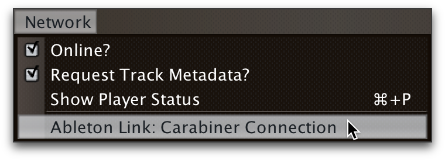
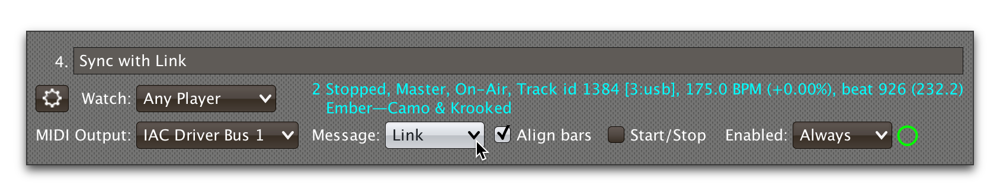
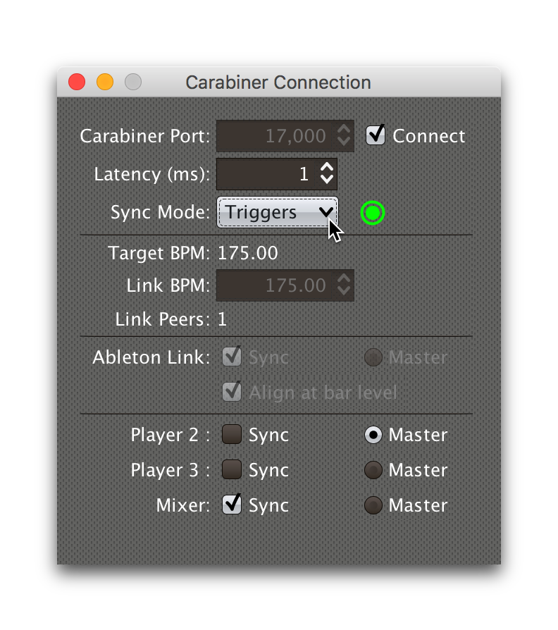

= Working with Ableton Link
James Elliott <james@deepsymmetry.org>
:icons: font
:toc:
:experimental:
:toc-placement: preamble
:guide-top: v4

// Set up support for relative links on GitHub, and give it
// usable icons for admonitions, w00t! Add more conditions
// if you need to support other environments and extensions.
ifdef::env-github[]
:outfilesuffix: .adoc
:tip-caption: :bulb:
:note-caption: :information_source:
:important-caption: :heavy_exclamation_mark:
:caution-caption: :fire:
:warning-caption: :warning:
endif::env-github[]

// Render section header anchors in a GitHub-compatible way when
// building the embedded user guide.
ifndef::env-github[]
:idprefix:
:idseparator: -
endif::env-github[]

With the help of
https://github.com/brunchboy/carabiner#carabiner[Carabiner], Triggers
can synchronize an Ableton Link session’s tempo, beats, and bars to
the track playing on their watched player, or you can add Link as its
own “player” that can become Tempo Master to the CDJs.

== Overview

If you install and run
https://github.com/brunchboy/carabiner#carabiner[Carabiner], Beat Link
Trigger can tie into an https://www.ableton.com/en/link/[Ableton Link]
session, so you can synchronize programs like Ableton Live, Traktor,
and an increasing collection of others (and hardware), to the tempo
and beat grid established by the players being watched by your
triggers.

Once you have installed Carabiner and have it running, bring up the
Carabiner Connection window by choosing
`Ableton Link: Carabiner Connection` in the `Network` menu:



This will open the Carabiner Connection window:

image:assets/CarabinerWindow.png[Carabiner Connection window, 338]

NOTE: This window will also open whenever you choose `Link` in a
trigger's <<message-menu,Message Menu>>, or load a trigger that is
configured that way, if Carabiner is not already connected.

Set the `Carabiner Port` value to match the port on which your
Carabiner daemon is listening. The default value of 17000 will work
unless you have had to explicitly tell it to use a different port
because some other program is using that one on your system.

The `Latency` value is the number of milliseconds it takes from when a
beat is actually playing on the players in your DJ Link Pro network to
when the corresponding beat packet is received by Beat Link Trigger.
The default value of 20 ms seems to work well, but if your Ableton
Link session seems to be running audibly behind beats from your
Pioneer gear, you can increase this value until things sound right.

Once your port value is correct, you can click the Connect check box
to establish a connection with Carabiner:

image:assets/CarabinerConnected.png[Carabiner connection established, 412]

Once connected, you can no longer adjust the port value, but you can
tweak the latency at any time while listening to sound from your
Pioneer gear and Link-enabled software.

The current tempo of the Link session is shown, as well as the number
of other Link-enabled programs (Link Peers) visible on the network.

In order to influence the Link session, configure a trigger to send to Link by choosing
`Link` in its `Message` menu:



Triggers that work with Link can align the beat grid with either
individual beats, or entire bars of four beats (the default). If you
want simple beat-level alignment, uncheck the trigger's `Align at bar
level` check box.

Once a trigger like this activates, the tempo of its watched player
will show up as the `Target BPM` within the Carabiner Connection
window:

image:assets/CarabinerTargeting.png[Carabiner targeting a tempo, 412]

As you can see, the Link session's tempo is not yet tracking the
trigger's tempo. In order to allow that to happen, check the `Master`
check box in the Carabiner Connection window. Once Carabiner is
connected and set to Master, whenever a Link trigger is active, Beat
Link Trigger will control the Link session tempo, and will align it to
the beat (or bar) of the trigger's watched player:



=== Carabiner Status

To the right of the `Master` check box there is a status indicator
which shows whether Carabiner is currently enabled (a green circle) or
disabled (a red circle with a slash). To be enabled, both the
`Connect` and `Master` check boxes must be checked. If a Link trigger
is currently active and thus trying to affect the Link session, there
is a filled circle inside the enabled circle:

[width="50%",cols=".^,^.^",options="header"]
|===
|State
|Indicator

|Disabled, No Link Trigger Active
|image:assets/Disabled.png[Disabled]

|Enabled, No Link Trigger Active
|image:assets/Enabled.png[Enabled]

|Disabled, Link Trigger Active
|

|Enabled, Link Trigger Active
|image:assets/EnabledPlaying.png[Enabled, Trigger Active]

|===

=== Ignoring Track BPM

In very special situations, for example when you want to synchronize
with a set of Ableton tracks that have not been properly tempo marked
or warped, but are all pretending to be at 120 BPM, you can tell Beat
Link Trigger to ignore the actual tempo of the track that is playing
on a CDJ, and adjust your fixed tempo value based on the current
playback pitch.

To do this, use the Global Setup Expression to assign a value to the
`:use-fixed-sync-bpm` global, like so:

```clojure
(swap! globals assoc :use-fixed-sync-bpm 120.0)
```

Once you have done that, Beat Link Trigger will pretend that whatever
track is playing has a native tempo of 120 beats per minute (or
whatever value you have chosen). If the DJ plays it at a pitch of +5%,
Beat Link Trigger will sync the Link session (or MIDI clock, which
also supports this setting) to 126 BPM (which is 5% more than 120),
regardless of the actual tempo of the track.

Don't forget you have done this, or you will wonder why your sync is
not working properly when you are trying to sync with tracks and
systems that are properly beat gridded and tempo analyzed! To get back
to normal, either remove the above line from your Global Setup
Expression and quit and restart Beat Link Trigger, or edit the
expression and replace that line with the following one, which undoes
the setting immediately:

```clojure
(swap! globals dissoc :use-fixed-sync-bpm)
```

// TODO: Does this also work when sync is not driven by triggers? Should it?

// TODO: Add guide to non-trigger modes.

== Learning More

****

* Continue to <<Logs#logs,Logs>>
* Return to <<{guide-top}#beat-link-trigger-user-guide,Top>>

****

// Once Git finally supports it, change this to: include::Footer.adoc[]
== License

+++<a href="http://deepsymmetry.org"></a>+++
Copyright © 2016&ndash;2018 http://deepsymmetry.org[Deep Symmetry, LLC]

Distributed under the
http://opensource.org/licenses/eclipse-1.0.php[Eclipse Public License
1.0], the same as Clojure. By using this software in any fashion, you
are agreeing to be bound by the terms of this license. You must not
remove this notice, or any other, from this software. A copy of the
license can be found in
https://github.com/brunchboy/beat-link-trigger/blob/master/LICENSE[LICENSE]
within this project.
