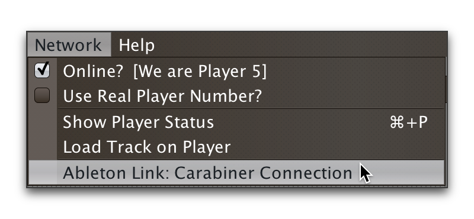
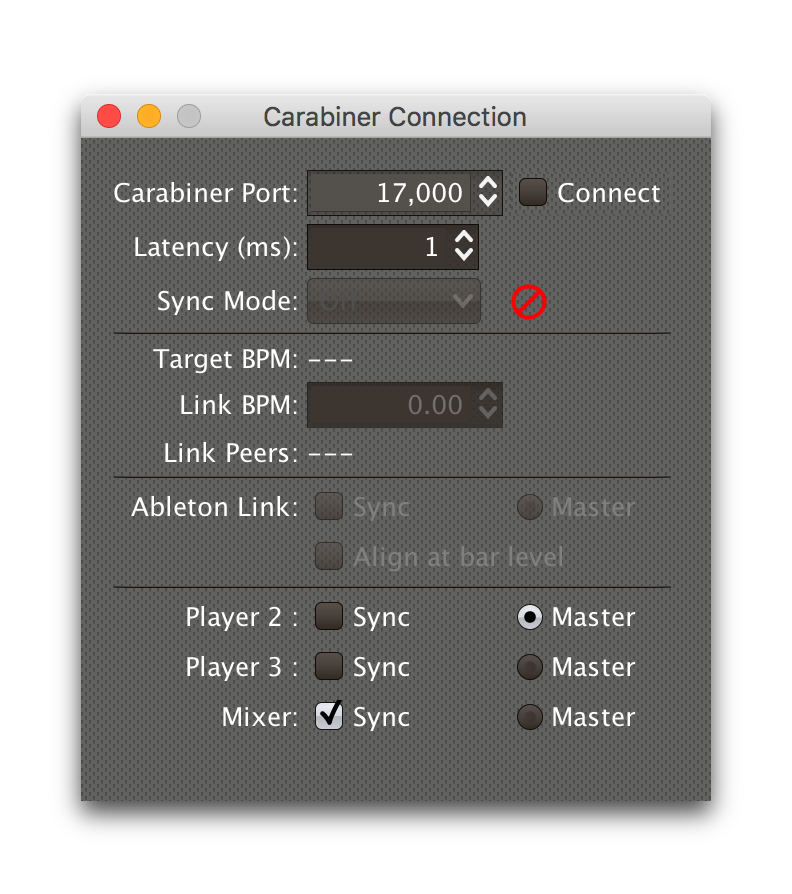

= Working with Ableton Link
James Elliott <james@deepsymmetry.org>
:icons: font
:toc:
:experimental:
:toc-placement: preamble
:guide-top: README

// Set up support for relative links on GitHub, and give it
// usable icons for admonitions, w00t! Add more conditions
// if you need to support other environments and extensions.
ifdef::env-github[]
:outfilesuffix: .adoc
:tip-caption: :bulb:
:note-caption: :information_source:
:important-caption: :heavy_exclamation_mark:
:caution-caption: :fire:
:warning-caption: :warning:
endif::env-github[]

// Render section header anchors in a GitHub-compatible way when
// building the embedded user guide.
ifndef::env-github[]
:idprefix:
:idseparator: -
endif::env-github[]

With the help of
https://github.com/Deep-Symmetry/carabiner#carabiner[Carabiner], Triggers
can synchronize an Ableton Link session’s tempo, beats, and bars to
the track playing on their watched player, or you can add Link as its
own “player” that can become Tempo Master to the CDJs. Even without
Carabiner, you can <<sync-control,control>> which players are Synced,
and which is the Tempo Master.

== Overview

If you install and run
https://github.com/Deep-Symmetry/carabiner#carabiner[Carabiner], Beat Link
Trigger can tie into an https://www.ableton.com/en/link/[Ableton Link]
session, so you can synchronize programs like Ableton Live, Traktor,
and an increasing collection of others (as well as more and more
hardware), to the tempo and beat grid established by the players being
watched by your triggers.

Once you have installed Carabiner and have it running, bring up the
Carabiner Connection window by choosing
`Ableton Link: Carabiner Connection` in the `Network` menu:



This will open the Carabiner Connection window (the set of devices you
see at the bottom will depend on what is actually on your network):



NOTE: This window will also open whenever you choose `Link` in a
trigger's <<Triggers#message-menu,Message Menu>>, or load a trigger
that is configured that way, if Carabiner is not already connected.

Set the `Carabiner Port` value to match the port on which your
Carabiner daemon is listening. The default value of 17000 will work
unless you have had to explicitly tell it to use a different port
because some other program is using that one on your system.

The `Latency` value is the number of milliseconds it takes from when a
beat is actually playing on the players in your DJ Link Pro network to
when the corresponding beat packet is received by Beat Link Trigger.
The default value of 1 ms seems to work well, but if your Ableton
Link session seems to be running audibly behind beats from your
Pioneer gear, you can increase this value until things sound right.

Once your port value is correct, you can click the Connect check box
to establish a connection with Carabiner:

image:assets/CarabinerConnected.png[Carabiner connection established,396,447]

Once connected, you can no longer adjust the port value, but you can
tweak the latency at any time while listening to sound from your
Pioneer gear and Link-enabled software or hardware.

The current tempo of the Link session is shown, as well as the number
of other Link-enabled programs (Link Peers) visible on the network.

== Syncing with Triggers

In order to allow triggers to influence the Link session, configure a
trigger to send to Link by choosing menu:Message[Link] in the trigger
itself:

image:assets/LinkTrigger.png[Link trigger,844,165]

Triggers that work with Link can align the beat grid with either
individual beats, or entire bars of four beats (the default). If you
want simple beat-level alignment, uncheck the trigger's `Align bars`
check box.

If the systems you are integrating with support version 3 of the
Ableton Link protocol, you can also use its Transport Control feature
to tell them to start playing when the trigger activates, and stop
when it deactivates, by checking the trigger's `Start/Stop` checkbox.
Software and devices using older versions of the protocol will simply
ignore these instructions even if you have this turned on.

Once a trigger like this activates, the tempo of its watched player
will show up as the `Target BPM` within the Carabiner Connection
window. That is not happening yet, though:


Starting with version 0.4.0 of Beat Link Trigger, Carabiner can sync
without using triggers at all. If you still want to use it in that
mode, you need to choose menu:Sync Mode[Passive] in the Carabiner
window. Once Carabiner is connected and set to Triggers as its Sync
Mode, whenever a Link trigger is active, Beat Link Trigger will
control the Link session tempo, and will align it to the beat (or bar)
of the trigger's watched player:

image:assets/CarabinerMastering.png[Carabiner controlling the tempo,396,447]

=== Carabiner Status (Triggers Mode)

To the right of the `Sync Mode` menu there is a status indicator
which shows whether Carabiner is currently enabled (a green circle) or
disabled (a red circle with a slash). To be enabled, the `Connect`
check box must be checked and the `Sync Mode` menu must be set to
something other than `Off`.

When you are using Triggers as your Sync mode, if a Link trigger is
currently active and thus trying to affect the Link session, there is
a filled circle inside the enabled circle:

[width="50%",cols=".^,^.^",options="header"]
|===
|State
|Indicator

|Disabled (Sync Mode `Off`)
|image:assets/Disabled.png[Disabled,52,52]

|Enabled, No Link Trigger Active
|image:assets/Enabled.png[Enabled,52,52]

|Enabled, Link Trigger Active
|image:assets/EnabledPlaying.png[alt=Enabled, Trigger Active,width=52,height=52]

|===

== Passive Sync Mode

Sometimes you simply want to tie the Ableton Link session to whatever
is playing on the CDJs, without having to set up a trigger to manage
it. You can do that by choosing menu:Sync Mode[passive] in the
Carabiner window. As soon as you do that the `Ableton Link` section of
the window becomes enabled:


This gives you a place to control the things that a trigger would
normally set for you (whether the Link session is currently being
synced, and if it should be aligned at the level of beats or entire
four-beat bars). Since it starts out with `Sync` unchecked, when you
are ready to tie the Link session to the Pioneer beat grid, simply
check the `Sync` checkbox in the Ableton Link section:


At this point the Link session will follow the master Pioneer player,
until you change the Carabiner settings.

[TIP]
====
If you are using Passive or <<full-sync-mode,Full>> Sync Mode, and
would still like a trigger to control the Ableton Link transport
(playing/stopped) state, you can do it by calling functions in your
trigger expressions. Use
`(beat-link-trigger.carabiner/start-transport)` to start it playing,
and `(beat-link-trigger.carabiner/stop-transport)` to stop it.

You do need to make sure Carabiner is connected before calling
either of these functions, though. This will do the trick:

    (when (beat-link-trigger.carabiner/active?)
      ;; Your code here
    )

If you want to only start or stop the transport when the `Sync`
checkbox in the Ableton Link section is checked, substitute
`sync-enabled?` for `active?` in the `when` clause above.
====

=== Carabiner Status (Passive Sync Mode)

The Sync Mode status indicator works very similarly in this mode to
how it worked in Triggers mode, except that it doesn't depend on the
state of any triggers. If the `Sync` checkbox is checked, it shows
an active Sync state:

[width="50%",cols=".^,^.^",options="header"]
|===
|State
|Indicator

|Enabled, Not Synced
|image:assets/Enabled.png[Enabled,52,52]

|Enabled, Synced
|image:assets/EnabledPlaying.png[alt=Enabled, Trigger Active,width=52,height=52]

|===

The `Sync` checkbox works for the Link session in the same way the
device `Sync` checkboxes in the bottom section do for Pioneer devices,
as described in the <<sync-control,Sync Control>> section below. This
Sync Mode is called `Passive` because Ableton Link can only follow the
Pionner players, it can never control their tempo or beat grid. That
is why the `Master` radio button in the Ableton Link session remains
disabled. To enable that, you need to take the Sync Mode all the way
up to `Full`, which is our next topic.

== Full Sync Mode

If you want the Ableton Link session to be a full participant on the
Pioneer network, and able to become Tempo Master, choose
menu:Sync Mode[Full] in the Carabiner window.

[NOTE]
====
In order to do this, Beat Link must be using a standard player number,
so it can fully participate as a Tempo Master. You turn this on by
checking menu:Network[Use Real Player Number].


====

Once you successfully activate Full Sync Mode, the entire Ableton Link
section is enabled, and you can have the Link session become Tempo
Master for the Pioneer players by clicking the Master radio button in
that section:


When Link is tempo master, any Ableton Link enabled software or
hardware can control the Link session tempo, and any Pioneer players
that are in Sync mode will follow along, aligning to the beats (or
bars, if you have that option checked) of the Link timeline.

In this Sync Mode, the `Link BPM` becomes editable in this window as
well. You can click on the arrows to nudge it up or down by 0.01 BPM
at a time, or you can type a new tempo in the field and press
kbd:[Return] to jump immediately to that tempo. This will affect both
the Link session itself, and any Pioneer players that are in Sync
mode.

=== Carabiner Status (Full Sync Mode)

The Sync Mode status indicator again works similarly in this mode to
how it worked in Passive Sync mode, except that it shows an active
Sync state when either the Ableton Link `Sync` checkbox is checked or
its `Master` radio button is chosen.

[width="50%",cols=".^,^.^",options="header"]
|===
|State
|Indicator

|Enabled, Neither Synced nor Master
|image:assets/Enabled.png[Enabled,52,52]

|Enabled, Synced or Master
|image:assets/EnabledPlaying.png[alt=Enabled, Trigger Active,width=52,height=52]

|===

You can also put any player in Sync mode, or assign it as the Tempo
Master, which is the topic of the next section.

[[sync-control]]
== Sync Control

The bottom section of the window lets you see and control which
players are in Sync mode, and which is the Tempo Master.

TIP: You can use this feature without connecting to Carabiner, and
without even installing the Carabiner daemon.

Simply check or uncheck the `Sync` checkbox to adjust each player's
Sync state, or click the Master radio button of the player that you
want to become the Tempo Master.

Beat Link's implementation of the sync control protocol works in both
directions. If the DJ causes another player to become Tempo Master,
the Link session will gracefully give up that role. The checkboxes
and radio buttons will update to reflect any changes made on the
players themselves. And if there is a DJM mixer on the network, it
can tell Beat Link to turn its own Sync on or off, or become Tempo
Master, and Beat Link will obey.

[[ignoring-track-bpm]]
== Ignoring Track BPM

In very special situations, for example when you want to synchronize
with a set of Ableton tracks that have not been properly tempo marked
or warped, but are all pretending to be at 120 BPM, you can tell Beat
Link Trigger to ignore the actual tempo of the track that is playing
on a CDJ, and adjust your fixed tempo value based on the current
playback pitch.

To do this, use the Global Setup Expression to assign a value to the
`:use-fixed-sync-bpm` global, like so:

```clojure
(swap! globals assoc :use-fixed-sync-bpm 120.0)
```

Once you have done that, Beat Link Trigger will pretend that whatever
track is playing has a native tempo of 120 beats per minute (or
whatever value you have chosen). If the DJ plays it at a pitch of +5%,
Beat Link Trigger will sync the Link session (or MIDI clock, which
also supports this setting) to 126 BPM (which is 5% more than 120),
regardless of the actual tempo of the track.

NOTE: This fixed Sync BPM override works only for Trigger-driven sync,
and works for triggers configured to use either Link or MIDI Clock. It
has no effect when you are using the Carabiner window in Passive or
Full Sync mode to bridge the Ableton Link session to the Pioneer
network.

Don't forget you have done this, or you will wonder why your sync is
not working properly when you are trying to sync with tracks and
systems that are properly beat gridded and tempo analyzed! To get back
to normal, either remove the above line from your Global Setup
Expression and quit and restart Beat Link Trigger, or edit the
expression and replace that line with the following one, which undoes
the setting immediately:

```clojure
(swap! globals dissoc :use-fixed-sync-bpm)
```

== Learning More

****

* Continue to <<Debugging#debugging-and-sharing,Debugging and Sharing>>
* Return to <<{guide-top}#beat-link-trigger-user-guide,Top>>

****

// Once Git finally supports it, change this to: include::Footer.adoc[]
== License

+++<a href="http://deepsymmetry.org"></a>+++
Copyright © 2016&ndash;2019 http://deepsymmetry.org[Deep Symmetry, LLC]

Distributed under the
http://opensource.org/licenses/eclipse-1.0.php[Eclipse Public License
1.0], the same as Clojure. By using this software in any fashion, you
are agreeing to be bound by the terms of this license. You must not
remove this notice, or any other, from this software. A copy of the
license can be found in
https://github.com/Deep-Symmetry/beat-link-trigger/blob/master/LICENSE[LICENSE]
within this project.

=== Library Licenses

https://sourceforge.net/projects/remotetea/[Remote Tea],
used for communicating with the NFSv2 servers on players,
is licensed under the
https://opensource.org/licenses/LGPL-2.0[GNU Library General
Public License, version 2].

The http://kaitai.io[Kaitai Struct] Java runtime, used for parsing
rekordbox exports and media analysis files, is licensed under the
https://opensource.org/licenses/MIT[MIT License].
