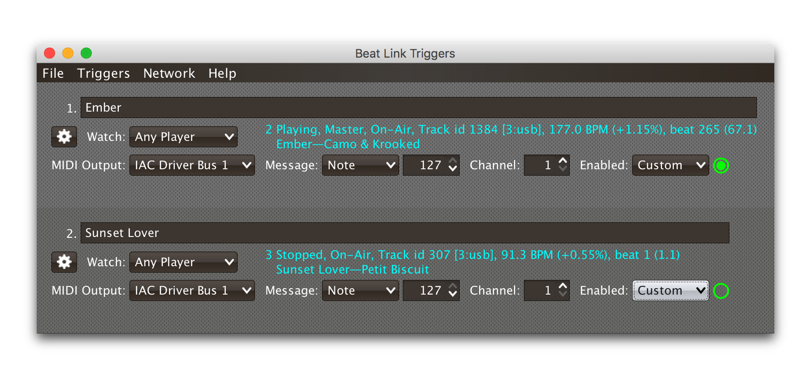

= Matching Tracks
James Elliott <james@deepsymmetry.org>
:icons: font
:toc:
:experimental:
:toc-placement: preamble
:guide-top: v4

// Set up support for relative links on GitHub, and give it
// usable icons for admonitions, w00t! Add more conditions
// if you need to support other environments and extensions.
ifdef::env-github[]
:outfilesuffix: .adoc
:tip-caption: :bulb:
:note-caption: :information_source:
:important-caption: :heavy_exclamation_mark:
:caution-caption: :fire:
:warning-caption: :warning:
endif::env-github[]

// Render section header anchors in a GitHub-compatible way when
// building the embedded user guide.
ifndef::env-github[]
:idprefix:
:idseparator: -
endif::env-github[]

Configure your triggers to respond only when particular tracks are
being played.

== Overview

As described in the <<Triggers#player-status-summary,Player Status
Summary>> discussion, the most reliable way to match a track is using
the `rekordbox-id`, source player, and slot values, and the most
convenient way to do that is to turn on metadata requests, so Beat
Link Trigger asks the player hosting the track for details like its
title, artist, and so on. This section describes how to work with that
metadata in your triggers. If you can't turn on metadata requests (for
example, you are running a show with a full set of four CDJs, all
loading tracks from the same media on a single player), you can
prepare ahead of gime by hard-coding the rekordbox ID numbers in your
triggers, or you can set up a <<Players#caching-metadata,Metadata
Cache>>.

The simplest approach is to configure your triggers to Watch Any
Player, and use a custom Enabled Filter expression to activate them
when any player has loaded the track that the trigger cares about. For
example, in the following screen shot we have two triggers watching
for two specific tracks:

// TODO: Needs to be reshot.


The Enabled Filter expression for the first trigger is as follows:

```clojure
(and
  (= track-title "Ember (Original Mix)")
  (= track-artist "Camo & Krooked"))
```

This activates the trigger whenever a player has loaded a track with
the specified exact title and artist. The values available for
matching are listed in the expression documentation you can scroll
through in the bottom half of the expression editor window, and other
metadata-based values include `track-comment`, `track-genre`,
`track-key`, and `track-length`. The entire
http://deepsymmetry.org/beatlink/apidocs/org/deepsymmetry/beatlink/TrackMetadata.html[`TrackMetadata`]
object is available as `track-metadata`, if you want to use
http://clojure.org/reference/java_interop[Clojure Java Interop] to
work with it.

In addition to using `=` to match entire strings, you can use
http://clojuredocs.org/clojure.core/re-matches[`re-matches`] with
regular expressions for more flexible, loose matching. In addition to
the basic http://clojuredocs.org/clojure.core/re-matches[Clojure
documentation], the Java
https://docs.oracle.com/javase/7/docs/api/java/util/regex/Pattern.html[Pattern]
documentation provides details of how you can construct your regular
expressions. For example, to match any track whose title begins with
"Ember" you would use an expression like this:

```clojure
(re-matches #"Ember.*" track-title)
```

Of course, you might also want the trigger to activate only when
playback reaches a particular beat. You can combine as many different
kinds of rules and logic as you need in your Enabled expression to
achieve your goals:

```clojure
(and
  (= track-title "Sunset Lover")
  (= track-artist "Petit Biscuit")
  (>= beat-number 17))
```

To have the trigger active within a specific range of beats, you can
express that in a single expression like so:

```clojure
(and
  (re-matches #"Ember.*" track-title)
  (= track-artist "Camo & Krooked")
  (<= 65 beat-number 192))
```

Including that within the trigger will enable it when a player that
has loaded that specific track, and playback is positioned anywhere
from beat 65 to 192, inclusive.

== Writing a Playlist

Another way to take advantage of the new metadata support is to write
out a file that logs all the tracks that were played during a DJ set.
Here is a simple example of how to do that, although you can certainly
get fancier in terms of how you format the timestamps and what
information you log.

TIP: Starting with version 0.4.0, Beat Link Trigger has a built-in
Playlist Writer window that does all this for you, and more. This
discussion has been left in as an example of the kinds of things you
can do with your expression code.
// TODO: Make Playlist Writer a link to that section once written.

Set up a Trigger that is configured to watch the Master Player, and
install the following Tracked Update Expression:

```clojure
(when trigger-active?
  (when (not= track-metadata (:last-track @locals))
    (swap! locals assoc :last-track track-metadata)
    (when (some? track-metadata)
      (let [log-entry (with-out-str
                        (println "Timestamp:" (str (java.time.LocalDateTime/now)))
                        (println "   Artist:" track-artist)
                        (println "    Title:" track-title)
                        (println))]
       (spit "/Users/james/Desktop/playlist.txt" log-entry :append true)))))
```

TIP: This version creates a file called `playlist.txt` on my desktop;
change the file path in the `spit` call to match where you want the
file created.

Whenever this trigger is enabled, as soon as a new track is being
played by whatever player is currently the tempo master, a new entry
will be written to the playlist log. The file content will look like
this:

```
Timestamp: 2017-03-18T18:21:43.705
   Artist: Exige & EJR
    Title: Escape ft. Zoë Phillips (Bazarro Remix)

Timestamp: 2017-03-18T18:21:56.170
   Artist: Imogen Heap
    Title: Hide and Seek (Tiësto In Search of Summer mix)

Timestamp: 2017-03-18T18:22:07.713
   Artist: Faithless
    Title: insomnia 2008 (a1 electro mix)
```

== Learning More

****

* Continue to <<Players#the-player-status-window,The Player Status Window>>
* Return to <<{guide-top}#beat-link-trigger-user-guide,Top>>

****

// Once Git finally supports it, change this to: include::Footer.adoc[]
== License

+++<a href="http://deepsymmetry.org"></a>+++
Copyright © 2016&ndash;2018 http://deepsymmetry.org[Deep Symmetry, LLC]

Distributed under the
http://opensource.org/licenses/eclipse-1.0.php[Eclipse Public License
1.0], the same as Clojure. By using this software in any fashion, you
are agreeing to be bound by the terms of this license. You must not
remove this notice, or any other, from this software. A copy of the
license can be found in
https://github.com/brunchboy/beat-link-trigger/blob/master/LICENSE[LICENSE]
within this project.
