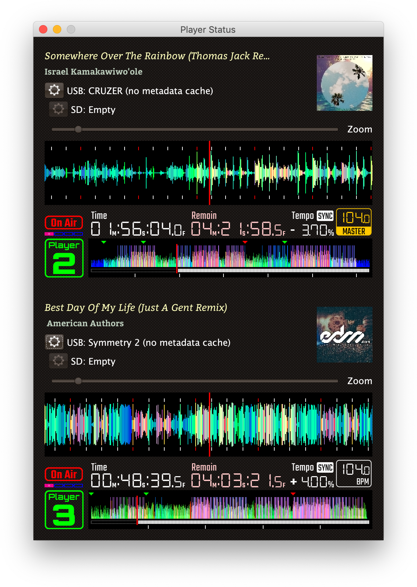
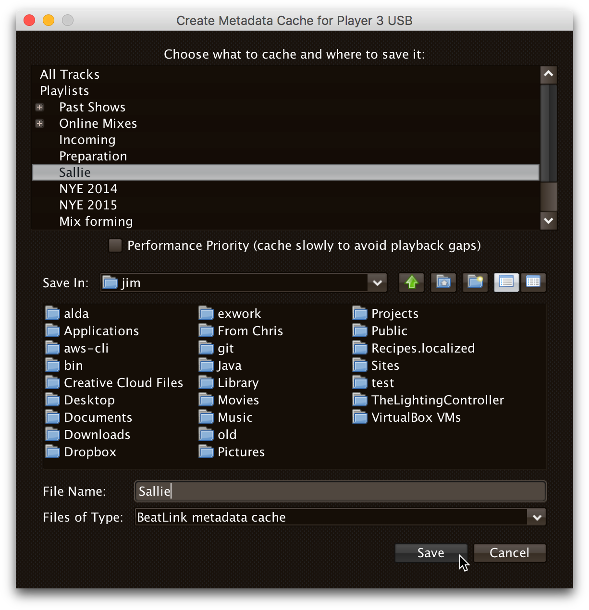

= The Player Status Window
James Elliott <james@deepsymmetry.org>
:icons: font
:toc:
:experimental:
:toc-placement: preamble
:guide-top: v4

// Set up support for relative links on GitHub, and give it
// usable icons for admonitions, w00t! Add more conditions
// if you need to support other environments and extensions.
ifdef::env-github[]
:outfilesuffix: .adoc
:tip-caption: :bulb:
:note-caption: :information_source:
:important-caption: :heavy_exclamation_mark:
:caution-caption: :fire:
:warning-caption: :warning:
endif::env-github[]

// Render section header anchors in a GitHub-compatible way when
// building the embedded user guide.
ifndef::env-github[]
:idprefix:
:idseparator: -
endif::env-github[]

Get a detailed view of what is happening on each player, what is
coming up next, and even load and play tracks during pre-show.

== Overview

Beat Link Trigger can take advantage of track metadata and related
information from the `dbserver` running on the players to provide you
a rich view of what is happening right now on all the decks. As shown
in the example view below, this can be an invaluable resoure on its
own for running visuals for a show, even if you don't have any
triggers set up:



Only players currently visible on the network will appear in this
window. The player number will be bright green if it is currently
playing, and gray if it is stopped. (The playback position indicators
in both the full track preview and, if you have it showing, the
scrolling wave detail view, will also be white when playing and red
when stopped.)

In addition to the current track time (position) and remaining time,
the current playback pitch (speed, shown as a percentage change from
normal speed, `+` meaning faster and `-` meaning slower), the current
effective tempo (combining the track tempo with the playback pitch)
and master/sync status are displayed above the track waveform preview.

[WARNING]
====
Although Beat Link can do a good job of tracking the playback location
for tracks that are being played normally, the only information it has
available are the beat packets which tell it when the player has
reached a particular beat, and which can be translated to a time using
the track's beat grid. It can combine these with the playback speed
information which comes more frequently (in status packets sent
several times per second), to interpolate the current playback
position in between beats.

However, if the DJ is playing a track backwards, no beat packets are
sent. And if the track is looping, the correct position can not be
detected except if and when the loop happens to cross a beat boundary,
causing a beat packet to be sent. So you can not assume time
information is accurate during reverse or loop playback, especially
for small loops that start or end in the middle of beats.

This also means that if the DJ uses the touch strip to &ldquo;needle
jump&rdquo; to an arbitrary point in the track, the time may start
out slighly wrong, since we can only assume playback started at the
beginning of the beat that was landed on. But after that (or once the
DJ changes back to playing forward without a loop), as soon as the
player reaches the next beat marker, the time will resynchronize, and
stay tracked well as long as normal playback continues.
====

The current beat playing is shown above the player number, and
individual beat (white) and bar (red) marks are drawn in the waveform
detail view (although if you zoom out to see more of the track, the
individual beats go away, and only bars are drawn).

The white tick marks below the full-track preview waveform at the
bottom of a player row are minute markers, so you can see at a glance
how long the track is and how much is left.

Hot cues are shown above the waveform as green triangles, memory
points as red triangles, and loops as orange triangles. The loop body
is shown in the wave detail section, if you have that open. Only loops
that are stored in the track can be displayed; loops created
on-the-fly by the DJ are not visible over the network.

If you are using a compatible mixer, and it (and the players) are all
configured to display their On-Air status, and the player numbers are
properly configured to match the mixer channels that they are
connected to, then you can use the "On-Air" indication above the
player number as an additional hint about when you need to pay
attention to it.

If you do not have metadata requests active when you try opening the
player window, Beat Link Trigger will show the following warning
dialog:

image:assets/NoMetadata.png[No Metadata for Player Window,644,199]

In that situation, unless you have already created a metadata cache to
use as described below, you will want to turn on metadata requests.
See the Metadata section <<Triggers#metadata,above>> for more details about
that process.

TIP: For the status window to be of any use, you need to either have
Beat Link Trigger configured to request track metadata (`Request Track
Metadata?` needs to be selected in the `Network` menu, as described
<<Triggers#metadata,above>>), or a metadata cache needs to be attached. What is
a metadata cache, you ask? Well, read on!

In order to enable you to work with metadata even during shows with a
full complement of CDJs (when you can't be sure that all of the
players will be never be simultaneously linked to the database you
need metadata for) you can set up a metadata cache before the show,
and attach that to the slot where your DJ has inserted his media.

[[caching-metadata]]
== Caching Metadata

To create a metadata cache, have your DJ insert his media into a
player before the show begins, and then click on the gear button next
to the corresponding player slot, choosing the Create Metadata Cache
File option:

image:assets/CreateCache04.png[Create Metadata Cache option,350,234]

This will open a dialog where you can choose to cache either all the
tracks present on the media, or only those associated with a
particular playlist. If you have limited time available, and the DJ
will be using a particular playlist for the tracks that you need
metadata for, the playlist option can save you a lot of time.

NOTE: Creating a cache from a playlist means that only tracks in that
playlist will have metadata available when you attach the cache. Beat
Link Trigger will not attempt to query the player directly for tracks
that are not present in an attached cache file. So only use this
approach when you have prearranged with your DJ to be certain that
you only need the metadata for tracks on the chosen playlist.

Also choose the file where you want to save the cache:



When you click `Save`, Beat Link Trigger will download the metadata,
artwork, cue list, beat grid, and waveform information about all the
tracks you specified, creating a zip file that can be used to retrieve
them when needed, instead of querying the player itself. This takes a
couple of seconds per track, so it can be a time-consuming operation
for large amounts of media.

NOTE: If you are creating a cache while a performance is taking place,
you should check the `Performance Priority` checkbox in the middle of
the cache creation dialog, to tell Beat Link Trigger to pause a second
between adding each track to the cache. This greatly slows down the
process, but it avoids interfering with the players. Failing to do
this can cause playback to stutter if the DJ jumps directly to the
middle of a track, for example. Don't check the box if the player is
idle and you want to quickly cache a lot of tracks.


Once the cache is created, it will automatically be attached to that
player slot, so Beat Link Trigger will use the cache instead of asking
the player for metadata. If the media is ejected from the slot, the
cache is automatically detached. You can also manually detach or
attach caches using the gear button next to any player media slot. The
gear will be filled in when a cache is attached, and the cache file
information displayed next to it, as shown here:

image:assets/CreateCache4-04.png[Metadata Cache Attached,350,234]

== Auto-Attaching Metadata Caches

If you have created a metadata cache and want it to automatically be
attached to the appropriate player slot whenever your DJ inserts the
corresponging media (since it can be hard to predict where it will end
up in a busy show), you can ask Beat Link Trigger to watch for media
that matches the cache, and automatically attach it. To do this,
choose `Auto-Attach Metadata Caches` in the `File` menu.

image:assets/AutoAttach04.png[Auto-Attach option,344,162]

This will open a window where you can configure the cache files that
should be watched for. Click `Add File` to add one:


This will open a file chooser dialog you can use to find the file or
files that you want to be watched, and they will appear in the window.
Whenever a new media stick or SD card is inserted into one of the
players, it will be checked to see if it has the same number of tracks
as one of the caches (or, if the cache was created from a playlist, if
the media has a playlist with the same ID and the same number of
tracks). If so, a random sampling of the tracks will be examined in
both the cache and the player, and if the metadata of those tracks
match exactly, the media cache will be attached to that slot.

NOTE: The playlist (or all tracks) must match *exactly*, so if the
media has been modified in rekordbox since the cache was created, an
all-tracks cache will need to be re-created. A playlist cache will
continue to match unless that specific playlist has been altered.


If you no longer want one of the files to be watched for, simply click
the `Remove` button next to it.

NOTE: It does not make sense to try to auto-attach multiple files
created from the same media, for example from different playlists.
Beat Link Trigger will always give priority to files created from all
tracks over files created from a playlist when considering matches,
but it is unpredictable which file will be chosen if more than one
playlist cache from the same media is being matched.

== Viewing Metadata Cache Contents

If you want to work on trigger definitions while you don't have access
to CDJs or the media containing the tracks that you want to base them
on, you can look at the contents of a metadata cache to find out the
rekordbox IDs of the tracks you want your triggers to match.

To do this, choose `View Metadata Cache Contents` in the `File` menu.

image:assets/ViewCacheContents04.png[View Cache option,344,162]

This will open a file chooser dialog you can use to find the file
containing the cache that you want to examine. Once you choose one, a
window will open containing a row for each entry in the metadata
cache, showing its rekordbox ID, title, and artist:


[[loading-playing]]
== Loading and Playing Tracks

During pre-show and after-show situations, when there is no DJ on
stage, it can be convenient to cue up and play tracks from Front of
House. If you can ensure that the tracks are inserted into one of the
players' media slots before the show (or at the end of the show), you
can use Beat Link Trigger to accomplish this, either by choosing
menu:Network[Load Track on Player], or using the popup menu associated
with a particular media slot in the Player Status window as shown in
the screen shot below:


Either method opens the interface shown below; the advantage of
starting from a media slot's popup menu is that the corresponding
section of the loader interface will be automatically opened for you.


This window allows you to drill down through the menu hierarchy
associated with the media mounted in any player slot, just as if you
were on the player itself. The top-level elements are the mounted
media libraries themselves, showing the media name and, for rekordbox
media, the total number of tracks and playlists present on the media.

NOTE: The actual sections available for each media library will depend
on what the DJ chose to enable when configuring it within rekordbox.
(Non-rekordbox media will only have the `FOLDER` menu, which shows the
raw filesystem. That is also available on rekordbox media, in case
there are some non-rekordbox tracks in there.)

You can click on the `+` icon to expand a section, or double-click
anywhere in that row of the tree. The same actions will collapse an
already-expanded section (although the icon will be labeled `-` in
that case). Selecting a row that corresponds to an individual track
enables the kbd:[Load] button:


Clicking that button tells the player chosen in the menu:Load on[]
menu to load the selected track. (The button will also be disabled,
with an explanation next to it, if that player is currently playing
a track.)

If the chosen player is currently stopped at the Cue point, the
kbd:[Play if Cued] button will be enabled; pressing it tells that
player to start playing. If the player is currently playing, the
button will be labeled kbd:[Stop and Cue], and clicking it will tell
the player to stop and return to the Cue point, so it will be ready
to start playing again.

NOTE: Limitations in the Fader Start protocol, which is used to start
and stop players, make it impossible to start a player that is stopped
anywhere other than the current Cue point.

The easiest way to find a track, if you know its title, artist, or
album name, is to use the Search interface. As soon as you click on
the Search section of a media entry, the search interface opens at the
top of the window, and you can start typing. As you add to your search
string, the results are narrowed down. Once you can see what you are
looking for, you can expand and load it.


If there are more than 25 results matching your search string, only
the first 25 will be loaded and shown to begin with. You can use the
kbd:[Load] button to load more, in larger and larger batches, although
your best bet is probably to use a longer and more selective search
string instead:


== Keeping Player Status Always Visible

Some users have expressed an interest in making the Player Status
Window always be visible, no matter what window is active in their
operating system. This can be arranged by creating a global variable
entry with the key `:player-status-always-on-top` and the value `true`
before showing the window. In other words, add the following
form to your Global Setup Expression:

```clojure
(swap! globals assoc :player-status-always-on-top true)
```

If the window was already open when you set up this entry, you can make
it take effect by choosing menu:Network[Show Player Status] again.

== Learning More

****

* Continue to <<Link#working-with-ableton-link,Working with Ableton Link>>
* Return to <<{guide-top}#beat-link-trigger-user-guide,Top>>

****

// Once Git finally supports it, change this to: include::Footer.adoc[]
== License

+++<a href="http://deepsymmetry.org"></a>+++
Copyright © 2016&ndash;2018 http://deepsymmetry.org[Deep Symmetry, LLC]

Distributed under the
http://opensource.org/licenses/eclipse-1.0.php[Eclipse Public License
1.0], the same as Clojure. By using this software in any fashion, you
are agreeing to be bound by the terms of this license. You must not
remove this notice, or any other, from this software. A copy of the
license can be found in
https://github.com/brunchboy/beat-link-trigger/blob/master/LICENSE[LICENSE]
within this project.
