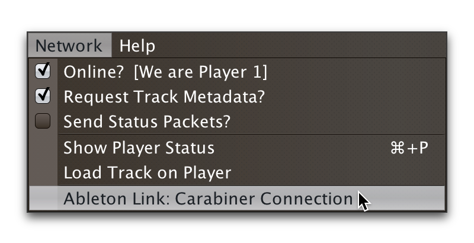

= Beat Link Trigger User Guide
James Elliott <james@deepsymmetry.org>
:icons: font
:experimental:

// Set up support for relative links on GitHub, and give it
// usable icons for admonitions, w00t! Add more conditions
// if you need to support other environments and extensions.
ifdef::env-github[]
:outfilesuffix: .adoc
:tip-caption: :bulb:
:note-caption: :information_source:
:important-caption: :heavy_exclamation_mark:
:caution-caption: :fire:
:warning-caption: :warning:
endif::env-github[]

// Render section header anchors in a GitHub-compatible way when
// building the embedded user guide.
ifndef::env-github[]
:idprefix:
:idseparator: -
endif::env-github[]

This is an introduction to the Beat Link Trigger interface and
expression programming environment. It shows some ways you can use it,
but as an open-ended environment, the possibilities are endless. If you
have questions or other approaches you'd like to share, please post to
the https://gitter.im/brunchboy/beat-link-trigger[Gitter chat room].

IMPORTANT: This guide is being updated to reflect important changes in
version 0.5.0. If you are using an older version, please refer to the
built-in guide for accurate instructions.

To keep page sizes manageable, this guide is split into several pages.
It is worth reading through this whole guide once if you are new to
Beat Link Trigger. Once you know what you are looking for, you can
also dive right into it by jumping to the page you want:

****

[horizontal]
<<startup,Startup>>::
Connect to a network of players or work offline.

<<Triggers#triggers,Triggers>>::
Watch for specific activity on one or more CDJs, and send things
like MIDI or OSC messages in response. Recognize tracks and synchronize
external systems to them using MIDI clock or Ableton Link.

<<Expressions#expressions,Expressions>>::
Customize and extend Beat Link Trigger by writing code in Clojure,
the language used to implement the program itself.

<<Matching#matching-tracks,Matching Tracks>>::
Configure your triggers to respond only when particular tracks are
being played.

<<Players#the-player-status-window,The Player Status Window>>::
Get a detailed view of what is happening on each player, what is
coming up next, and even load and play tracks during pre-show.

<<Shows#shows,Shows>>::
Watch for beat ranges of specific tracks to be played, and send
things like MIDI or OSC messages in response.

<<Link#working-with-ableton-link,Working with Ableton Link>>::
With the help of
https://github.com/Deep-Symmetry/carabiner#carabiner[Carabiner], Triggers
can synchronize an Ableton Link session’s tempo, beats, and bars to
the track playing on their watched player, or you can add Link as its
own “player” that can become Tempo Master to the CDJs. Even without
Carabiner, you can <<Link#sync-control,control>> which players are
Synced, and which is the Tempo Master.

<<Debugging#debugging-and-sharing,Debugging and Sharing>>::
Tools to help figure out what is going on in your triggers, share
them between projects or with others, and log playlists.

<<Integration#integration-examples,Integration Examples>>::
Ways Beat Link Trigger has been used to run shows with other systems.

<<what-next,What Next?>>::
How to learn more, get help from the community, and support this effort.

****

[[startup]]
== Startup

When you first open Beat Link Trigger, it tries to find the Pro DJ
Link devices that you want it to monitor. If it can't find any, after
ten seconds you will see this window:

image:assets/NoDevices.png[No devices found,516,196]

If you were expecting to find devices, double-check that they are
powered on, and properly networked with your computer (and that any
hub or wireless router you are using is also properly turned on and
configured). Then click kbd:[Try Again] to try again.

If you just wanted to work on setting up your triggers or expressions,
and don't have any actual players handy, you can also click
kbd:[Continue Offline] to work in an offline mode. Your triggers won't
actually fire, but you can do all the configuration and editing that
you need.

Once a device is found, or you choose to continue offline, the Trigger
window opens, in the same configuration that you left it the last time
you used the program.

=== Connecting Later

If you connect to a DJ Link network after a period of working on your
triggers in offline mode, you can take Beat Link Trigger online by
checking menu:Network[Online?]:

image:assets/GoingOnline.png[Going Online,400,185]

You can also go offline at any time by un-checking the menu option.

[TIP]
====
If there has been a disruption to the network, and you seem to have
lost contact with the players, taking Beat Link Trigger offline and
then going back online can often solve the problem.
====

=== Checking your Player Number

Once you have successfully taken Beat Link Trigger online, you can
see what Player Number it is using by looking at the menu:Network[Online?]
menu option without toggling it again. Whenever it is checked, the
Player Number being used by Beat Link is shown there.

Most of the time you will want to be using Player 5, as shown here,
because that is compatible with big shows where there are four real
players in use. However, if you want to do things like letting an
Ableton Link session become the Tempo Master and
<<Link#full-sync-mode,control the speed>>
and beat sync of the players, or display metadata for CD and other
non-rekordbox tracks, you will need to use a real player number,
which may require you to turn off one of the other players.

== Learning More

****

* Continue to <<Triggers#triggers,Triggers>>

****

[[what-next]]
== What Next?

Hopefully this has been enough to get you started, and thinking about
interesting ways you can synchronize your CDJs with other elements of
your show.

If you have any thoughts, questions, your own integration examples, or
even crazy ideas, please share them in the
https://gitter.im/brunchboy/beat-link-trigger[Gitter chat] or
https://github.com/Deep-Symmetry/beat-link-trigger/wiki[project Wiki]!

If you find what seems to be an actual problem with the software,
please open an
https://github.com/Deep-Symmetry/beat-link-trigger/issues[Issue], or at
least check whether someone else already has.

Thanks for reading this, and have fun with Beat Link Trigger! I hope
to hear from you.

=== Funding

Beat Link Trigger is, and will remain, completely free and
open-source. If it has helped you, taught you something, or pleased
you, let us know and share some of your discoveries and code as
described above. If you'd like to financially support its ongoing
development, you are welcome (but by no means obligated) to donate
towards the hundreds of hours of research, development, and writing
that have already been invested. Or perhaps to facilitate future
efforts, tools, toys, and time to explore.

+++
 using Liberapay, or
 using PayPal
+++

> If enough people jump on board, we may even be able to get a newer
> CDJ to experiment with, although that's an unlikely stretch goal.

// Once Git finally supports it, change this to: include::Footer.adoc[]
== License

++++++
Copyright © 2016&ndash;2019 http://deepsymmetry.org[Deep Symmetry, LLC]

Distributed under the
http://opensource.org/licenses/eclipse-1.0.php[Eclipse Public License
1.0], the same as Clojure. By using this software in any fashion, you
are agreeing to be bound by the terms of this license. You must not
remove this notice, or any other, from this software. A copy of the
license can be found in
https://github.com/Deep-Symmetry/beat-link-trigger/blob/master/LICENSE[LICENSE]
within this project.

=== Library Licenses

https://sourceforge.net/projects/remotetea/[Remote Tea],
used for communicating with the NFSv2 servers on players,
is licensed under the
https://opensource.org/licenses/LGPL-2.0[GNU Library General
Public License, version 2].

The http://kaitai.io[Kaitai Struct] Java runtime, used for parsing
rekordbox exports and media analysis files, is licensed under the
https://opensource.org/licenses/MIT[MIT License].
