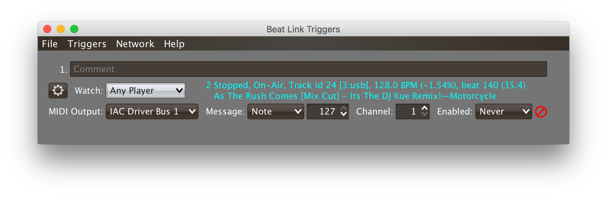

= Beat Link Trigger User Guide
James Elliott <james@deepsymmetry.org>
:icons: font
:experimental:

// Set up support for relative links on GitHub; add more conditions
// if you need to support other environments and extensions.
ifdef::env-github[:outfilesuffix: .adoc]

== Startup

When you first open Beat Link Trigger, it tries to find the Pro DJ
Link devices that you want it to monitor. If it can't find any, after
ten seconds you will see this window:

image:assets/NoDevices.png[No devices found]

If you were expecting to find devices, double-check that they are
powered on, and properly networked with your computer (and that any
hub or wireless router you are using is also properly turned on and
configured). Then click kbd:[Try Again] to try again.

If you just wanted to work on setting up your triggers or expressions,
and don't have any actual players handy, you can also click
kbd:[Continue Offline] to work in an offline mode. Your triggers won't
actually fire, but you can do all the configuration and editing that
you need.

Once a device is found, or you choose to continue offline, the Trigger
window opens, in the same configuration that you left it the last time
you used the program.

== Triggers

Each row in the Trigger window defines a single trigger, which watches
a player or category of players, and can be configured to send
different messages in response to what the player is doing.

If this is the first time you have opened Beat Link Trigger, you will
see just one trigger containing default options.

To create additional triggers you can choose `New Trigger` in the
`Triggers` menu, or type kbd:[⌘+T] (on the Mac) or kbd:[Ctrl+T] (on
other platforms). You can get back to this default state at any time
by choosing `Clear Triggers` in the `Triggers` menu.

image:assets/TriggersMenu.png[Triggers Menu, 341]

Here are the sections of a trigger, and how they work:

=== Comment

The Comment field is a free-form text area you can use to describe the
purpose of the trigger, to remind you when you later come back to it.
Apart from the trigger index, a number by which Beat Link Trigger
identifies the trigger when it is reporting errors or naming related
windows (like expression editors, described below), the comment takes
up the entire width of the first line of the trigger row.

=== Watch Menu

The Watch menu tells the trigger what player(s) it should pay
attention to. It lets you choose Player 1 through Player 4,
as well as two special choices.

image:assets/WatchMenu.png[Watch Menu]

NOTE: If a player is chosen which is not currently present on the
network, the player will be reported “not found”, and the trigger will
not operate until either the player reappears, or a different player
is chosen. Of course when you are working in Offline mode, all players
will be missing and the trigger will simply say “Offline”.

==== Any Player

If you choose to watch Any Player, then just as you would expect, the
trigger will respond to activity on any player in the network. It will
track whatever player seems “best” at the moment: If there is an
Enabled condition which causes the trigger to be enabled for some
players and not for others, it will watch the players that enable it.
Within that group, if some players are playing and others are not, it
will watch the ones that are playing. Finally, if there are still
multiple players to choose between, it will pick the lowest-numbered
one.

==== Master Player

If you choose to watch the Master Player, the trigger will focus on
whichever player is the current Tempo (sync) Master.

==== Player Status

Right after the Watch menu, the trigger row displays the player number
and latest status received from the watched player, if one was found.

=== MIDI Output Menu

The MIDI Output Menu lets you choose the MIDI device to which the
trigger will send messages. It will show all MIDI outputs currently
available on your system.

image:assets/MidiMenu.png[MIDI Output Menu]

NOTE: If a MIDI Output is chosen which is no longer available on the
system (as shown in trigger 3 above), it will remain in that row's
menu, but the Enabled section of the trigger will be replaced with the
message “Not found.” Once the output reappears, or a different output
is chosen, the trigger will become fully operational again.

=== Message Menu

(to be continued...)

=== Context Menu

Each trigger row has a context menu attached to it, which can be
accessed by right-clicking (or control-clicking) anywhere on the row's
background, but you can also open the context menu with a regular
mouse click on the button with a gear icon in it. Most of the menu is
devoted to editing various expressions to customize the trigger, as
described below. The gear icon next to an expression will be filled in
if that expression has a value, and the gear in the button will be
filled in if any expression associated with the trigger has a value.

image:assets/ContextMenu.png[Context Menu, 254]

Below the expression-related options, you can export the current
trigger configuration to a text file which can be imported into a
different trigger or shared with colleagues, and you can delete the
trigger, unless it is the only remaining trigger in the window.

== Expressions

A great deal of the power of Beat Link Trigger is in what you can do
with custom expressions.

WARNING: If you are playing with this already, please be aware it
is not finished, and you are getting a sneak preview with no
schedule or guarantees!

== Logs

== Inspecting Locals and Globals

== Saving and Loading

=== Exporting and Importing Triggers
