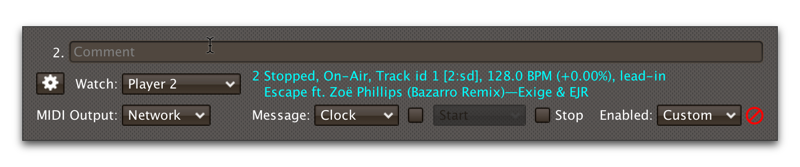
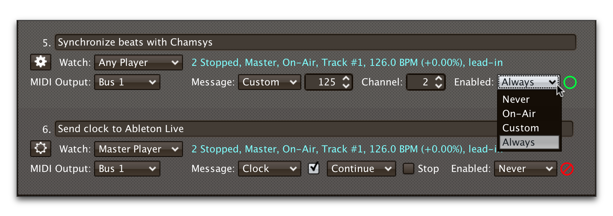
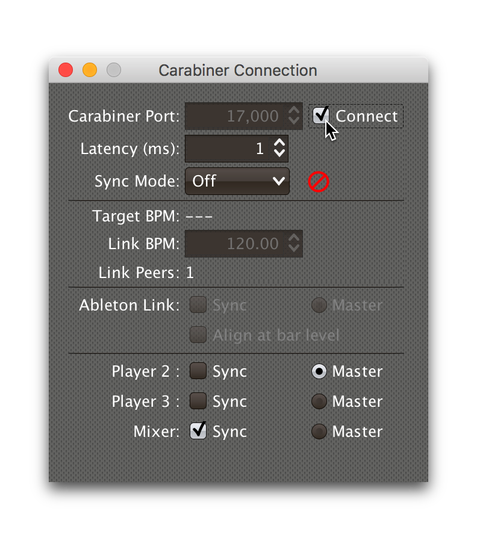
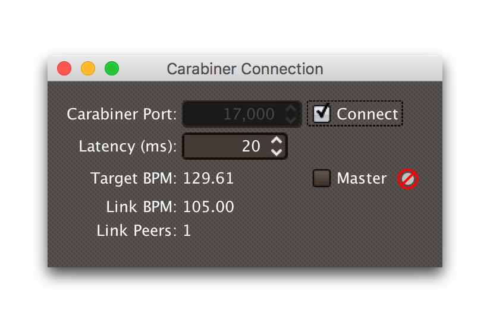
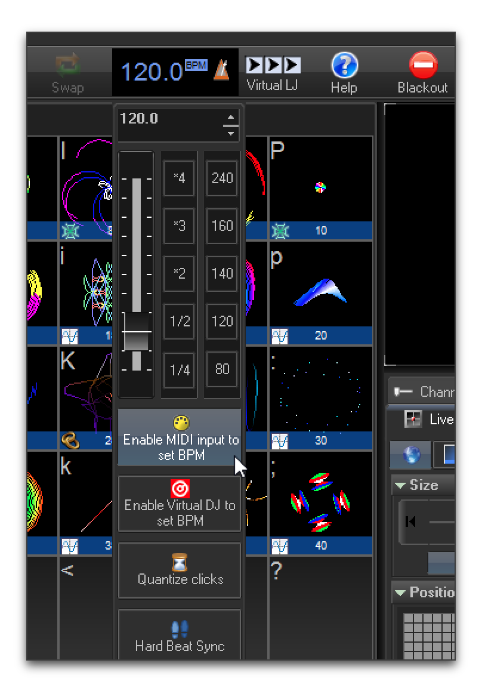
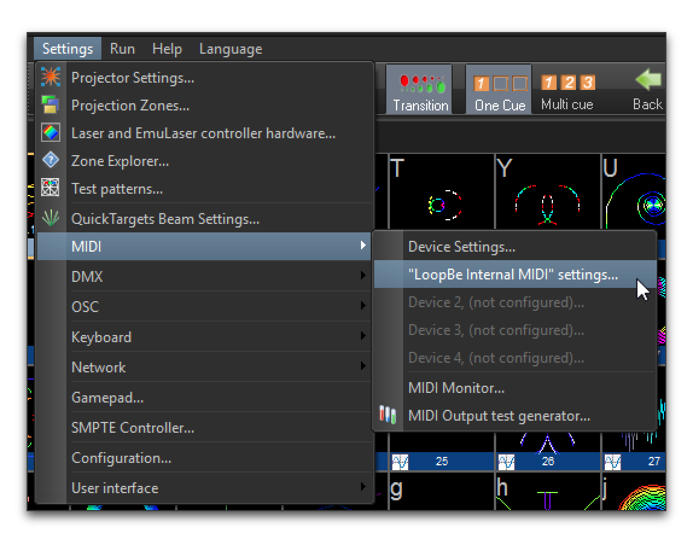
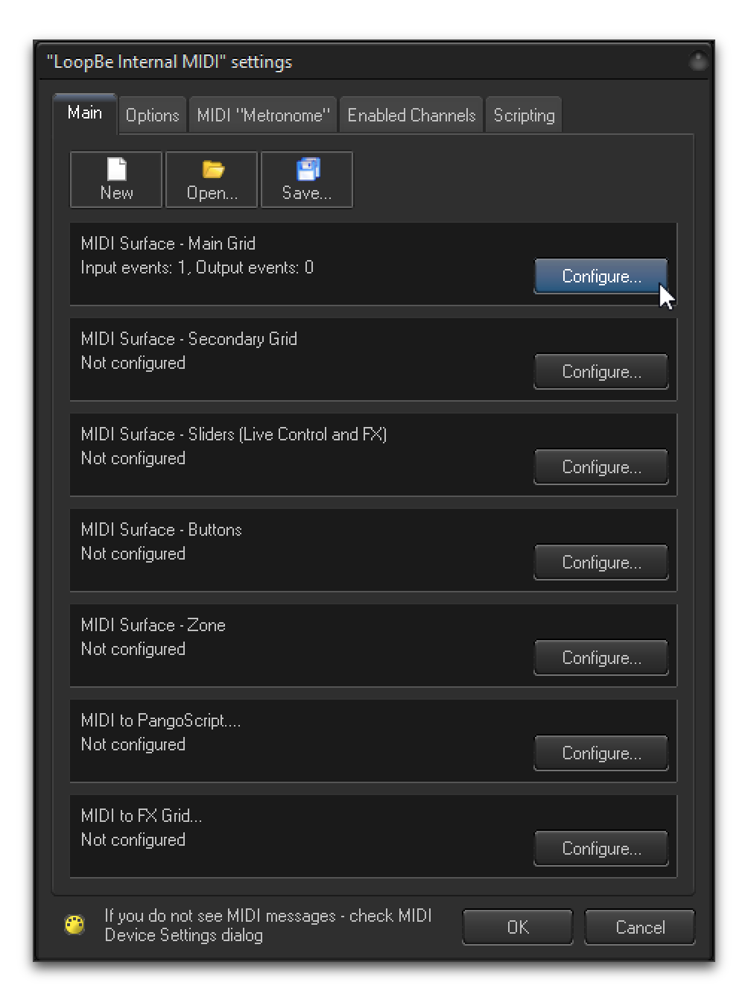
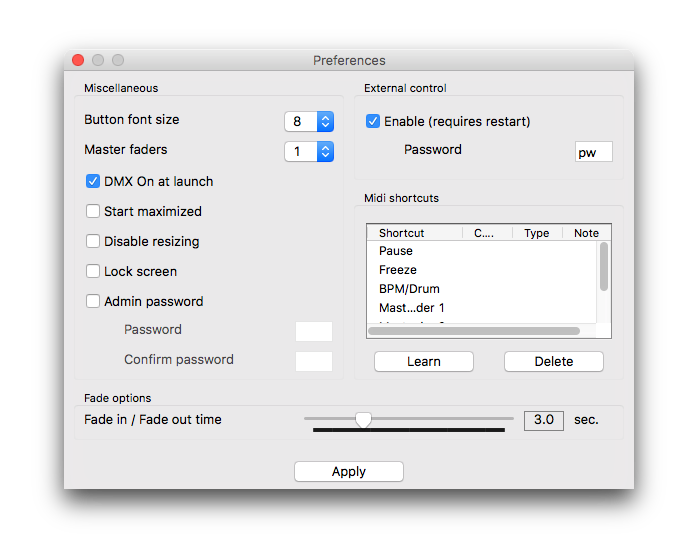

= Beat Link Trigger User Guide
James Elliott <james@deepsymmetry.org>
:icons: font
:toc:
:experimental:
:toc-placement: preamble

// Set up support for relative links on GitHub; add more conditions
// if you need to support other environments and extensions.
ifdef::env-github[:outfilesuffix: .adoc]

This is an introduction to the Beat Link Trigger interface and
expression programming environment. It shows some ways you can use it,
but as an open-ended environment, the possibilities are endless. If you
have questions or other approaches you'd like to share, please post to
the https://gitter.im/brunchboy/beat-link-trigger[Gitter chat room].

NOTE: These instructions are in the process of being updated to
prepare for the release of a new version of Beat Link Trigger with
important track metadata support. Any discussion you see of the
Network menu, or requesting and using track metadata, work only with
the PREVIEW version available for download at the top of the Releases
page.

== Startup

When you first open Beat Link Trigger, it tries to find the Pro DJ
Link devices that you want it to monitor. If it can't find any, after
ten seconds you will see this window:

image:assets/NoDevices.png[No devices found]

If you were expecting to find devices, double-check that they are
powered on, and properly networked with your computer (and that any
hub or wireless router you are using is also properly turned on and
configured). Then click kbd:[Try Again] to try again.

If you just wanted to work on setting up your triggers or expressions,
and don't have any actual players handy, you can also click
kbd:[Continue Offline] to work in an offline mode. Your triggers won't
actually fire, but you can do all the configuration and editing that
you need.

Once a device is found, or you choose to continue offline, the Trigger
window opens, in the same configuration that you left it the last time
you used the program.

=== Connecting Later

If you connect to a DJ Link network after a period of working on your
triggers in offline mode, you can take Beat Link Trigger online by
checking `Online?` in the `Network` menu:

image:assets/GoingOnline.png[Going Online, 338]

You can also go offline at any time by unchecking the menu option.

== Triggers

Each row in the Trigger window defines a single trigger, which watches
a player or category of players, and can be configured to send
different messages in response to what the player is doing.

If this is the first time you have opened Beat Link Trigger, you will
see just one trigger containing default options.

image:assets/FirstTrigger.png[First Trigger, 848]

To create additional triggers you can choose `New Trigger` in the
`Triggers` menu, or type kbd:[⌘+T] (on the Mac) or kbd:[Ctrl+T] (on
other platforms). You can get back to this default state at any time
by choosing `Clear Triggers` in the `Triggers` menu.

image:assets/TriggersMenu.png[Triggers Menu, 396]

Here are the sections of a trigger, and how they work:

=== Comment

The Comment field is a free-form text area you can use to describe the
purpose of the trigger, to remind you when you later come back to it.
Apart from the trigger index, a number by which Beat Link Trigger
identifies the trigger when it is reporting errors or naming related
windows (like expression editors, described <<expressions,below>>),
the comment takes up the entire width of the first line of the trigger
row.

=== Watch Menu

The Watch menu tells the trigger what player(s) it should pay
attention to. It lets you choose Player&nbsp;1 through Player&nbsp;4,
as well as two dynamic choices.

image:assets/WatchMenu.png[Watch Menu, 816]

NOTE: If a player is chosen which is not currently present on the
network, the player will be reported “not found”, and the trigger will
not operate until either the player reappears, or a different player
is chosen. Of course when you are working in Offline mode, all players
will be missing and the trigger will simply say “Offline”.

Any Player:: If you choose to watch Any Player, then just as you would
expect, the trigger will respond to activity on any player in the
network. It will track whatever player seems “best” at the moment: If
there is an Enabled condition which causes the trigger to be enabled
for some players and not for others, it will watch the players that
enable it. Within that group, if some players are playing and others
are not, it will watch the ones that are playing. Finally, if there
are still multiple players to choose between, it will pick the
lowest-numbered one.

Master Player:: If you choose to watch the Master Player, the trigger
will focus on whichever player is the current Tempo (sync) Master.

=== Player Status

Right after the Watch menu, the trigger row displays the player number
and latest status received from the watched player, if one was found.
The status includes the current state of the player, information about
the loaded track, the current effective BPM and relative pitch, and
the number of the current beat.

[NOTE]
====
If a rekordbox-analyzed track was loaded, the database ID of the
track will be displayed, as shown in the figure above, followed by an
indication in square brackets of the player and slot (USB or SD) from
which the track was loaded. That combination (ID number, source player
and slot) will be unique to that track until that media is unloaded
and replaced. IDs are not unique across players and slots.

If another kind of track is loaded (such as an audio CD), instead of
an ID number, its position within its playlist will be shown,
indicated by "#", as shown in the Midi Output Menu figure below.
====

The track ID (along with its source player and slot, if you want to be
safe when you are working with multiple media) can be used to identify
the track and set up fairly sophisticated custom filter expressions,
as described <<matching-tracks,below>>. If one of your expressions
recognizes a track, it can tell Beat Link Trigger to display its name
(or any other text you like) instead of the normal track description
by storing your desired description string under the key
`:track-description` in the trigger `locals` map. Here is an example
of what that could look like, when a track named Apex has been
recognized, and the string `Apex` has been stored under
`:track-description` in the trigger's `locals`:

image:assets/ApexRecognized.png[Track Apex Recognized, 804]

==== Metadata

Now that Beat Link Trigger can request track metadata from the CDJs,
that is often the most convenient and flexible way of matching tracks.
To enable this feature, check `Request Track Metadata?` in the
`Network` menu:

image:assets/RequestMetadata.png[Requesting Metadata, 338]

When metadata is available for a track, the Player Status section
grows to two lines, and displays the track title and artist on the
second line, without any effort on the part of your trigger code:



Your trigger can also change the content of the metadata line by
setting whatever value it wants under the key `:metadata-summary` in
the trigger's `locals`. Metadata values available to your trigger
expressions include `track-artist`, `track-comment`, `track-genre`,
`track-key`, `track-label`, `track-length` (in seconds), and
`track-title`.

[NOTE]
====
There are limitations on when you can reliably obtain metadata.
To be safe, you should not have more than three actual CDJs or other
players on the DJ Link network, so that Beat Link Trigger can assign
itself a device number in the range 1 through 4.

Although you can still try to request metadata when Beat Link Trigger
has to use a device number of 5 or higher, it needs to
&ldquo;borrow&rdquo; one of the actual players&rsquo; device numbers
in order to make the metadata requests. It can't do that at all if
every player has loaded tracks from the SD or USB slot on a single
player. And even when the players have loaded tracks from different
sources, there is a possibility that by borrowing their device
numbers, Beat Link Trigger will confuse them and interfere with the
DJ's ability to use the Link Info feature.

It seems to be safe and reliable to request metadata as long as there
are no more than three other players on the network, so Beat Link
Trigger can reserve a device number from 1 to 4, or as long as the four
players are only loading tracks from rekordbox instead of each other,
because rekordbox will happily reply to metadata requests from device
numbers larger than 5.
====

=== MIDI Output Menu

The MIDI Output Menu lets you choose the MIDI device to which the
trigger will send messages. It will show all MIDI outputs currently
available on your system.

image:assets/MidiMenu.png[MIDI Output Menu, 810]

NOTE: If a MIDI Output is chosen which is no longer available on the
system (as shown in trigger 3 above), it will remain in that row's
menu, but the Enabled section of the trigger will be replaced with the
message “Not found.” Once the output reappears, or a different output
is chosen, the trigger will become operational again.

=== Message Menu

The Message Menu determines what kind of MIDI message is sent by the
trigger.

image:assets/MessageMenu.png[Message Menu, 790]

Note:: With this setting, the trigger sends a Note On message, with
velocity 127 and the note number shown to the right of the menu, when
the watched player starts playing (as long as the trigger is enabled),
and a Note Off message when the watched player stops or the trigger is
disabled.

CC:: With this setting, the trigger sends a Control Change message,
with value 127 and the controller number shown to the right of the
menu, when the watched player starts playing (as long as the trigger
is enabled), and sends a CC with value 0 when the player stops or the
trigger is disabled.

Clock:: With this setting, the trigger sends MIDI Beat Clock messages
whenever the trigger is enabled, to synchronize the tempo of the
target device with the tempo reported by the watched player. If the
check box to the right of the menu is checked, it will either send a
Start or Continue message (as chosen in the following menu) when the
watched player starts playing, and if the Stop box is checked, it will
send a Stop message when the watched player stops.

Link:: When this option is chosen, the trigger does not send MIDI
messages at all. Instead, when activated, it tries to synchronize an
Ableton Link session to the tempo and beat grid being established by
the player that it is watching. For this to work, you need to have
Carabiner installed, running, and connected, as described in
<<working-with-ableton-link,Working with Ableton Link>>. You can also
use expressions, as described <<expressions,below>>, to send additional
messages over MIDI or other communication protocols.

Custom:: When this option is chosen, the trigger will not send any
messages on its own, and it is up to you to send them in code you
write in the trigger expressions, as described <<expressions,below>>.
This gives you the most flexibility because in addition to MIDI
messages, you can send arbitrary UDP packets, HTTP requests, or
whatever you might need.

=== Note/Controller Spinner

Found immediately to the right of the Message Menu (unless MIDI Beat
Clock is chosen as the Message type), this field lets you set the MIDI
note number used for Note messages, or the controller number used for
Control Change messages. The value is also available to your trigger
expressions if they want to use it.

=== Channel Spinner

For triggers sending anything but MIDI Beat Clock, this lets you
specify the MIDI channel on which messages are sent.

=== Enabled Menu

The Enabled menu controls when the trigger will respond to the watched
player starting or stopping playback.



Always:: With this setting, the trigger is enabled until you disable
it.

Never:: With this setting, the trigger is disabled until you re-enable
it.

On-Air:: With this setting, the trigger is enabled whenever the
watched player reports that it is On the Air. (For that to work, the
player must be connected to a Nexus mixer, and must have the feature
turned on.)

Custom:: With this setting, the trigger is controlled by an Enabled
Filter expression that you write yourself. Whenever a status update is
received from any watched player, your expression is called. If it
returns a `true` value, the trigger will be enabled. This lets you
apply sophisticated logic, like enabling the trigger when a particular
track number is loaded into the player, and it has reached a
particular beat during playback. Expressions are further explained
<<expressions,below>>. If you choose Custom and have not yet written
an Enabled Filter expression, the expression editor will be opened to
let you do that.

=== Trigger Status

To the right of the Enabled menu there is a Trigger Status indicator
which shows whether the trigger is currently enabled (a green circle)
or disabled (a red circle with a slash). If the player is currently
playing, there is a filled circle inside the enabled circle:

[width="50%",cols=".^,^.^",options="header"]
|===
|State
|Indicator

|Disabled, Not Playing
|

|Enabled, Not Playing
|

|Disabled, Playing
|image:assets/DisabledPlaying.png[Disabled, Playing]

|Enabled, Playing
|image:assets/EnabledPlaying.png[Enabled, Playing]

|===

=== Context Menu

Each trigger row has a context menu attached to it, which can be
accessed by right-clicking (or control-clicking) anywhere on the row's
background, but you can also open the context menu with a regular
mouse click on the button with a gear icon in it. Most of the menu is
devoted to editing various expressions to customize the trigger, as
described <<expressions,below>>. The gear icon next to an expression
will be filled in if that expression has a value, and the gear in the
button will be filled in if any expression associated with the trigger
has a value.

image:assets/ContextMenu.png[Context Menu, 314]

Below the expression-related options, you can export the current
trigger configuration to a text file which can be imported into a
different trigger or shared with colleagues, and you can delete the
trigger, unless it is the only remaining trigger in the window.

== Expressions

A great deal of the power of Beat Link Trigger is in what you can do
with custom expressions. The user interface lets you configure
triggers to send simple MIDI messages in response to basic state
changes, but with expressions you can write your own logic to
determine when the trigger should be enabled, using all of the
information provided by the DJ Link protocol, and you can even send
other kinds of messages locally or over the network to integrate with
systems that do not respond to MIDI.

NOTE: Expressions are written in http://clojure.org[Clojure], the same
language that was used to write Beat Link Trigger. When you write one,
it gets compiled to Java byte-code and loaded, essentially becoming
part of Beat Link Trigger as if it had been there all along. So you
have access to the full power of the language and Java environment,
and can do anything you need to. But you will need to learn a little
Clojure to do it. http://www.tryclj.com[Try Clojure] is a five-minute
online introduction that is a great starting point. Please give it a
try!

The expression you are first likely to want to use is the Enabled
Filter, which is found in each trigger's context menu. In fact, as
soon as you set a trigger's Enabled menu to Custom, Beat Link Trigger
will pop open the editor for that expression for you, if you have not
yet created it:

image:assets/Editor.png[Enabled Filter Editor, 880]

The editor window for each type of expression provides documentation
about the purpose of the expression and guidance on how to write it.
Most expression types have a variety of values that are available to
help you in writing the expression, and those are described and
explained in the help section as well.

Reading through the documentation, we see that the Enabled filter
should return a `true` value to enable the filter, and has access to a
lot of information about the watched player that it can use to decide.
Suppose we want the trigger to be enabled when the player has track
number 5 loaded, and has reached the fourth bar of music (which starts
on beat 17, since there are four beats per bar, and the track starts
with beat 1). Armed with the Clojure knowledge gained from our
http://www.tryclj.com[Try Clojure] detour, and the help text in the
editor window, we come up with the following expression:


Try entering that as the Enabled Filter expression for your filter,
set the Enabled menu to Custom, and watch the Trigger Status indicator
as you load and play different tracks to confirm that it works!

TIP: As you use the editor, you will notice that it provides syntax
coloring and parenthesis-matching help. But if you end up making a
mistake in your expression, Beat Link Trigger will likely report an
compilation error when you click kbd:[Update], and you can check the
<<logs,log>> for a more detailed stack trace. You can try googling for
information about the error, or looking in the Clojure
http://clojuredocs.org[documentation], but you can also ask for help
in the Beat Link Trigger
https://gitter.im/brunchboy/beat-link-trigger[Gitter chat room].

=== Global Expressions

The Triggers menu at the top of the window lets you define two
expressions that can manage values you want to make available to all
your other expressions. To make that convenient, all expressions have
access to a Clojure http://clojure.org/reference/atoms[atom] named
`globals` that is shared with all other expressions, so that is a
great place to put things for them to find. The atom starts out
holding an empty
http://clojure.org/reference/data_structures#Maps[map], which allows
you to add key/value pairs to organize the information you want to
share across expressions.

Global Setup Expression:: This is run when Beat Link Trigger starts
up, or when you open a new Trigger file, so it runs before any of your
individual trigger expressions. Here is a fairly sophisticated example that
creates a
https://docs.oracle.com/javase/8/docs/api/java/net/DatagramSocket.html[`DatagramSocket`]
for sending a remote trigger command to the ChamSys MagicQ lighting
control software using its
https://secure.chamsys.co.uk/help/documentation/magicq/ch31.html[remote
protocol]:
+
```clojure
(let [chamsys-address (InetSocketAddress.
                       (InetAddress/getByName "172.16.42.255") 6553)
      trigger-on (byte-array (map int "71,1H"))
      trigger-off (byte-array (map int "71,0H"))]
  (swap! globals assoc
         :chamsys-socket (DatagramSocket.)
         :chamsys-on (DatagramPacket. trigger-on (count trigger-on)
                                      chamsys-address)
         :chamsys-off (DatagramPacket. trigger-off (count trigger-off)
                                      chamsys-address)))
```
+
This begins with a `let` binding which sets up some values that will
be used later in the expression. `chamsys-address` gets set to a
https://docs.oracle.com/javase/8/docs/api/java/net/SocketAddress.html[`SocketAddress`]
representing port 6553 (the default port used by MagicQ) on the
broadcast address for the Deep Symmetry show network (you will need to
use the value appropriate for your own network). `trigger-on` and
`trigger-off` are arrays of bytes containing the characters that make
up the commands for turning a MagicQ remote programming trigger on and
off.
+
Those values are then used in the http://clojure.github.io/clojure/clojure.core-api.html#clojure.core/swap![`swap!`]
call, which is the way you modify a Clojure atom. In this case we are modifying the map in `globals` by
using http://clojure.github.io/clojure/clojure.core-api.html#clojure.core/assoc[`assoc`]
to add some new key-value pairs to it: `:chamsys-socket`
gets associated with a newly-allocated
https://docs.oracle.com/javase/8/docs/api/java/net/DatagramSocket.html[`DatagramSocket`]
that triggers will be able to use for sending UDP messages to MagicQ,
and the actual command packets are created as
https://docs.oracle.com/javase/8/docs/api/java/net/DatagramPacket.html[`DatagramPacket`]
objects preconfigured with the correct command bytes and destination
address and port, in `:chamsys-on` and `:chamsys-off`.
+
The Beat Expression below shows how these globals are actually used.

Global Shutdown Expression:: This is run when Beat Link Trigger is
exiting, or before it opens a new Trigger file (or when you choose to
delete all triggers). It gives you a chance to close any connections
and release any system resources that you allocated in your Global
Setup Expression. Here is how we would do that for the ChamSys MagicQ
example we started above:
+

```clojure
(.close (:chamsys-socket @globals))
```
+

This simply looks up the
https://docs.oracle.com/javase/8/docs/api/java/net/DatagramSocket.html[`DatagramSocket`]
that was created in the setup expression, and closes it. There is no
need to remove the key/value pairs themselves from the `globals` atom
because Beat Link Trigger will reset it to hold an empty map once the
shutdown expression finishes.

=== Trigger Expressions

Each trigger has its own set of expressions which can be accessed from
its context menu. In addition to the `globals` atom described above,
these have access to a very similar `locals` atom which can be used to
share values across expressions within the trigger itself (but not
other triggers; each gets its own `locals` map), and individual
expressions will have other values available to them which make sense
in the context in which the expression is used. The help text below
the expression editor will list and explain the values that are
available for each expression.

Setup Expression:: This is like the Global Setup Expression described
above, but it is used to set up the `locals` atom which is shared only
with other expressions on the same trigger. It is called when the
trigger is loaded, and when Beat Link Trigger starts up, after the
Global Setup Expression.
+

For a different example than the Global version, suppose you have a
single trigger that wants to send pitch information to
https://resolume.com[Resolume] Arena 5 so that a clip you are
triggering runs at the same speed as the track playing on the CDJ.
Beat Link Trigger embeds Project Overtone's
https://github.com/rosejn/osc-clj[osc-clj] library and aliases it to
`osc` within the context of expressions to make it easy to send Open
Sound Control messages. Assuming your copy of Arena 5 is running on
the same machine, and listening for OSC messages on port 9801, here is
how you could set things up so your other expressions on this trigger
can communicate with it:
+

```clojure
(swap! locals assoc :resolume (osc/osc-client "localhost" 9801))
```
+

This uses
http://clojure.github.io/clojure/clojure.core-api.html#clojure.core/swap![`swap!`]
to modify the map in `locals` by using
http://clojure.github.io/clojure/clojure.core-api.html#clojure.core/assoc[`assoc`]
to add the key `:resolume`, which will hold an OSC client that can be
used to send Open Sound Control messages to Arena 5 on the local
machine. See the Enabled Filter Expression below for how we use it.

Shutdown Expression:: This is used to release any system resources
(open connections or files) that were allocated by the Setup
Expression. It is called when the trigger is deleted, and when Beat
Link Trigger is exiting, before the Global Shutdown Expression.
+

Continuing our example, here is how we would clean up the OSC client
we created to talk to Resolume:
+

```clojure
(osc/osc-close (:resolume @locals))
```

Enabled Filter Expression:: As described in the
<<expressions,introduction>> to this section, this is used when you
set a trigger's Enabled menu to Custom. It is called whenever a status
update packet is received from a watched player, and tells Beat Link
Trigger if the trigger should be enabled or not. Often you will want a
trigger to be enabled when a DJ has loaded a particular track, and a
variety of strategies for achieving that are described in their own
<<matching-tracks,section below>>, see that for lots of great ideas.
Following some of its suggestions, our Resolume example could enable
its trigger with a custom Enabled Filter along the lines of:
+

```clojure
(= track-title "Language")
```
+

Since this expression is called every time we get a status update from
a watched player, you might think it could be useful even when you
don't need a custom Enabled state for the trigger, to relay ongoing
state information to other systems like Resolume. But because it is
called to decide which player to track when your trigger is set to
watch Any Player, it will be called more times than you might expect,
so there is a better expression to use for that kind of integration:

Tracked Update Expression:: This is similar to the Enabled Filter
Expression, but even when a trigger is configured to potentially watch
multiple players, it is called only for the player that is currently
being tracked, which will be the one that is considered “best” as
described in the <<watch-menu,Watch Menu>> section above. Players which
enable the trigger are better than ones that don't; within that group,
it is better to be playing, and as a tie-breaker the lowest numbered
player is chosen.
+

NOTE: The Tracked Update expression is the ideal place to adjust the
track description displayed in the Player Status section of the
trigger by storing values in the `:track-description` and/or
`:metadata-summary` keys of the trigger locals.

+

Continuing our example, we can use a Tracked Update Expression to
update the playback speed within Arena 5 to stay synced with the
current tempo of the CDJ. We want to send messages to Resolume only
when the trigger is active--which means it is enabled and the player
it is watching is currently playing--so we wrap our expression in a
`when` clause like this:
+

```clojure
(when trigger-active?
  (let [pitch (/ (- pitch-multiplier 0.05) 2)]
    (osc/osc-send (:resolume @locals) "/activeclip/audio/pitch/values" pitch))))
```
+

We need to do a little bit of silly math because Beat Link Trigger
represents the current pitch multiplier in a fairly straightforward
way (a range where 0.0 means stopped, 1.0 means normal speed, and 2.0
means double time), while Resolume squashes that whole range into 0.0
to 1.0, slightly off-center. But with that calculation accomplished,
we can simply send the appropriate OSC message to tell it the speed at
which it should be playing. (The OSC path was found by Editing the OSC
Applicaton Map within Arena 5 and clicking on the parameter I wanted
to control, as described in the
https://resolume.com/manual/en/r4/controlling#open_sound_control_osc[manual].)
+

There is one more improvement we can make, though. Our code as it
stands sends an OSC message to Resolume for every status packet from
the watched player, even when the pitch is not changing. That's
inefficient; it puts needless traffic on the network, and makes
Resolume waste time processing messages that don't change anything. By
adding a little more sophistication to our Tracked Update Expression,
we can keep track of the last value we sent to Resolume, and only send
a new one when it is different. We will use a local named
`:resolume-pitch` to keep track of the last value we sent:
+

```clojure
(when trigger-active?
  (let [pitch (/ (- pitch-multiplier 0.05) 2)]
    (swap! locals update-in [:resolume-pitch]
           (fn [old-pitch]
             (when (not= pitch old-pitch)
               (osc/osc-send (:resolume @locals) "/layer3/clip3/audio/pitch/values" pitch))
             pitch))))
```
+

So once again we are only doing anything when the trigger is active
(that's what the `when` clause ensures). Within that, we
compare the current calculated pitch value we want Resolume to be
using with the value that was found in the `locals` map under
`:resolume-pitch`. Only if they are different does `osc-send` get
called to notify Resolume of the new value. Then we store the
calculated value at `:resolume-pitch` so that it is available for
comparison when we get the next status update. The first time this
runs, there will be no comparison value found in `locals`, so we will
always send an initial pitch message to Resolume when the right track
loads for the first time.
+

If you want to watch this happening, you can add a log statement that
will report the new pitch value each time it is sent, like this:
+
```clojure
(when trigger-active?
  (let [pitch (/ (- pitch-multiplier 0.05) 2)]
    (swap! locals update-in [:resolume-pitch]
           (fn [old-pitch]
             (when (not= pitch old-pitch)
               (timbre/info "New pitch:" pitch)
               (osc/osc-send (:resolume @locals) "/layer3/clip3/audio/pitch/values" pitch))
             pitch))))
```
+

With this expression in place, when the trigger is active and you
fiddle with the Pitch fader on the CDJ that is playing the track, you
will see entries like this in the <<logs,log file>>:
+

```
2016-Jul-24 23:21:31 INFO [beat-link-trigger.expressions:?] - New pitch: 0.475
2016-Jul-24 23:22:18 INFO [beat-link-trigger.expressions:?] - New pitch: 0.4782496452331543
2016-Jul-24 23:22:18 INFO [beat-link-trigger.expressions:?] - New pitch: 0.4802499771118164
```

Activation Expression:: This is called when the trigger trips (in
other words, when it would send a MIDI message reporting that its
watched player has started to play). You can send additional MIDI
messages here, or use the Clojure and Java networking infrastructure
to send a different kind of message entirely. If this is all you want
the trigger to do, you can set its Message menu to Custom, to suppress
the default MIDI messages that it would otherwise send.
+

Continuing our Resolume example, here is an Activation expression that
would use OSC to trigger the clip that our Tracked Update expression
was adjusting the pitch for:
+

```clojure
(osc/osc-send (:resolume @locals) "/layer3/clip3/connect/" (int 1))
```
+

You can also use the Activation expression to send MIDI messages that
differ from the ones available through the graphical interface. Beat
Link Trigger embeds Project Overtone's
https://github.com/rosejn/midi-clj[midi-clj] library and aliases it to
`midi` within the context of expressions to make it easy to send MIDI
messages. The trigger's chosen MIDI output is available as
`trigger-output` (but may be `nil` if the device is currently not
available). So as an example of how you could send a Note On message
with velocity 42 on the note and channel chosen in the trigger window:
+

```clojure
(when trigger-output
  (midi/midi-note-on trigger-output trigger-note 42 (dec trigger-channel))
```
+

Note that the user-oriented channel number displayed in the Trigger's
Channel menu is actually one larger than the value you actually need
to send in the MIDI protocol (Channel 1 is represented in protocol by
the number 0, and Channel 16 by the number 15, so that the channel can
fit into four bits). So you need to decrement the value of
`trigger-channel` before passing it to the midi library, as shown
above.


Deactivation Expression:: This is called when the player that the
trigger is watching stops playing, or when the trigger becomes
disabled if it had been active. (This is when a Note Off message, or
Control Change with value zero, is sent.) You can send your own custom
messages here, much like the Activation Expression.

Beat Expression:: This is called when any of the watched players
reports the start of a new beat. Continuing the example started in the
Global Setup Expression, here is how you could synchronize the BPM of
your ChamSys MagicQ console to the beats coming from your CDJs. Set
the trigger to watch Any Player, and then within the Beat expression,
we will react only to beat packets from the mixer, since it will
always track the master player. (Alternately, you could set the
trigger to watch the Master Player, but this shows an example of how
to filter packets by the type of device sending them, and that you get
beat packets from the mixer itself too.)
+

```clojure
(when mixer?
  (.send (:chamsys-socket @locals) (:chamsys-on @locals))
  (future
    (Thread/sleep (long (/ 30000 effective-tempo)))
    (.send (:chamsys-socket @locals) (:chamsys-off @locals))))
```
+

After checking that the packet came from the mixer, we immediately
send the UDP packet that tells MagicQ that the remote trigger is on.
We want to later tell it that it is off, but it is critical that Beat
Link Trigger expressions finish and return promptly, or they will back
up the whole event distribution system, and cause other events to be
delayed or lost. So we use Clojure's
http://clojuredocs.org/clojure.core/future[`future`] to send a block
of code to be executed in the background on another thread. The
expression will return immediately, but in the background our inner
block of code sleeps for half a beat (we calculate that by dividing
30,000 milliseconds, or half a minute, by the number of beats per
minute that the mixer reported it is running at). When we wake up,
halfway through the beat, we send the other UDP message that tells
MagicQ the remote trigger is off again. So, by cycling those messages
once per beat, the lighting console can be driven at the same BPM as
the CDJs.

== Matching Tracks

As described in the <<player-status,Player Status>> discussion, the
most reliable way to match a track is using the `rekordbox-id` value,
and the most convenient way to do that is to turn on metadata
requests, so Beat Link Trigger asks the player hosting the track for
details like its title, artist, and so on. This section describes how
to work with that metadata in your triggers. If you can't turn on
metadata requests (for example, you are running a show with a full set
of four CDJs, all loading tracks from the same media on a single
player), you can use the lower-level techniques that were used
<<NoMetadata#recognizing-tracks,before we discovered how to request
metadata>>.

The simplest approach is to configure your triggers to Watch Any
Player, and use a custom Enabled Filter expression to activate them
when any player has loaded the track that the trigger cares about. For
example, in the following screen shot we have two triggers watching
for two specific tracks:

image:assets/MatchTracksMeta.png[Matching Tracks, 850]

The Enabled Filter expression for the first trigger is as follows:

```clojure
(and
  (= track-title "Ember (Original Mix)")
  (= track-artist "Camo & Krooked"))
```

This activates the trigger whenever a player has loaded a track with
the specified exact title and artist. The values available for
matching are listed in the expression documentation you can scroll
through in the bottom half of the expression editor window, and other
metadata-based values include `track-comment`, `track-genre`,
`track-key`, and `track-length`. The entire
http://deepsymmetry.org/beatlink/apidocs/org/deepsymmetry/beatlink/TrackMetadata.html[`TrackMetadata`]
object is available as `track-metadata`, if you want to use
http://clojure.org/reference/java_interop[Clojure Java Interop] to
work with it.

In addition to using `=` to match entire strings, you can use
http://clojuredocs.org/clojure.core/re-matches[`re-matches`] with
regular expressions for more flexible, loose matching. In addition to
the basic http://clojuredocs.org/clojure.core/re-matches[Clojure
documentation], the Java
https://docs.oracle.com/javase/7/docs/api/java/util/regex/Pattern.html[Pattern]
documentation provides details of how you can construct your regular
expressions. For example, to match any track whose title begins with
"Ember" you would use an expression like this:

```clojure
(re-matches #"Ember.*" track-title)
```

Of course, you might also want the trigger to activate only when
playback reaches a particular beat. You can combine as many different
kinds of rules and logic as you need in your Enabled expression to
achieve your goals:

```clojure
(and
  (= track-title "Sunset Lover")
  (= track-artist "Petit Biscuit")
  (>= beat-number 17))
```

To have the trigger active within a specific range of beats, you can
express that in a single expression like so:

```clojure
(and
  (re-matches #"Ember.*" track-title)
  (= track-artist "Camo & Krooked")
  (<= 65 beat-number 192))  
```

Including that within the trigger will enable it when a player that
has loaded that specific track, and playback is positioned anywhere
from beat 65 to 192, inclusive.

=== Writing a Playlist

Another way to take advantage of the new metadata support is to write
out a file that logs all the tracks that were played during a DJ set.
Here is a simple example of how to do that, although you can certainly
get fancier in terms of how you format the timestamps and what
information you log.

Set up a Trigger that is configured to watch the Master Player, and
install the following Tracked Update Expression:

```clojure
(when trigger-active?
  (when (not= track-metadata (:last-track @locals))
    (swap! locals assoc :last-track track-metadata)
    (when (some? track-metadata)
      (let [log-entry (with-out-str
                        (println "Timestamp:" (str (java.time.LocalDateTime/now)))
                        (println "   Artist:" track-artist)
                        (println "    Title:" track-title)
                        (println))]
       (spit "/Users/james/Desktop/playlist.txt" log-entry :append true)))))
```

TIP: This version creates a file called `playlist.txt` on my desktop;
change the file path in the `spit` call to match where you want the
file created.

Whenever this trigger is enabled, as soon as a new track is being
played by whatever player is currently the tempo master, a new entry
will be written to the playlist log. The file content will look like
this:

```
Timestamp: 2017-03-18T18:21:43.705
   Artist: Exige & EJR
    Title: Escape ft. Zoë Phillips (Bazarro Remix)

Timestamp: 2017-03-18T18:21:56.170
   Artist: Imogen Heap
    Title: Hide and Seek (Tiësto In Search of Summer mix)

Timestamp: 2017-03-18T18:22:07.713
   Artist: Faithless
    Title: insomnia 2008 (a1 electro mix)
```

== Working with Ableton Link

With the help of
https://github.com/brunchboy/carabiner#carabiner[Carabiner], Beat Link
Trigger can tie into an https://www.ableton.com/en/link/[Ableton Link]
session, so you can synchronize programs like Ableton Live, Traktor,
and an increasing collection of others, to the tempo and beat grid
established by the players being watched by your triggers. Once you
have installed Carabiner and have it running, bring up the Carabiner
Connection window by choosing
`Ableton Link: Carabiner Connection` in the `Network` menu:

image:assets/ConnectionMenu.png[Ableton Link: Carabiner Connection menu, 292]

This will open the Carabiner Connection window:

image:assets/CarabinerWindow.png[Carabiner Connection window, 338]

NOTE: This window will also open whenever you choose `Link` in a
trigger's <<message-menu,Message Menu>>, or load a trigger that is
configured that way, if Carabiner is not already connected.

Set the `Carabiner Port` value to match the port on which your
Carabiner daemon is listening. The default value of 17000 will work
unless you have had to explicitly tell it to use a different port
because some other program is using that one on your system.

The `Latency` value is the number of milliseconds it takes from when a
beat is actually playing on the players in your DJ Link Pro network to
when the corresponding beat packet is received by Beat Link Trigger.
The default value of 20 ms seems to work well, but if your Ableton
Link session seems to be running audibly behind beats from your
Pioneer gear, you can increase this value until things sound right.

Once your port value is correct, you can click the Connect check box
to establish a connection with Carabiner:



Once connected, you can no longer adjust the port value, but you can
tweak the latency at any time while listening to sound from your
Pioneer gear and Link-enabled software.

The current tempo of the Link session is shown, as well as the number
of other Link-enabled programs (Link Peers) visible on the network.

In order to influence the Link session, configure a trigger to send to Link by choosing
`Link` in its `Message` menu:

image:assets/LinkTrigger.png[Link trigger, 772]

Triggers that work with Link can align the beat grid with either
individual beats, or entire bars of four beats (the default). If you
want simple beat-level alignment, uncheck the trigger's `Align at bar
level` check box.

Once a trigger like this activates, the tempo of its watched player
will show up as the `Target BPM` within the Carabiner Connection
window:



As you can see, the Link session's tempo is not yet tracking the
trigger's tempo. In order to allow that to happen, check the `Master`
check box in the Carabiner Connection window. Once Carabiner is
connected and set to Master, whenever a Link trigger is active, Beat
Link Trigger will control the Link session tempo, and will align it to
the beat (or bar) of the trigger's watched player:

image:assets/CarabinerMastering.png[Carabiner controlling the tempo, 412]

=== Carabiner Status

To the right of the `Master` check box there is a status indicator
which shows whether Carabiner is currently enabled (a green circle) or
disabled (a red circle with a slash). To be enabled, both the
`Connect` and `Master` check boxes must be checked. If a Link trigger
is currently active and thus trying to affect the Link session, there
is a filled circle inside the enabled circle:

[width="50%",cols=".^,^.^",options="header"]
|===
|State
|Indicator

|Disabled, No Link Trigger Active
|

|Enabled, No Link Trigger Active
|

|Disabled, Link Trigger Active
|image:assets/DisabledPlaying.png[Disabled, Trigger Active]

|Enabled, Link Trigger Active
|image:assets/EnabledPlaying.png[Enabled, Trigger Active]

|===

== Logs

When Beat Link Trigger is running it reports events to a log file. As
noted above, this includes full stack traces for compilation problems
when you try to save an expression that isn't quite right. If a
problem occurs while trying to run your expression later, that will
end up in the log too. So it can be a useful place to look when things
are not working the way you expect. You can find the log file by using
the Open Logs Folder option in the File menu.

Each time you launch Beat Link Trigger it creates a new log folder in
a temporary directory, so that they can be cleaned up automatically
sometime after it exits. It cycles through log files and limits their
maximum length, which can be important if an error is being logged
each time a packet comes in because of a problematic Enabled Filter
expression.

Even if things are not crashing, you might want to log your own
information to get a better understanding of what is happening inside
one of your expressions. Beat Link Trigger uses
https://github.com/ptaoussanis/timbre[timbre] to perform its logging,
and so can you.

For example, if you are trying to figure out exactly what you are
receiving in your Beat expression, you could add this as its first
line:

```clojure
(timbre/info "Received beat" status "master?" tempo-master?)
```

Suddenly your logs will be growing steadily, filling with lines like these:

```
2016-Jun-05 00:12:10 Alacrity.local INFO [beat-link-trigger.expressions:?] -
  Received beat Beat: Device 2, name: CDJ-2000nexus, pitch: +0.00%,
  track BPM: 126.0, effective BPM: 126.0, beat within bar: 4 master? true
2016-Jun-05 00:12:11 Alacrity.local INFO [beat-link-trigger.expressions:?] -
  Received beat Beat: Device 33, name: DJM-2000nexus, pitch: +0.00%,
  track BPM: 126.0, effective BPM: 126.0, beat within bar: 1 master? false
```

== Inspecting Locals and Globals

In addition to logging values to the log file, you can get a glimpse
at what your expressions are up to by opening an inspector window on
the Expression Globals or a particular trigger's Expression Locals.
The first is done by choosing Inspect Expression Globals in the
Triggers menu. It opens a window showing you all the keys and values
that have been created in the `globals` atom shared by all triggers.
Here is what that looks like after the example code shown
<<global-expressions,above>> has run:

image:assets/ExpressionGlobals.png[Enabled Example, 872]

The inspector is a little busy, but right away you can see the three
keys we created, and the corresponding Java objects stored under them.
by clicking next to the blue diamond in the lower pane, you can expand
each entry and dive down into the fields and values that make it up,
which can be quite a powerful way to explore the objects.

Similarly, the locals for a trigger can be inspected by choosing
Inspect Expression Locals from that trigger's context menu. Here's the
result of drilling down a little into the `:resolume` OSC client
object created in that example's trigger:

image:assets/ExpressionLocals.png[Enabled Example, 789]

== Saving and Loading

The entire trigger configuration can be saved to a text file by
choosing Save in the File menu. That file can be sent to another
machine, shared with a colleague, or just kept around for future use
after you are done with a different project. As you would expect, the
Load option replaces the current trigger configuration with one loaded
from a save file.

=== Exporting and Importing Triggers

As mentioned in the <<context-menu,Context Menu>> section, individual
triggers can be exported on their own, and imported into other trigger
configurations.

== Integration Examples

When explaining the Beat Link Trigger interface and how to extend it
with custom expressions, we showed some examples of ways to integrate
other systems. This section builds on the concepts introduced there,
to demonstrate useful and practical integrations with systems we use
regularly.

=== Pangolin BEYOND Advanced

http://pangolin.com/shop/lasershow-designer-beyond-advanced/#tab-description[Pangolin
BEYOND] is such flexible and powerful laser show software that Deep
Symmetry invested in a Windows virtual machine purely to be able to
use it to control our best laser projector. With an Advanced license,
you can send it PangoScript commands over the network to achieve a
deep level of integration with other systems. Here are some ways you
can use it with Beat Link Trigger.

TIP: This section shows how to achieve tight integration using the
PangoTalk UDP server, which requires BEYOND Advanced, but you can use
MIDI with BEYOND Essentials to get decent tempo tracking and basic cue
triggers, as described <<pangolin-beyond-essentials,below>>.

To begin with, in the Global Setup Expression, we tell Beat Link
Trigger how to communicate with BEYOND, by specifying the broadcast
address of the network interface it is listening on, and the port on
which the BEYOND Talk UDP server is listening. To determine these
things, you can choose menu:Tools[Network Monitor...] within BEYOND to
bring up a window like this:

image:assets/BeyondNetworkMonitor.png[Network Monitor, 584]

By looking at the Adapter IP and Mask lines, we can determine that the
broadcast address we want to use to reach the BEYOND Talk server is
`172.16.1.255`.

TIP: In versions of BEYOND prior to 2.1, it was possible to send UDP
unicast messages directly to the Adapter IP address. however, starting
with version 2.1, you must actually send UDP broadcast packets to the
broadcast address of the subnet the server is attached to.

Then, make sure the BEYOND UDP Talk server is enabled
(menu:Settings[Network > Network Settings...]):

image:assets/BeyondNetworkSettings.png[Network Monitor, 424]

Choose a port that is not in use by anything else on your system (the
default of `16062` is likely fine), check the Enable Talk Server check
box, and click btn:[OK]. Make a note of the broadcast address and UDP
port it is listening on, and then make sure the talk server is fully
enabled by choosing menu:Settings[Network > BEYOND Talk server]:

image:assets/BeyondTalkServer.png[Talk Server, 720]

TIP: In older versions of BEYOND, we sometimes had to quit and restart
the program after making these configuration changes in order for them
to take effect. That is probably no longer true, but we mention this
as a potential trouleshooting step. You can also test connectivity
using a tool like https://packetsender.com[Packet Sender] to send
commands like `SetBpm 123.4\r\n` as UDP packets to the broadcast
address and port you determined above, verifying that BEYOND's BPM
updates to the value that you sent. Packet Sender also has a Subnet
Calculator found at menu:Tools[Subnet Calculator] that can help you
determine the broadcast address.

Once you have the UDP Talk server up and working, edit Beat Link
Trigger's Global Setup expression to use the broadcast address and
port to define a new function, `beyond-command`, that your other
expressions will be able to use to send PangoScript commands to it:

```clojure
(let [beyond-address (InetSocketAddress. (InetAddress/getByName "172.16.1.255") 16062)
      send-socket (DatagramSocket.)]
   (defn beyond-command
     "Sends a PangoScript command to the configured BEYOND Talk server."
     [command]
     (let [payload (str command \return \newline)
           packet (DatagramPacket. (.getBytes payload) (.length payload) beyond-address)]
       (.send send-socket packet))))
```

> Of course, replace the address and port in the first line with the
> correct values to use for your BEYOND UDP Talk server.

With that in place, we are ready to integrate laser shows. First,
let's see how to have the tempo within BEYOND always precisely match
the tempo of your master player.

==== Laser Show Tempo Synchronization

Create a new Trigger in Beat Link Trigger (menu:Triggers[New Trigger])
and label it something like &ldquo;Beyond BPM Sync&rdquo; in the
Comment field. Configure it to Watch the Master Player, and give it a
Custom Enabled Filter:

image:assets/BeyondBPMSync.png[Beyond BPM Sync, 810]

The Enabled Filter editor will pop open, so you can paste in the
following code:

```clojure
(swap! locals update-in [:beyond-bpm]
       (fn [old-bpm]
         (when (not= effective-tempo old-bpm)
           (beyond-command (str "SetBpm " effective-tempo)))
         effective-tempo))
nil  ;; Never need to actually activate.
```

What this function will do is look at every status update packet that
is received from the Master Player, and see if the BPM being reported
is different from what we last told BEYOND to use (it tracks this in a
value stored in the trigger `locals` map under the key `:beyond-bpm`,
and the first time the expression is called, nothing will be found
there, so it will always start by sending the current BPM value to
BEYOND).

When the current tempo is different from what we have sent to BEYOND,
we use the `beyond-command` function that we defined in the Global
Setup expression to send a `SetBpm` command to BEYOND, containing the
current tempo at which the Master Player is playing. If there is no
difference, we send nothing, because BEYOND is already at the right
tempo. Either way, we record the current effective tempo in the
`locals` map for use when the next update packet is received.

Finally, the expression always returns `nil`, because there is never
any reason for it to be enabled. It is not actually triggering
anything in response to a particular track playing, it is simply
always keeping BEYOND's tempo tied to the master player. (For the same
reason, it doesn't matter what you choose in the MIDI Output, Message,
and Channel menus; they will never be sent.)

Once you have this expression saved, try playing a track on the Master
Player, adjust the pitch fader, and watch BEYOND smoothly and
precisely track the BPM of the music being played.

==== Triggering a Laser Cue

With this framework in place, it is very easy to have a laser cue
controlled by a trigger. Create another new Trigger, label it to
describe the cue you want it to control, and set it up to be activated
when an interesting track reaches an interesting beat, using the
techniques described above. The only thing you need to do different is
set the Message menu to Custom, so it will send its Activation message
to Beyond's Talk server rather than a MIDI message.

> Actually, you can map MIDI and OSC messages to BEYOND cues, so once
> you have the BPM sync working, feel free to go that route if you
> prefer. But since we already have a Talk server running, here is how
> to use it.

The easiest way to identify the proper PangoScript message to use to
refer to a particular cue is to take advantage of a special mode of
the BEYOND laser preview window that shows you all the internal
PangoScript messages it is sending itself when you interact with its
user interface. Choose menu:Settings[Configuration...] and click the
Laser Preview tab. Check the Display Internal BEYOND Command check
box, and click btn:[OK]:

image:assets/BeyondPreviewConfig.png[Beyond Laser Preview configuration, 486]

One that is done, as you interact with the interface, you will see
small messages at the bottom left of the laser preview section showing
you the equivalent PangoScript command for what you just did:

image:assets/BeyondPreview.png[Beyond Laser Preview, 336]

In this case, I just activated cue 16, 20 (cue 20 on page 16). So in
the trigger's Activation Expression editor, I would use the following:

```clojure
(beyond-command "StartCue 16,20")
```

And finally, adding the corresponding Deactivation Expression rounds
out the trigger:

```clojure
(beyond-command "StopCue 16,20")
```

With that in place, whenever this trigger activates, the specified
BEYOND laser cue will start, and whenever the trigger deactivates, so
will the laser cue. And when combined with the tempo synchronization
set up in the previous section, the cue will look great with the
music.

=== Pangolin BEYOND Essentials

To use the power of the PangoTalk UDP server, you need a BEYOND
Advanced license. But even with just BEYOND Essentials, you can use
MIDI mapping to achieve basic tempo synchronization and cue triggering
with Beat Link Trigger. Here are some pointers about how to do that.

==== MIDI and Windows

Because BEYOND Essentials runs on Windows, which has no built-in
support for routing MIDI between applications on the same machine or
over the network, you need to add some other software to allow Beat
Link Trigger to send MIDI to it.

Single Machine:: If you are running both programs on the same machine,
you can use http://www.nerds.de/en/loopbe1.html[LoopBe1] to create a
virtual MIDI port that Beat Link Trigger can use to send messages to
BEYOND Essentials.

Networked Machines:: If you want to run Beat Link Trigger on a
different machine than BEYOND Essentials, then you can use
http://www.tobias-erichsen.de/software/rtpmidi.html[rtpMIDI] to send
MIDI messages between them. (If both machines are Windows, you need to
install rtpMIDI on each one. If you are running Beat Link Trigger on a
Mac, it already has native Core MIDI network support, which rtpMIDI is
designed to be compatible with.)

See the documentation of LoopBe1 and/or rtpMIDI for instructions on
how to install, configure, and use it.

==== Connecting to BEYOND Essentials

Once the virtual or network MIDI port is available on the machine that
BEYOND is running on, you need to connect it as one of the MIDI
devices that BEYOND is watching. Open up the MIDI Devices settings by
choosing menu:Settings[MIDI>Device Settings...] Here, the new LoopBe
virtual port has been chosen for input and output as Device 1 within
Beyond:

image:assets/LoopBeDevice1.png[LoopBe Internal MIDI chosen for Device
1, 498].

Click btn:[OK] and the device will be available as a source of MIDI
messages.

==== Tempo to BEYOND via MIDI

To enable Beat Link Trigger to adjust BEYOND's tempo using MIDI Clock
messages, right-click on the metronome at the top of the BEYOND
window, and click the btn:[Enable MIDI input to set BPM] button in the
contextual menu that appears:



Once that is done, you can configure a Trigger in Beat Link Trigger to
send MIDI output to the device that BEYOND is listening to, and set
the Message menu to Clock, so it will send MIDI Clock messages to
communicate the current BPM:

image:assets/BeyondClockTrigger.png[Clock Trigger for BEYOND,806]

++++++
Once that trigger activates, the BPM display in BEYOND will turn
yellow and will track the tempo of the track that activated the
trigger, although not quite as precisely as it can using the PangoTalk
server, since MIDI clock is a less direct way of communicating it.

If you don't want Beat Link Trigger to send Start or Stop messages
when the trigger activates and deactivates, you can uncheck the
corresponding check boxes in the trigger row. You may want to
experiment to see how BEYOND responds to them, or ask an expert in
BEYOND MIDI integration.

==== Triggering Laser Cues via MIDI

Once you have the MIDI connection established, getting cues to run
when triggers are active is fairly straightforward. You just have to
assign each trigger a unique MIDI Note or Controller number, and then
map that to the appropriate cue cell in BEYOND.

The screen capture below shows the addition of a basic MIDI Note
trigger to the clock trigger from the previous example. This new
trigger will send a MIDI Note On message for note 125 on channel 1
when the trigger activates, and the corresponding Note Off message
when it deactivates:


To tie that to a cue cell in BEYOND, choose
menu:Settings[MIDI>"(device)" settings...], picking the name of the
device that you connected in order to receive MIDI messages from Beat
Link Trigger:



That will open a window that gives you access to a great many MIDI
mapping options, allowing you to cause BEYOND to react to incoming
MIDI events in different ways. For much more information about it, see
the BEYOND MIDI Settings manual section, accessible through
menu:Help[Documentation>Settings>MIDI settings]. In this example we'll
just take a quick look at mapping the first cue cell to respond to the
Beat Link Trigger we have just created. To do that, click the
btn:[Configure...] button for the Main Grid MIDI surface:



This section allows you to set the MIDI messages which BEYOND will
interpret as a mouse down or mouse up event in each of the cue cells.
If you happen to know that the MIDI message we chose above corresponds
to the hexadecimal numbers `90 7d 7f` for the Note 125 On (with
velocity 127) and `80 7d 00` for the Note 125 Off, you could
double-click in those cells and enter the values directly. Far more
likely, you will select the Cell Down box for the cell you want the
trigger to affect, then click the btn:[Learn 1+2] button, and while
BEYOND is in Learn mode, activate and deactivate the trigger in Beat
Link Trigger. The Learn 1+2 command tells BEYOND to watch for the next
two MIDI events and enter them into the grid cells for you:

image:assets/BeyondMIDILearn.png[Beyond MIDI Main Grid,770]

Once you have that mapping set up, whenever Beat Link Trigger reports
that the trigger is activated, BEYOND will act as though you have
clicked the mouse in the first cue cell, and when the trigger is
deactivated, BEYOND will act as though you have released the mouse. In
order to have cues end when triggers deactivate, you will want to put
BEYOND into Flash mode:


Alternately, if you want to leave it in the default Toggle mode, you
could use a custom Deactivation Expression in Beat Link Trigger to
send another Note On message when the trigger deactivates.

If you just jumped to this section to get a look at how to get BEYOND
to respond to CDJs, and you think it will be useful, you will want to
go back and read this entire user guide to get a better understanding
of how to make your triggers activate for just the portions of the
tracks that you want them to. And again, this barely scratches the
surface of MIDI mapping in BEYOND; see the BEYOND documentation and
Pangolin forums for more information about that.

=== Chauvet ShowXpress Live (SweetLight, QuickDMX)

https://github.com/PouleR[PouleR] pointed out that
https://www.chauvetdj.com/showxpress/[this lighting control software],
which goes by several different names, can be configured to respond to
commands on a TCP socket, and asked for some help in figuring out how
to take advantage of that from beat-link-trigger. I was happy to do
so, and it turns out to work quite well.

To enable this integration, make sure that **External control** is
turned on in the ShowXpress Live Preferences, and choose a password.
Quit and relaunch the application if this was not turned on when you
initially opened it.



Then paste this block of code into beat-link-trigger's Global Setup
Expression:

```clojure
(defn live-response-handler
  "A loop that reads messages from ShowXpress Live and responds
  appropriately."
  []
  (try
    (loop [socket (get-in @globals [:live-connection :socket])]
      (when (and socket (not (.isClosed socket)))
        (let [buffer (byte-array 1024)
              input  (.getInputStream socket)
              n      (.read input buffer)]
          (when (pos? n)  ; We got data, so the socket has not yet been closed.
            (let [message (String. buffer 0 n "UTF-8")]
              (timbre/info "Received from ShowXpress Live:" message)
              (cond
                (= message "HELLO\r\n")
                (timbre/info "ShowXpress Live login successful.")

                (= message "BEAT_ON\r\n")
                (do (swap! globals assoc-in [:live-connection :beats-requested] true)
                    (timbre/info "Beat message request from ShowXpress Live recorded."))

                (= message "BEAT_OFF\r\n")
                (do (swap! globals assoc-in [:live-connection :beats-requested] false)
                    (timbre/info "Beat message request from ShowXpress Live removed."))

                (.startsWith message "ERROR")
                (timbre/warn "Error message from ShowXpress Live:" message)

                :else
                (timbre/info "Ignoring unrecognized ShowXpress message type.")))
            (recur (get-in @globals [:live-connection :socket]))))))
    (catch Throwable t
      (timbre/error t "Problem reading from ShowXpress Live, loop aborted."))))

(defn send-live-command
  "Sends a command message to ShowXpress Live."
  [message]
  (let [socket (get-in @globals [:live-connection :socket])]
    (if (and socket (not (.isClosed socket)))
      (.write (.getOutputStream socket) (.getBytes (str message "\r\n") "UTF-8"))
      (timbre/warn "Cannot write to ShowXpress Live, no open socket, discarding:" message))))

(defn set-live-tempo
  "Tells ShowXpress Live the current tempo if it is different than the
  value we last reported. Rounds to the nearest beat per minute
  because the protocol does not seem to accept any fractional values.
  The expected way to use this is to include the following in a
  trigger's Tracked Update Expression:

  `(when trigger-active? (set-live-tempo effective-tempo))`"
  [bpm]
  (let [bpm (Math/round bpm)]
    (when-not (= bpm (get-in @globals [:live-connection :bpm]))
      (send-live-command (str "BPM|" bpm))
      (swap! globals assoc-in [:live-connection :bpm] bpm)
      (timbre/info "ShowXpress Live tempo set to" bpm))))

(defn send-live-beat
  "Sends a beat command to ShowXpress Live if we have received a
  request to do so. The expected way to use this is to include the
  following in a trigger's Beat Expresssion:

  `(when trigger-active? (send-live-beat))`"
  []
  (when (get-in @globals [:live-connection :beats-requested])
    (send-live-command "BEAT")))

(defn send-button-press
  "Sends a BUTTON PRESS command to ShowXpress Live."
  [message]
    (send-live-command (str "BUTTON_PRESS|" message)))

(defn send-button-release
  "Sends a BUTTON RELEASE command to ShowXpress Live."
  [message]
    (send-live-command (str "BUTTON_RELEASE|" message)))

;; Attempt to connect to the Live external application port.
;; Edit the variable definitions below to reflect your setup.
(try
  (let [live-address    "127.0.0.1"
        live-port       7348
        live-password   "pw"
        connect-timeout 5000
        socket-address  (InetSocketAddress. live-address live-port)
        socket          (java.net.Socket.)]
    (.connect socket socket-address connect-timeout)
    (swap! globals assoc :live-connection {:socket socket})
    (future (live-response-handler))
    (send-live-command (str "HELLO|beat-link-trigger|" live-password)))
  (catch Exception e
    (timbre/error e "Unable to connect to ShowXpress Live")))
```

NOTE: You will want to edit the values assigned to `live-address`,
`live-port`, and `live-password` to match your setup. This code
assumes that ShowXpress Live already running and configured to listen
on the specified port before you launch beat-link-trigger. If nothing
seems to be working, check the log file for error messages, and see if
the login process was successful. Unfortunately, there is no friendly
user interface to tell it to try again if it was not, but you can do
so by editing the Global Setup Expression and saving it--even without
making any changes, that will run both the shutdown and setup code
again for you.

Also paste this smaller block of code into the Global Shutdown
Expression:

```clojure
;; Disconnect from the Live external application port.
(when-let [socket (get-in @globals [:live-connection :socket])]
  (.close socket)
  (swap! globals dissoc :live-connection))
```

With these in place, beat-link-trigger will maintain a connection to
the ShowXpress Live external control port while it runs, and make
a new set of functions available to all your trigger expressions which
make it easy to send tempo information and cue commands.

If you want to control the Live BPM, it is probably easiest to
set up a single trigger to Watch the Master Player, and set its
Tracked Update Expression to:

```clojure
(when trigger-active? (set-live-tempo effective-tempo))
```

Whenever you have this trigger enabled, it will slave the tempo in
ShowXpress Live to the tempo of the Master Player.

You may also want to set this trigger's Beat Expression to:

```clojure
(when trigger-active? (send-live-beat))
```

That way, if Live has requested that we send `BEAT` messages on each
beat, the triggers will do so when they are active. (But if it has not
requested that, they will not.)

NOTE: It is not entirely clear to me what the purpose of the BEAT
messages is, so sending them might be redundant given that we are
already sending BPM messages whenever the BPM value changes, rounded
to the nearest integer, which is the most precision that the protocol
seems to support.

Of course you will also want to be able to trigger light cues when
triggers activate, which is as simple as setting the trigger’s
Activation Expression to something like:

```clojure
(send-button-press "Chill 3")
```

This causes the button labeled "Chill 3" in Live to be pressed when
the trigger activates. To have the cue released when the trigger
deactivates, as you might expect, you set the trigger’s Deactivation
Expression to something like:

```clojure
(send-button-release "Chill 3")
```

And, as with all triggers, you can configure it to be active only when
a CDJ is playing a particular track, or is within a particular range
of beats within that track, as shown in <<matching-tracks,Matching
Tracks>> above. This allows you to have certain looks called up
automatically when the right parts of the right tracks are played.

TIP: If you jumped to this section to learn about how to integrate the
lighting controller with CDJs, and you think it looks promising, you
will want to go back and read this entire user guide to get a better
understanding of how to make your triggers activate, and the other
things you can do with beat-link-trigger.

== What Next?

Hopefully this has been enough to get you started, and thinking about
interesting ways you can synchronize your CDJs with other elements of
your show.

If you have any thoughts, questions, your own integration examples, or
even crazy ideas, please share them in the
https://gitter.im/brunchboy/beat-link-trigger[Gitter chat]!

If you find what seems to be an actual problem with the software,
please open an
https://github.com/brunchboy/beat-link-trigger/issues[Issue], or at
least check whether someone else already has.

Thanks for reading this, and have fun with Beat Link Trigger! I hope
to hear from you.

## License

+++<a href="http://deepsymmetry.org"></a>+++
Copyright © 2016 http://deepsymmetry.org[Deep Symmetry, LLC]

Distributed under the
http://opensource.org/licenses/eclipse-1.0.php[Eclipse Public License
1.0], the same as Clojure. By using this software in any fashion, you
are agreeing to be bound by the terms of this license. You must not
remove this notice, or any other, from this software. A copy of the
license can be found in
https://github.com/brunchboy/beat-link-trigger/blob/master/LICENSE[LICENSE]
within this project.
