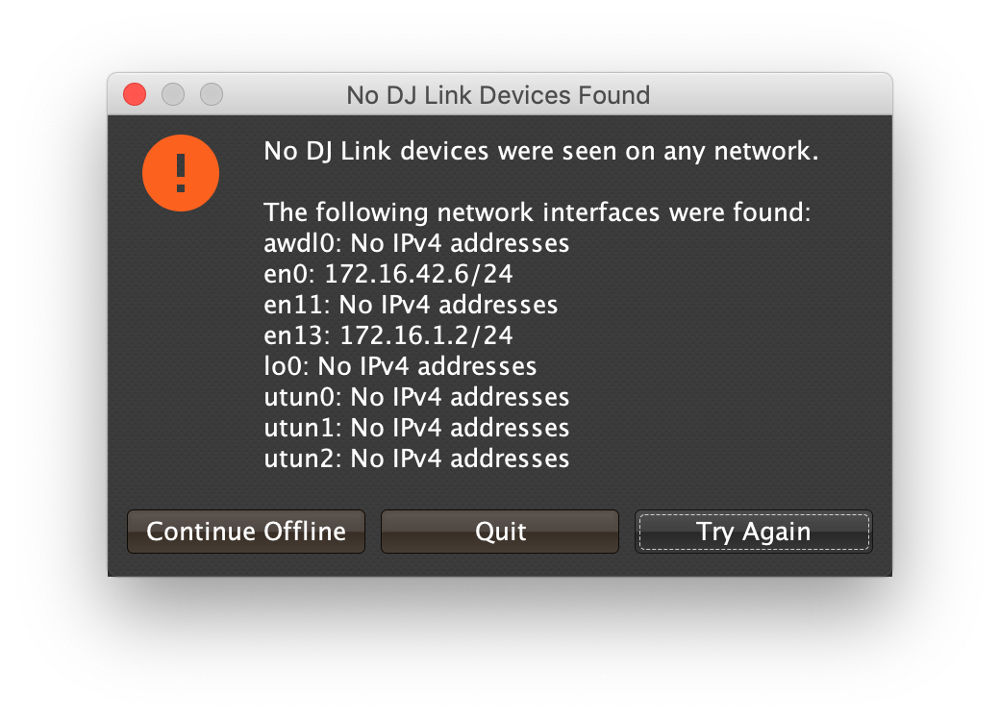

= Beat Link Trigger User Guide
James Elliott <james@deepsymmetry.org>
:icons: font
:experimental:

// Set up support for relative links on GitHub; add more conditions
// if you need to support other environments and extensions.
ifdef::env-github[:outfilesuffix: .adoc]

== Startup

When you first open Beat Link Trigger, it tries to find the Pro DJ
Link devices that you want it to monitor. If it can't find any, after
ten seconds you will see this window:

If you were expecting to find devices, double-check that they are
powered on, and properly connected to your computer (and that any hub
or wireless router you are using is also properly turned on and
configured).  Then click kbd:[Try Again] to try again.

If you just wanted to work on setting up your triggers or expressions,
and don't have any actual players handy, you can also click
kbd:[Continue Offline] to work in an offline mode. Your triggers won't
actually fire, but you can do all the configuration and editing that
you need.

Once a device is found, or you choose to continue offline, the Trigger
window opens, in the same configuration that you left it the last time
you used the program.

== Triggers

Each row in the Trigger window defines a single trigger, which watches
a player or category of players, and can be configured to send
different messages in response to what the player is doing. Here are
the sections of a trigger, and how they work:

=== Comment

The Comment field is a free-form text area you can use to describe the
purpose of the trigger, to remind you when you later come back to it.

=== Watch Menu

The Watch menu tells the trigger what player(s) it should pay
attention to. It lets you choose Player 1 through Player 4,
as well as two special choices.

NOTE: If a player is chosen which is not currently present on the
network, the player will be reported missing, and the trigger will not
operate until either the player reappears, or a different player is
chosen. Of course when you are working in Offline mode, all players
will be missing and the trigger will simply say Offline.

==== Any Player

If you choose to watch Any Player, then just as you would expect, the
trigger will respond to activity on any player in the network. It will
track whatever player seems "best" at the moment: If there is an
Enabled Filter expression which causes the trigger to be enabled for
some players and not for others, it will watch the players that enable
it. Within that group, if one player is playing and the others are
not, it will watch the one that is playing. Finally, if there are
still multiple players to choose between, it will pick the
lowest-numbered one.

==== Master Player

If you choose to watch the Master Player, the trigger will focus on
whichever player is the current Tempo (sync) Master.

==== Player Status

Right after the Watch menu, the trigger row displays the current
status received from the watched player.

=== MIDI Output

(To be continued from here...)

== Expressions

A great deal of the power of Beat Link Trigger is in what you can do
with custom expressions.

WARNING: If you are playing with this already, please be aware it
is not finished, and you are getting a sneak preview with no
schedule or guarantees!

== Logs

== Inspecting Locals and Globals

== Saving and Loading

=== Exporting and Importing Triggers
