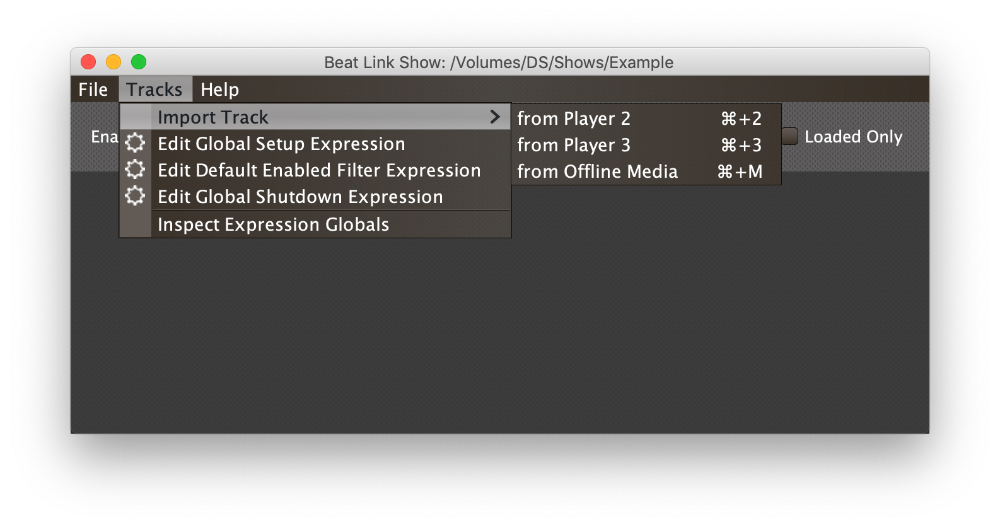
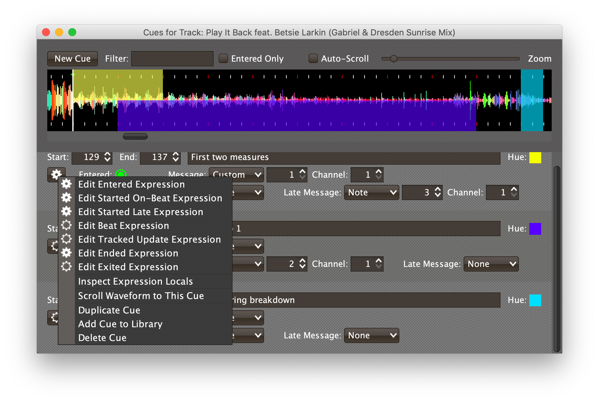

= Shows
James Elliott <james@deepsymmetry.org>
:icons: font
:toc:
:experimental:
:toc-placement: preamble
:toclevels: 3
:guide-top: README

// Set up support for relative links on GitHub, and give it
// usable icons for admonitions, w00t! Add more conditions
// if you need to support other environments and extensions.
ifdef::env-github[]
:outfilesuffix: .adoc
:tip-caption: :bulb:
:note-caption: :information_source:
:important-caption: :heavy_exclamation_mark:
:caution-caption: :fire:
:warning-caption: :warning:
endif::env-github[]

// Render section header anchors in a GitHub-compatible way when
// building the embedded user guide.
ifndef::env-github[]
:idprefix:
:idseparator: -
endif::env-github[]

Watch for beat ranges of specific tracks to be played, and send things
like MIDI or OSC messages in response.

== Overview

Version 0.5 of Beat Link Trigger introduced a major new set of user
interface features called the Show interface, which make it far easier
to match tracks, and cause things to happen when particular beat
ranges in those tracks are played.

All of these things could be done before the Show interface (and
several people put together quite sophisticated shows) using basic
Triggers, but they involved writing a great many custom Expressions to
match the tracks and watch for the right beats, and were very tedious
to figure out, requiring lots of time hooked up to CDJs during the
design process.

Also, there is a practical limit to how many Triggers you can have in
your file, because each one gets considered in sequence whenever a
packet is received from a player. The limit may be a few dozen, or
many more, but eventually your CPU will be get busy just evaluating
triggers. The Show interface doesn't have this limitation--it uses a
sophisticated and efficient mechanism for recognizing tracks, and
allows you to add thousands of tracks to your Shows. Tracks in a Show
will not put any load on your CPU until they are actually loaded in a
player.

Finally, because tracks can be added to a Show either from players on
the network, or by reading them directly from your rekordbox USB or SD
media, you can set up your Shows, draw cues on the tracks' beat grids,
with reference to their waveforms, and configure the messages you want
the cues to send, even in situations where you don't have access to
CDJs. Almost all of the Show interface features are fully functional
when Beat Link Trigger is operating in Offline mode, and the ones that
don't make sense are simply hidden from view. This supports a flexible
and convenient workflow.

== Creating a Show

To use the Show interface, you start by choosing menu:File[New Show]
in the Beat Link Triggers window.

image:assets/NewShow.png[New Show option,314,210]

This opens a Save dialog where you choose the location and name of
your new Show file. Navigate to where you would like to keep it, type
a name, and click kbd:[Save].

image:assets/NewShow2.png[New Show Save dialog,660,460]

Beat Link Trigger will create a new, empty Show file for you with your
chosen name, and open its window. If you quit with a Show window open,
it will automatically be reopened the next time you start the program.
You can have multiple Show windows open at the same time, in case you
want to organize your cues into separate groups for controlling
different kinds of integrations (such as perhaps laser cues in one
Show, and video cues in another) and each one will be reopened
automatically and run independently. You can tailor which Shows you
open based on which hardware is being used for a given performance.

image:assets/NewShowWindow.png[Empty Show window,793,418]

=== Show Window Header Elements

At the top of the Show window, above any Tracks that you have added to
it, is a header that allows you to configure the default Enabled
filter (explained <<Shows#enabled-menu,below>>), and to filter which
Tracks are currently visible, which is helpful when you have added a
lot of them to the Show.

If you type any text in the `Filter` box, only tracks that match that
text will be visible. Similarly, if you check the `Loaded Only`
checkbox, only tracks that are currently loaded on a player on the
network will be visible. This is a great way to narrow down your focus
to watch what is going on with tracks the DJ is currently playing.

TIP: The `Loaded Only` checkbox is only visible when Beat Link Trigger
is Online, because otherwise there is no way tracks could be
identified as loaded.

=== Show Menu Bar

The Show window has its own menu bar with commands that apply to the
Show as a whole.

Beat Link Trigger automatically saves the Show when you exit normally,
but if you are concerned that your computer might crash and want to
avoid the risk of losing data, you can manually save it by choosing
menu:File[Save]. You can also save a copy to a different file at any
time using menu:File[Save a Copy].

If you want to stop working with a show, and don't want Beat Link
Trigger to automatically open it the next time you launch the program,
choose menu:File[Close].

The menu:Tracks[] Menu allows you to add tracks to the show, as
discussed in the <<Shows#adding-tracks,next section>>, and to edit
expressions that customize the show as a whole, as described in the
<<Expressions#show-global-expressions,Expressions section>>.

The menu:Inspect Expression Locals[] option allows you to explore any
values that have been set up by expressions to share across the entire
Show. See <<Debugging#inspecting,Inspecting Locals and Globals>> for
more details.

The menu:Help[] Menu is the same as in the Triggers window, providing
a variety of helpful information and shortcuts for getting support.

[[adding-tracks]]
=== Adding Tracks to a Show

Shows don't do anything until they include at least one Track. There
are a number of different ways you can add Tracks to your Show. Most
of them can be found by choosing menu:Tracks[Import Track] in the Show
window menu bar:

If you are currently Online, and there are any players on the network
that have rekordbox tracks loaded that are not already part of the
Show, you will see them as options in the menu. Choosing
menu:Tracks[Import Track>from Player 2] (for example) will download
that track from the player, and add everthing needed to work with the
it to the Show file (the elements of a Track row are explained
<<Shows#track-row-elements,below>>, after the other ways of adding
them to a Show).

image:assets/FirstTrackLoaded.png[First track loaded into Show,1009,466]

To help avoid confusion, rather than simply having the player
disappear from the list of import choices if the track it has loaded
is already part of the Show, the menu option is disabled and an
explanation is added:

To make it possible to set up your Show even when you don't have
access to your player network, you can also import Tracks directly
from rekordbod USB or SD media. To do that, mount the media on your
computer, and choose menu:Tracks[Import Track>from Offline Media]. An
Choose Media dialog will appear, from which you can navigate to the
media:

Once you click kbd:[Choose Media], the exported database is parsed,
and a Choose Track window is presented, which is very similar to the
<<Players#loading-playing,Loading and Playing Tracks>> interface
offered by the Player Status window (see that section for details
about how to navigate the interface and use the Search feature):

Once you have found the Track you are looking for, click kbd:[Choose
Track] to add it to the Show.

image:assets/SecondTrackLoaded.png[Second track loaded into Show,1005,589]

TIP: To save time, once you have chosen media to load tracks from
during a Beat Link Trigger session, your media choice is remembered
(and the parsed database export is kept open), so the next time you
choose to import from offline media, the media selection window is
skipped and you are taken right to the track selection window. If you
want to import from different media, click the kbd:[Change Media]
button at the bottom of the window. This also means you will not be
able to eject the media on most operating systems because BLT has it
open; if you do need to eject it without quitting BLT, choose
menu:Tracks[Import Track>from Offline Media], click kbd:[Change
Media], and it will be closed so you can eject it. At that point you
can click kbd:[Cancel] if you did not actually want to import a Track.

The final way to add a Track to a Show is to copy it from another
Show. When you have multiple Show windows open, you can copy Tracks
from one to another by finding the Track in the open Show that already
contains it, then choosing menu:Copy to Show “<name>”[] in the Track's
context menu:

TIP: If you don't see an open Show in the `Copy to` list, that means
the Track is already present in the other Show.

[[track-row-elements]]
== Track Row Elements

Tracks are kept sorted alpahabetically by title and artist in the Show
window (and remember that you can narrow the display to include only
those matching a string you type in the `Filter` field). If there is
album art available, it is shown at the top left. To the right of that
is a column that shows the track title, artist, a comment field, and
information about which players have the track loaded, and which are
currently playing it.

=== Comment Field

The comment field starts out holding whatever comment the DJ entered
about the track in rekordbox, but you are free to edit it however you
like, to help you remember things about the track or to make it easy
to find using the `Filter` field.

=== Waveform Preview

The waveform preview section shows the overall intensity and dominant
frequencies of the track from beginning to end. As in the Player
Status window, you can see the locations of hot cues and memory points
in the waveform preview, and if any players have the track loaded, you
can see their playback position markers. (Unlike in the Player Status
window, you may see more than one player position on a single track,
because the same track might be loaded in more than one player.) The
tick marks along the bottom each represent one minute of playback time.

Along the bottom of the track row you find the controls that let you
configure how you want the Show to respond to the track.

[[track-context-menu-button]]
=== Context Menu Button

This allows you to access the track Context Menu with a regular mouse
click. The gear inside the button will be filled in if there have been
any Cues or Expressions added to the Track, and hollow otherwise. The
contents of the menu itself are described
<<Shows#track-context-menu,below>>.

=== MIDI Output Menu

The menu:MIDI Output[] Menu lets you choose the MIDI device to which
the trigger will send messages when you configure it to send MIDI
messages for particular events. It will show all MIDI outputs
currently available on your system.

The chosen MIDI output will be used for all messages that the Track
is configured to send, including those belonging to any Cues created
in the Track. But each Track can have its own MIDI output, in case
you have a large show with many cues.

NOTE: As with the MIDI Output Menu in the
<<Triggers#midi-output-menu,Triggers window>>, if a MIDI Output is
chosen which is no longer available on the system, it will remain in
that Track's menu, but the Enabled section of the Track will be
replaced with the message “Not found.” Once the output reappears, or a
different output is chosen, the Track will become operational again.

=== Loaded Status

To the right of the MIDI Output menu there is a Loaded Status
indicator which has two parts. The outer ring indicates whether the
Track is currently enabled (a green circle) or disabled (a red circle
with a slash). If any player currently has the Track loaded, there is
a filled circle inside the enabled indicator ring:

[width="50%",cols=".^,^.^",options="header"]
|===
|State
|Indicator

|Disabled, Not Loaded
|image:assets/Disabled.png[Disabled,52,52]

|Enabled, Not Loaded
|image:assets/Enabled.png[Enabled,52,52]

|Disabled, Loaded
|image:assets/DisabledPlaying.png[alt=Disabled, Playing,width=52,height=52]

|Enabled, Loaded
|image:assets/EnabledPlaying.png[alt=Enabled, Playing,width=52,height=52]

|===

NOTE: Tracks are recognized by their _signature_, a cryptographic hash
calculated from their title, artist, duration, waveform, and beat
grid. This is taken care of by the `SignatureFinder` class in Beat
Link, which allows them to be efficiently detected and indexed within
the Show, and means that even if you have a variety of remixes of the
same track, they should all be recognized correctly.

=== Loaded Message Menu

The menu:Loaded Message[] Menu determines what kind of MIDI message is
sent when the Track first becomes loaded by any player (as long as the
Track is Enabled, as described below), or when the track is unloaded
by the last player that had loaded it.

image:assets/LoadedMessageMenu.png[Loaded Message Menu,1005,625]

None:: With this setting, which is the default, nothing is sent when
the Track loads or unloads.footnote:none[Note that this is different
from low-level Triggers, which always send something--you need to
remember to pick the kind of message to be sent for any Show events
that you want to respond to.] When `None` is chosen, there are no
interface elements visible to configure the event. They will appear
once you choose an event type to send.

Note:: With this setting, the Show sends a Note On message, with
velocity 127 and the note number shown to the right of the menu, when
the Track gets loaded onto the first player (as long as the Track is
enabled), and a Note Off message when the last player unloads the
Track, or the Track is disabled.
+

+
The Channel on which the Loaded/Unloaded messages are sent is
configured just to the right of the note selector.

CC:: With this setting, the Show sends a Control Change message,
with value 127 and the controller number shown to the right of the
menu, when the the Track is loaded (as long as it is enabled), and
sends a CC with value 0 when the Track is unloaded or becomes
disabled.

Custom:: When this option is chosen, you can send any kind of message
you want when the Track loads and/or unloads, by writing code as
described in the <<Expressions#show-track-expressions,Expressions>>
section. This gives you the most flexibility because in addition to
MIDI messages, you can send arbitrary UDP packets, HTTP requests, or
whatever you might need. The expression editors for the Loaded
Expression and Unloaded Expression are accessed through the
<<Shows#track-context-menu,track context menu>>.
+
If you choose `Custom` and have not yet written a Loaded expression,
the expression editor will be opened to let you do that. You can
also open that editor using the <<Shows#track-context-menu,track
context menu>>.

==== Loaded Note/Controller Spinner

Found immediately to the right of the menu:Loaded Message[] Menu (unless
`None` is chosen as the Message type), this field lets you set the MIDI
note number used for Note-based  loaded and unloaded messages, or the
controller number used for Control Change-based loaded and unloaded
messages. The value is also available to your Track expressions if they
want to use it.

==== Loaded Channel Spinner

As described above, this lets you specify the MIDI channel on which
loaded/unloaded messages are sent for this Track.

=== Playing Status

To the right of the Loaded Message section there is a Playing Status
indicator. As with the Loaded Status indicator, it has an outer ring
which shows whether the Track is currently enabled (a green circle) or
disabled (a red circle with a slash). If any player is currently
playing the Track, there is a filled circle inside the enabled
indicator ring:

[width="50%",cols=".^,^.^",options="header"]
|===
|State
|Indicator

|Disabled, Not Playing
|image:assets/Disabled.png[Disabled,52,52]

|Enabled, Not Playing
|image:assets/Enabled.png[Enabled,52,52]

|Disabled, Playing
|image:assets/DisabledPlaying.png[alt=Disabled, Playing,width=52,height=52]

|Enabled, Playing
|image:assets/EnabledPlaying.png[alt=Enabled, Playing,width=52,height=52]

|===

=== Playing Message Menu

The menu:Playing Message[] Menu determines what kind of MIDI message is
sent when the first player starts playing the Track (as long as the
Track is Enabled, as described below), or when the last player that
was playing the track stops.

None:: With this setting, which is the default, nothing is sent when
the Track starts or stops playing.footnote:none[] When `None` is
chosen, there are no interface elements visible to configure the
event. They will appear once you choose an event type to send, as
shown in the screen shot above.

Note:: With this setting, the Show sends a Note On message, with
velocity 127 and the note number shown to the right of the menu, when
some player starts playing the Track (as long as the Track is
enabled), and a Note Off message when the last player playing it
stops, or the Track is disabled.
+
The Channel on which the Started/Stopped messages are sent is
configured just to the right of the note selector.

CC:: With this setting, the Show sends a Control Change message,
with value 127 and the controller number shown to the right of the
menu, when the the Track starts playing (as long as it is enabled), and
sends a CC with value 0 when the Track is stopped or becomes
disabled.

Custom:: When this option is chosen, you can send any kind of message
you want when the Track starts and/or stops, by writing code as
described in the <<Expressions#track-playing-expression,Expressions>>
section. This gives you the most flexibility because in addition to
MIDI messages, you can send arbitrary UDP packets, HTTP requests, or
whatever you might need.
+
If you choose `Custom` and have not yet written a Playing expression,
the expression editor will be opened to let you do that. You can
also open that editor using the <<Shows#track-context-menu,track
context menu>>.

==== Playing Note/Controller Spinner

Found immediately to the right of the menu:Playing Message[] Menu (unless
`None` is chosen as the Message type), this field lets you set the MIDI
note number used for Note-based  started and stopped messages, or the
controller number used for Control Change-based started and stopped
messages. The value is also available to your Track expressions if they
want to use it.

==== Playing Channel Spinner

As described above, this lets you specify the MIDI channel on which
started/stopped messages are sent for this Track.

[[enabled-menu]]
=== Enabled Menu

The menu:Enabled[] menu controls whether the Show will react to
players doing things with the Track.

Default:: With this setting, which will be used by most Tracks, the
Show's shared menu:Enabled Default[] menu (at the top of the window)
is used. This allows you to enable and disable most or all tracks
using a common set of rules, while special tracks that need to be
different can still use their own settings. All of the options in this
list (except for `Default` itself) are available in the Enabled
Default menu, and have the same meaning there, being used by any
Tracks whose own Enabled menu is set to `Default`.

Never:: With this setting, the Track is disabled until you re-enable
it.

On-Air:: With this setting, the Track is enabled whenever it is
loaded by at least one player that reports that it is On the Air. (For
that to work, the player must be connected to a Nexus mixer, and must
have the feature turned on.)

Master:: With this setting, the Track is enabled whenever it is loaded
by the player that is the current Tempo Master.

Custom:: With this setting, the Track is controlled by an Enabled
Filter, Clojure code that you write yourself. Whenever a status update
is received from any player, your expressions are evaluated. If the
last expression in your filter returns a `true` value, the Track will
be enabled. This lets you apply sophisticated logic, like enabling the
Track when another track is loaded into a different player, or only
during particular times of day. Expressions are further explained in
the <<Expressions#track-enabled-filter-expression,Expressions>>
section. If you choose `Custom` and have not yet written an Enabled
Filter expression, the expression editor will be opened to let you do
that. You can always open that editor using the Track Context Menu,
described in the next section.

Always:: With this setting, the Track is enabled until you disable
it.

[[track-context-menu]]
=== Track Context Menu

Each Track row has a context menu attached to it, which can be
accessed by right-clicking (or control-clicking) anywhere on the row's
background, but you can also open the context menu with a regular
mouse click on the button with a gear icon in it. Most of the menu is
devoted to editing various expressions to customize the Track, as
described in the <<Expressions#show-track-expressions,Expressions
section>>. The gear icon next to an expression will be filled in if
that expression has a value, and the gear in the button will be filled
in if any expression associated with the Track has a value, or if
there are any Cues in the Track.

The first option in the menu, menu:Edit Track Cues[], opens the Cues
window for the Track, which is how you can create Cues that respond to
particular beat ranges in the Track, as discussed in the
<<Shows#editing-cues,next section>>.

Below that come the expression-related options, allowing you to open
editors to create or edit Clojure code that runs at well-defined
moments to customize the behavior of the Track. These are followed by
the menu:Inspect Expression Locals[] option, which allows you to
explore any values that have been set up by expressions in the Track
to re-use or share with each other. See
<<Debugging#inspecting,Inspecting Locals and Globals>> for more
details.

As mentioned at the end of the <<Shows#adding-tracks,Adding Tracks
section>>, if you have more than one Show window open, and you bring
up the context menu for a Track that does not exist in one of the
other Shows, you will see an option to copy it to that Show.

Finally, the menu:Delete Track[] option does just what it sounds like,
after confirming that you want to discard any expressions and Cues you
have set up for that Track.

[[editing-cues]]
== Editing Track Cues

Tracks have settings and expressions that allow you to make things
happen when they load or start and stop playing, but you will often be
interested in more specific _parts_ of the track being played. That's
where Cues come in. To add Cues to a Track, choose
menu:Edit Track Cues[] in the Track's context menu, as described in the
previous section. That will open a new window for viewing and editing
details about that Track's Cues:

Before introducing the various ways to add Cues to the track, let's
explore the features available at the top of the window.

=== Cues Window Header Elements

At the top of the Cues window, above any Cues that you have added to
it, is a header that shows a scrollable and zoomable view of the track
waveform and beat grid, much like the one that appears in the
<<Players#overview,Player Status Window>>, except that you can
manually scroll this one to the section you want to see regardless of
whether any players are currently playing it. If any are, you will
see their playback position(s) marked on the waveform as illustrated
above, but they will not cause the waveform to scroll to follow them
unless you check the `Auto-Scroll` checkbox. Although you wont't want
to do that when you are editing cues, it can be nice when running a
show, as it makes it easy to follow along as Cues approach and run.

The kbd:[New Cue] button creates a new cue on the first beat of the
Track, unless you have selected a beat range first as described below.

As with the Show window, if you type any text in the `Filter` box,
only Cues that match that text will be visible. Similarly, if you
check the `Entered Only` checkbox, only Cues that currently have a
player positioned inside them will be visible. This is a great way to
narrow down your focus to watch what is going on with cues the DJ is
currently playing.

TIP: The `Entered Only` and `Auto-Scroll` checkboxes are only visible
when Beat Link Trigger is Online, because they only make sense in the
context of being able to detect that a player has loaded the track.

[[adding-cues]]
=== Adding Cues to a Track

The Cues window doesn't do much until you add at least one Cue. As
mentioned above, you can use the kbd:[New Cue] button to do this, and
then edit the cue to position it where you want it, but it is easier
to specify where you want it on the beat grid first. To do that,
you can click and drag in the waveform view to highlight the beats
that you want the Cue to run for. Dragging over the eight beats
past where the player was cued in the above example sets up a
selection like this:

If your aim was slightly off, you can drag the edges of the selection
to adjust them, as suggested by the cursor in the image above, or you
can shift-click to grow or shrink the cue, perhaps after scrolling
the wavform to a different section. Also remember that you can adjust
the Zoom slider to make it easier to position your cue.

Alternately, you can click to select a single beat, then shift-click
another to specify the entire range without dragging. If you created
a beat selection by accident and want to get rid of it, you can either
drag it back down to nothing, or shift-click a different beat and then
shift-click it again to deselect it.

Regardless of how you do it, once you have the right beats selected,
clicking the kbd:[New Cue] button will create a new cue covering
the chosen beats:

== Cue Row Elements

=== Start and End Spinners

You can see and adjust the beats on which the Cue starts and ends
using these two fields, either by typing new values, or clicking the
arrows. However, it is probably even more convenient to simply drag
the edges of the cue in the waveform, which also works.

The End must always be at least one beat past the Start, and neither
can extend outside the beat grid of the Track.

=== Cue Name

To help understand the purpose of the cue, you can give it a name. The
default is `Untitled` (with a numeric suffix if needed to keep it
distinct), but as soon as the cue is created, the Name field is
selected and ready for you to type something more meaningful. For this
example, we'll type "First two measures", since we placed the cue at
the point where this track begins playback after being loaded.

The cue name also appears as a tool tip when you hover the mouse
pointer over the cue in the waveform:

=== Cue Hue

Cues are assigned distinct hues when they are created to help you tell
them apart (and to tie the cue in the waveform to the corresponding
detail row below), but you can also assign each cue a specific hue if
that helps organize your show by clicking the `Hue` swatch in the Cue
row. That will bring up a color picker window wher you can choose the
exact hue you want.

If cues overlap each other, Beat Link Trigger draws them in separate
lanes to make it easier to tell where each begins and ends. It can
handle even very complex sets of overlapping cues, adjusting them
into a minimal set of lanes. Here's an example of what it would look
like if we added a second cue called “Video Clip 1” that overlaps
part of our first cue:

Cues are also visible, and show their names as tool tips, in the
waveform preview drawn in Track rows in the Show window, so you don't
even need to open the Cues Editor for a quick reminder of what cues
are coming up:

In both waveforms, <<Shows#entered-status,Entered>> Cues are whitened
slightly and <<Shows#started-status,Started>> Cues are whitened even
more as a visual indicator of their state.

[[cue-context-menu-button]]
=== Context Menu Button

Below the first row of cue configuration elements there is a gear
button that allows you to access the cue's Context Menu with a regular
mouse click. The gear will be filled in if any Expressions have been
added to the Cue, and hollow otherwise. The contents of the menu
itself are described <<Shows#cue-context-menu,below>>.

[[entered-status]]
=== Entered Status

To the right of the context menu button there is an Entered Status
indicator which has two parts. The outer ring indicates whether the
Cue's Track is currently enabled (a green circle) or disabled (a red
circle with a slash). If any player is currently positioned anywhere
inside the Cue, there is a filled circle inside the enabled indicator
ring:

[width="50%",cols=".^,^.^",options="header"]
|===
|State
|Indicator

|Disabled, Not Entered
|image:assets/Disabled.png[Disabled,52,52]

|Enabled, Not Entered
|image:assets/Enabled.png[Enabled,52,52]

|Disabled, Entered
|image:assets/DisabledPlaying.png[alt=Disabled, Playing,width=52,height=52]

|Enabled, Entered
|image:assets/EnabledPlaying.png[alt=Enabled, Playing,width=52,height=52]

|===

=== Entered Message Menu

The menu:Entered Message[] Menu determines what kind of MIDI message
is sent when the first player moves into the cue (as long as the Cue's
Track is Enabled), or when the last player that had been positioned
inside the cue moves out of it.

NOTE: The player does not need to actually be playing for
Entered/Exited messages to be sent: if the track loads and the player
auto-cues within the Cue, or the DJ uses cue/loop call, needle jump,
the jog wheel, or search to move into or out of the cue, its state
will update and the appropriate messages will be sent.

None:: With this setting, which is the default, nothing is sent when
the Track loads or unloads.footnote:none[] When `None` is chosen,
there are no interface elements visible to configure the event. They
will appear once you choose an event type to send.

Note:: With this setting, the Show sends a Note On message, with
velocity 127 and the note number shown to the right of the menu, when
the first player moves inside the Cue (as long as the Cue's Track is
enabled), and a Note Off message when the last player that had been
inside the Cue moves back out of it, or the Track is disabled.
+

+
The Channel on which the Entered/Exited messages are sent is
configured just to the right of the note selector.

CC:: With this setting, the Show sends a Control Change message, with
value 127 and the note number shown to the right of the menu, when the
first player moves inside the Cue (as long as the Cue's Track is
enabled), and a CC with value 0 when the last player that had been
inside the Cue moves back out of it, or the Track is disabled.

Custom:: When this option is chosen, you can send any kind of message
you want when the Cue is entered and/or exited, by writing code as
described in the <<Expressions#show-cue-expressions,Expressions>>
section. This gives you the most flexibility because in addition to
MIDI messages, you can send arbitrary UDP packets, HTTP requests, or
whatever you might need. The expression editors for the Entered
Expression and Exited Expression are accessed through the
<<Shows#cue-context-menu,cue context menu>>.
+
If you choose `Custom` and have not yet written a Entered expression,
the expression editor will be opened to let you do that. You can
also open that editor using the <<Shows#cue-context-menu,cue
context menu>>.

==== Entered Note/Controller Spinner

Found immediately to the right of the menu:Entered Message[] Menu (unless
`None` is chosen as the Message type), this field lets you set the MIDI
note number used for Note-based  entered and exited messages, or the
controller number used for Control Change-based entered and exited
messages. The value is also available to your Cue expressions if they
want to use it.

==== Entered Channel Spinner

As described above, this lets you specify the MIDI channel on which
entered/exited messages are sent for this Cue.

[[started-status]]
=== Started Status

Below the Entered Status indicator there is an Started Status
indicator. Like the Entered Status indicator, it has two parts. The
outer ring indicates whether the Cue's Track is currently enabled (a
green circle) or disabled (a red circle with a slash). If any player
is currently playing inside the Cue, there is a filled circle inside
the enabled indicator ring:

[width="50%",cols=".^,^.^",options="header"]
|===
|State
|Indicator

|Disabled, Not Started
|image:assets/Disabled.png[Disabled,52,52]

|Enabled, Not Started
|image:assets/Enabled.png[Enabled,52,52]

|Disabled, Started
|image:assets/DisabledPlaying.png[alt=Disabled, Playing,width=52,height=52]

|Enabled, Started
|image:assets/EnabledPlaying.png[alt=Enabled, Playing,width=52,height=52]

|===

=== Started On-Beat Message Menu

The menu:Started On-Beat Message[] Menu determines what kind of MIDI
message is sent when the first player begins playing the Cue, as long
as it does so from the very first beat of the Cue (and as long as the
Cue's Track is enabled), or when the last player that had been playing
inside the cue moves out of it or the Track becomes disabled, if it
was started on its first beat.

None:: With this setting, which is the default, nothing is sent when
the Cue starts on its first beat or ends after having started that
way.footnote:none[] When `None` is chosen, there are no interface
elements visible to configure the event. They will appear once you
choose an event type to send.

Note:: With this setting, the Show sends a Note On message, with
velocity 127 and the note number shown to the right of the menu, when
the first player starts playing the Cue from its first beat (as long
as the Cue's Track is enabled), and a Note Off message when the last
player that had been playing the Cue stops doing so, or the Track is
disabled (as long as the Cue started playing from its first beat).
+

+
The Channel on which the Started On-Beat/Ended messages are sent is
configured just to the right of the note selector.

CC:: With this setting, the Show sends a Control Change message, with
value 127 and the note number shown to the right of the menu, when the
first player starts playing the Cue from its first beat (as long as
the Cue's Track is enabled), and a CC with value 0 when the last
player that had been playing the Cue stops doing so, or the Track is
disabled (as long as the Cue started playing from its first beat).

Custom:: When this option is chosen, you can send any kind of message
you want when the Cue is started on-beat and/or ended from that state,
by writing code as described in the
<<Expressions#show-cue-expressions,Expressions>> section. This gives
you the most flexibility because in addition to MIDI messages, you can
send arbitrary UDP packets, HTTP requests, or whatever you might need.
The expression editors for the Started Expression and Ended Expression
are accessed through the <<Shows#cue-context-menu,cue context menu>>.
+
If you choose `Custom` and have not yet written a Started On-Beat
expression, the expression editor will be opened to let you do that.
You can also open that editor using the <<Shows#cue-context-menu,cue
context menu>>.

==== Started On-Beat Note/Controller Spinner

Found immediately to the right of the menu:Started On-Beat Message[]
Menu (unless `None` is chosen as the Message type), this field lets
you set the MIDI note number used for Note-based started on-beat and
ended messages, or the controller number used for Control Change-based
started on-beat and ended messages. The value is also available to
your Cue expressions if they want to use it.

==== Started On-Beat Channel Spinner

As described above, this lets you specify the MIDI channel on which
started on-beat/ended messages are sent for this Cue.

=== Started Late Message Menu

The menu:Started Late Message[] Menu determines what kind of MIDI
message is sent when the first player begins playing the Cue, as long
as it missed playing the very first beat of the Cue (and as long as the
Cue's Track is enabled), or when the last player that had been playing
inside the cue moves out of it or the Track becomes disabled, if it
was started somewhere after its first beat.

None:: With this setting, which is the default, nothing is sent when
the Cue starts after its first beat or ends after having started that
way.footnote:none[] When `None` is chosen, there are no interface
elements visible to configure the event. They will appear once you
choose an event type to send.

Note:: With this setting, the Show sends a Note On message, with
velocity 127 and the note number shown to the right of the menu, when
the first player starts playing the Cue from somewhere past its first
beat (as long as the Cue's Track is enabled), and a Note Off message
when the last player that had been playing the Cue stops doing so, or
the Track is disabled (as long as the Cue started playing after its
first beat).
+

+
The Channel on which the Started Late/Ended messages are sent is
configured just to the right of the note selector.

CC:: With this setting, the Show sends a Control Change message, with
value 127 and the note number shown to the right of the menu, when the
first player starts playing the Cue from somewhere past its first beat
(as long as the Cue's Track is enabled), and a CC with value 0 when
the last player that had been playing the Cue stops doing so, or the
Track is disabled (as long as the Cue started playing after its first
beat).

Custom:: When this option is chosen, you can send any kind of message
you want when the Cue is started late and/or ended from that state,
by writing code as described in the
<<Expressions#show-cue-expressions,Expressions>> section. This gives
you the most flexibility because in addition to MIDI messages, you can
send arbitrary UDP packets, HTTP requests, or whatever you might need.
The expression editors for the Started Expression and Ended Expression
are accessed through the <<Shows#cue-context-menu,cue context menu>>.
+
If you choose `Custom` and have not yet written a Started Late
expression, the expression editor will be opened to let you do that.
You can also open that editor using the <<Shows#cue-context-menu,cue
context menu>>.

==== Started Late Note/Controller Spinner

Found immediately to the right of the menu:Started Late Message[]
Menu (unless `None` is chosen as the Message type), this field lets
you set the MIDI note number used for Note-based started late and
ended messages, or the controller number used for Control Change-based
started late and ended messages. The value is also available to
your Cue expressions if they want to use it.

==== Started Late Channel Spinner

As described above, this lets you specify the MIDI channel on which
started late/ended messages are sent for this Cue.

[[cue-context-menu]]
=== Cue Context Menu

Each Cue row has a context menu attached to it, which can be accessed
by right-clicking (or control-clicking) anywhere on the row's
background, but you can also open the context menu with a regular
mouse click on the button with a gear icon in it. Most of the menu is
devoted to editing various expressions to customize the Cue, as
described in the <<Expressions#show-cue-expressions,Expressions
section>>. The gear icon next to an expression will be filled in if
that expression has a value, and the gear in the button will be filled
in if any expression associated with the Cue has a value.

The menu starts with the expression-related options, allowing you to
open editors to create or edit Clojure code that runs at well-defined
moments to customize the behavior of the Cue. These are followed by
the menu:Inspect Expression Locals[] option, which allows you to
explore any values that have been set up by expressions in any Cue or
the Track itself to re-use or share with each other. See
<<Debugging#inspecting,Inspecting Locals and Globals>> for more
details.

Choosing menu:Scroll Waveform to This Cue[] does just what it sounds
like, ensuring that the cue is visible in the waveform display at the
top of the window. You can zoom the waveform out if you want to be
able to see more cues and context, or in if you want to see more
detail. See <<Shows#navigating-cues,Navigating Cues>> below for more
ways to find what you are looking for.

The menu:Duplicate Cue[] option makes a copy of the chosen Cue,
appending the word “Copy” (and possibly a number) to its name to keep
it unique. You can use this if you need to create several cues that
have common elements.

Finally, the menu:Delete Cue[] option does just what it sounds like,
after confirming that you want to discard any expressions and settings
you have configured for that Cue.

[[navigating-cues]]
== Navigating Cues

Beat Link Trigger tries to make it easy for you to find the cue you
want to work with. Here are some of the things that it does
automatically, and others you will likely find helpful to try when
working with a large number of cues.

* The list of cues is kept sorted by their start and end beats (and
  then their names, if you have multiple cues starting and ending on
  the same beat).

* You can type text in the `Filter` box at the top of the window to
  narrow the display to only cues whose name contain the text you
  typed.

* You can click the `Entered Only` check box to only show the cues
  that currently have players posititoned in them. This can be handy
  when you are running a show.

* When you create a new Cue, the list of cues is automatically
 scrolled to ensure the new cue is visible. (If your new cue is hidden
 by the `Filter` or `Entered Only` settings, Beat Link Trigger will
 pop up a dialog to remind you why you are not seeing it.)

* You can also scroll a Cue's configuration row into view by clicking
  on the cue in the waveform display at the top of the window.

* Finally, as noted in the Context Menu section above, you can use a
  Cue's context menu to scroll the waveform to reveal the cue within
  the track beat grid.

== Learning More

****

* Continue to <<Link#working-with-ableton-link,Working with Ableton Link>>
* Return to <<{guide-top}#beat-link-trigger-user-guide,Top>>

****

// Once Git finally supports it, change this to: include::Footer.adoc[]
== License

++++++
Copyright © 2016&ndash;2019 http://deepsymmetry.org[Deep Symmetry, LLC]

Distributed under the
http://opensource.org/licenses/eclipse-1.0.php[Eclipse Public License
1.0], the same as Clojure. By using this software in any fashion, you
are agreeing to be bound by the terms of this license. You must not
remove this notice, or any other, from this software. A copy of the
license can be found in
https://github.com/Deep-Symmetry/beat-link-trigger/blob/master/LICENSE[LICENSE]
within this project.

=== Library Licenses

https://sourceforge.net/projects/remotetea/[Remote Tea],
used for communicating with the NFSv2 servers on players,
is licensed under the
https://opensource.org/licenses/LGPL-2.0[GNU Library General
Public License, version 2].

The http://kaitai.io[Kaitai Struct] Java runtime, used for parsing
rekordbox exports and media analysis files, is licensed under the
https://opensource.org/licenses/MIT[MIT License].
