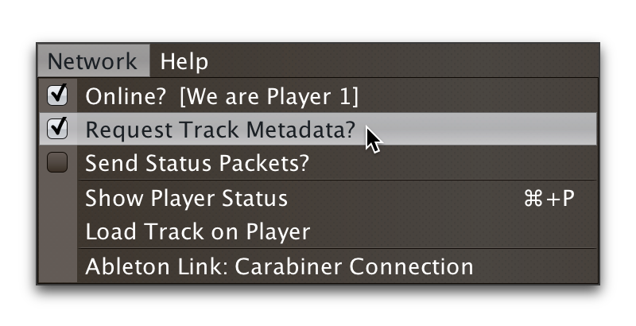
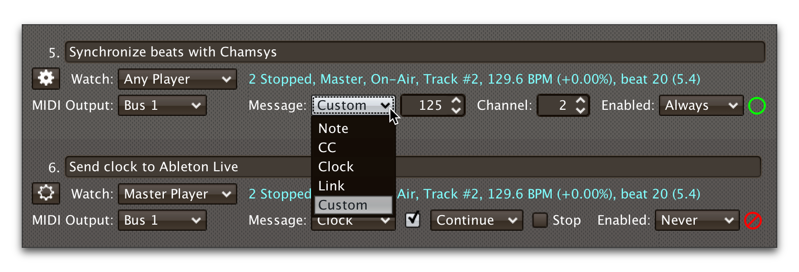

= Triggers
James Elliott <james@deepsymmetry.org>
:icons: font
:toc:
:experimental:
:toc-placement: preamble
:guide-top: v4

// Set up support for relative links on GitHub, and give it
// usable icons for admonitions, w00t! Add more conditions
// if you need to support other environments and extensions.
ifdef::env-github[]
:outfilesuffix: .adoc
:tip-caption: :bulb:
:note-caption: :information_source:
:important-caption: :heavy_exclamation_mark:
:caution-caption: :fire:
:warning-caption: :warning:
endif::env-github[]

// Render section header anchors in a GitHub-compatible way when
// building the embedded user guide.
ifndef::env-github[]
:idprefix:
:idseparator: -
endif::env-github[]

Triggers allow you to watch for a specific kind of activity on one or
more CDJs, and generate events like MIDI notes or OSC messages in
response, or synchronize external systems using MIDI clock or Ableton
Link.

== Overview

Each row in the Trigger window defines a single trigger, which watches
a player or category of players, and can be configured to send
different messages in response to what the player is doing.

If this is the first time you have opened Beat Link Trigger, you will
see just one trigger containing default options.

image:assets/FirstTrigger04.png[First Trigger, 900]

To create additional triggers you can choose `New Trigger` in the
`Triggers` menu, or type kbd:[⌘+T] (on the Mac) or kbd:[Ctrl+T] (on
other platforms). You can get back to this default state at any time
by choosing `Clear Triggers` in the `Triggers` menu.

image:assets/TriggersMenu04.png[Triggers Menu, 392]

== Trigger Elements

Here are the sections of a trigger, and how they work:

=== Comment

The Comment field is a free-form text area you can use to describe the
purpose of the trigger, to remind you when you later come back to it.
Apart from the trigger index, a number by which Beat Link Trigger
identifies the trigger when it is reporting errors or naming related
windows (like expression editors, described <<Expressions#expressions,below>>),
the comment takes up the entire width of the first line of the trigger
row.

=== Watch Menu

The Watch menu tells the trigger what player(s) it should pay
attention to. It lets you choose Player&nbsp;1 through Player&nbsp;4,
as well as two dynamic choices.

image:assets/WatchMenu04.png[Watch Menu, 840]

NOTE: If a player is chosen which is not currently present on the
network, the player will be reported “not found”, and the trigger will
not operate until either the player reappears, or a different player
is chosen. Of course when you are working in Offline mode, all players
will be missing and the trigger will simply say “Offline”.

Any Player:: If you choose to watch Any Player, then just as you would
expect, the trigger will respond to activity on any player in the
network. It will track whatever player seems “best” at the moment: If
there is an <<enabled-menu,Enabled condition>>
which causes the trigger to be enabled
for some players and not for others, it will watch the players that
enable it. Within that group, if some players are playing and others
are not, it will watch the ones that are playing. Finally, if there
are still multiple players to choose between, it will pick the
lowest-numbered one.

Master Player:: If you choose to watch the Master Player, the trigger
will focus on whichever player is the current Tempo (sync) Master.

=== Player Status Summary

Right after the Watch menu, the trigger row displays the player number
and latest status received from the watched player, if one was found.
The status includes the current state of the player, information about
the loaded track, the current effective BPM and relative pitch, and
the number of the current beat.

[NOTE]
====
If a rekordbox-analyzed track was loaded, the database ID of the
track will be displayed, as shown in the figure above, followed by an
indication in square brackets of the player and slot (USB or SD) from
which the track was loaded. That combination (ID number, source player
and slot) will be unique to that track until that media is unloaded
and replaced. IDs are not unique across players and slots.

If another kind of track is loaded (such as an audio CD), instead of
an ID number, its position within its playlist will be shown,
indicated by "#", as shown in the Midi Output Menu figure below.
====

The track ID (along with its source player and slot, if you want to be
safe when you are working with multiple media) can be used to identify
the track and set up fairly sophisticated custom filter expressions,
as described <<matching-tracks,below>>. If one of your expressions
recognizes a track, it can tell Beat Link Trigger to display its name
(or any other text you like) instead of the normal track description
by storing your desired description string under the key
`:track-description` in the trigger `locals` map. Here is an example
of what that could look like, when a track named Apex has been
recognized, and the string `Apex` has been stored under
`:track-description` in the trigger's `locals`:

==== Metadata

Now that Beat Link Trigger can request track metadata from the CDJs,
that is often the most convenient and flexible way of matching tracks.
To enable this feature, check `Request Track Metadata?` in the
`Network` menu:

[NOTE]
====
If you are already online when you turn on `Request Track Metadata?`,
Beat Link Trigger will be using a player number that is not good for
requesting metadata, and will warn you about it, as shown below.

image:assets/Metadata2Players.png[Metadata Player Number with 2 players, 578]

In this situation, the best option is to choose to `Go Offline` (the
default option), and then use the `Online?` option in the `Network`
menu to go back online. Going online with `Request Track Metadata?`
already checked like this will use a good player number for requesting
metadata, and everything will work great.

If you are on a network which already has four physical players
connected, though, you will see a slightly different version of the
warning:

image:assets/Metadata4Players.png[Metadata Player Number with 4 players, 578]

In such cases, as the window suggests, the safest option is to turn
off one of the players and go offline and back online, to reliably get
metadata. If you can't do that, though, you can also choose `Use
Unreliable Metadata`, and it will work as long as not all players are
linked to the same media.

Finally, if you have a single player connected to the network, the
unreliable option doesn't work at all, and you will see the following
choices instead:

image:assets/Metadata1Player.png[Metadata Player Number with 1 player, 562]

In this case, definitely choose `Go Offline`, and when you proceed to
check the `Online?` option in the `Network` menu after that, you will
be able to get metadata from the single player you have connected.
====

When metadata is available for a track, the Player Status section
grows to two lines, and displays the track title and artist on the
second line, without any effort on the part of your trigger code:

image:assets/MetadataStatus.png[Player Status with Metadata, 794]

Your trigger can also change the content of the metadata line by
setting whatever value it wants under the key `:metadata-summary` in
the trigger's `locals`. Metadata values available to your trigger
expressions include `track-artist`, `track-comment`, `track-genre`,
`track-key`, `track-label`, `track-length` (in seconds), and
`track-title`.

[IMPORTANT]
====
There are limitations on when you can reliably obtain metadata.
To be safe, you should not have more than three actual CDJs or other
players on the DJ Link network, so that Beat Link Trigger can assign
itself a device number in the range 1 through 4.

Although you can still try to request metadata when Beat Link Trigger
has to use a device number of 5 or higher, it needs to
&ldquo;borrow&rdquo; one of the actual players&rsquo; device numbers
in order to make the metadata requests. It can't do that at all if
every player has loaded tracks from the SD or USB slot on a single
player. And even when the players have loaded tracks from different
sources, there is a possibility that by borrowing their device
numbers, Beat Link Trigger will confuse them and interfere with the
DJ's ability to use the Link Info feature.

It seems to be safe and reliable to request metadata as long as there
are no more than three other players on the network, so Beat Link
Trigger can reserve a device number from 1 to 4, or as long as the four
players are only loading tracks from rekordbox instead of each other,
because rekordbox will happily reply to metadata requests from device
numbers larger than 5.

In order to be able to work with metadata in a busy performance
environment where DJs are using four physical players and potentially
loading tracks from a single player, you can create and attach a
<<caching-metadata,Metadata Cache>> as described below.

====

=== MIDI Output Menu

The MIDI Output Menu lets you choose the MIDI device to which the
trigger will send messages. It will show all MIDI outputs currently
available on your system.

image:assets/MidiMenu.png[MIDI Output Menu, 810]

NOTE: If a MIDI Output is chosen which is no longer available on the
system (as shown in trigger 3 above), it will remain in that row's
menu, but the Enabled section of the trigger will be replaced with the
message “Not found.” Once the output reappears, or a different output
is chosen, the trigger will become operational again.

=== Message Menu

The Message Menu determines what kind of MIDI message is sent by the
trigger.

Note:: With this setting, the trigger sends a Note On message, with
velocity 127 and the note number shown to the right of the menu, when
the watched player starts playing (as long as the trigger is enabled),
and a Note Off message when the watched player stops or the trigger is
disabled.

CC:: With this setting, the trigger sends a Control Change message,
with value 127 and the controller number shown to the right of the
menu, when the watched player starts playing (as long as the trigger
is enabled), and sends a CC with value 0 when the player stops or the
trigger is disabled.

Clock:: With this setting, the trigger sends MIDI Beat Clock messages
whenever the trigger is enabled, to synchronize the tempo of the
target device with the tempo reported by the watched player. If the
check box to the right of the menu is checked, it will either send a
Start or Continue message (as chosen in the following menu) when the
watched player starts playing, and if the Stop box is checked, it will
send a Stop message when the watched player stops.

Link:: When this option is chosen, the trigger does not send MIDI
messages at all. Instead, when activated, it tries to synchronize an
Ableton Link session to the tempo and beat grid being established by
the player that it is watching. For this to work, you need to have
Carabiner installed, running, and connected, as described in
<<Link#working-with-ableton-link,Working with Ableton Link>>. You can
also use expressions, as described <<Expressions#expressions,below>>,
to send additional messages over MIDI or other communication
protocols.

Custom:: When this option is chosen, the trigger will not send any
messages on its own, and it is up to you to send them in code you
write in the trigger expressions, as described
<<Expressions#expressions,below>>.
This gives you the most flexibility because in addition to MIDI
messages, you can send arbitrary UDP packets, HTTP requests, or
whatever you might need.

=== Note/Controller Spinner

Found immediately to the right of the Message Menu (unless Clock or
Link is chosen as the Message type), this field lets you set the MIDI
note number used for Note messages, or the controller number used for
Control Change messages. The value is also available to your trigger
expressions if they want to use it.

=== Channel Spinner

For triggers sending MIDI (other than Beat Clock), this lets you
specify the MIDI channel on which messages are sent.

=== Enabled Menu

The Enabled menu controls when the trigger will respond to the watched
player starting or stopping playback.

image:assets/EnabledMenu.png[Enabled Menu, 814]

Always:: With this setting, the trigger is enabled until you disable
it.

Never:: With this setting, the trigger is disabled until you re-enable
it.

On-Air:: With this setting, the trigger is enabled whenever the
watched player reports that it is On the Air. (For that to work, the
player must be connected to a Nexus mixer, and must have the feature
turned on.)

Custom:: With this setting, the trigger is controlled by an Enabled
Filter, Clojure code that you write yourself. Whenever a status update is
received from any watched player, your expressions are evaluated. If the
last expression in your filter
returns a `true` value, the trigger will be enabled. This lets you
apply sophisticated logic, like enabling the trigger when a particular
track is loaded into the player, and it has reached a
particular beat during playback. Expressions are further explained
<<Expressions#expressions,below>>.
If you choose `Custom` and have not yet written
an Enabled Filter expression, the expression editor will be opened to
let you do that.

=== Trigger Status

To the right of the Enabled menu there is a Trigger Status indicator
which shows whether the trigger is currently enabled (a green circle)
or disabled (a red circle with a slash). If the player is currently
playing, there is a filled circle inside the enabled circle:

[width="50%",cols=".^,^.^",options="header"]
|===
|State
|Indicator

|Disabled, Not Playing
|image:assets/Disabled.png[Disabled]

|Enabled, Not Playing
|image:assets/Enabled.png[Enabled]

|Disabled, Playing
|image:assets/DisabledPlaying.png[Disabled, Playing]

|Enabled, Playing
|image:assets/EnabledPlaying.png[Enabled, Playing]

|===

=== Context Menu

Each trigger row has a context menu attached to it, which can be
accessed by right-clicking (or control-clicking) anywhere on the row's
background, but you can also open the context menu with a regular
mouse click on the button with a gear icon in it. Most of the menu is
devoted to editing various expressions to customize the trigger, as
described <<Expressions#expressions,below>>.
The gear icon next to an expression
will be filled in if that expression has a value, and the gear in the
button will be filled in if any expression associated with the trigger
has a value.

Below the expression-related options, you can export the current
trigger configuration to a text file which can be imported into a
different trigger or shared with colleagues, and you can delete the
trigger, unless it is the only remaining trigger in the window.

== Learning More

****

* Continue to <<Expressions#expressions,Expressions>>
* Return to <<{guide-top}#beat-link-trigger-user-guide,Top>>

****

// Once Git finally supports it, change this to: include::Footer.adoc[]
== License

++++++
Copyright © 2016&ndash;2018 http://deepsymmetry.org[Deep Symmetry, LLC]

Distributed under the
http://opensource.org/licenses/eclipse-1.0.php[Eclipse Public License
1.0], the same as Clojure. By using this software in any fashion, you
are agreeing to be bound by the terms of this license. You must not
remove this notice, or any other, from this software. A copy of the
license can be found in
https://github.com/brunchboy/beat-link-trigger/blob/master/LICENSE[LICENSE]
within this project.
