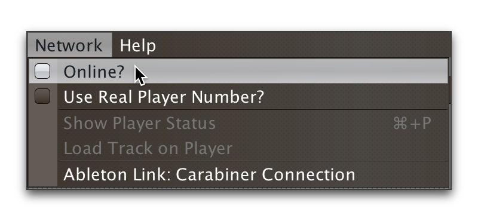

= Beat Link Trigger User Guide
James Elliott <james@deepsymmetry.org>
:icons: font
:experimental:

// Set up support for relative links on GitHub, and give it
// usable icons for admonitions, w00t! Add more conditions
// if you need to support other environments and extensions.
ifdef::env-github[]
:outfilesuffix: .adoc
:tip-caption: :bulb:
:note-caption: :information_source:
:important-caption: :heavy_exclamation_mark:
:caution-caption: :fire:
:warning-caption: :warning:
endif::[]

This is an introduction to the Beat Link Trigger interface and
expression programming environment. It shows some ways you can use it,
but as an open-ended environment, the possibilities are endless. If you
have questions or other approaches you'd like to share, please post to
the https://gitter.im/brunchboy/beat-link-trigger[Gitter chat room].

[NOTE]
====
This covers version 0.4.0, currently in preview release.
If you are using version 0.3.8, please refer to the
<<READKE#beat-link-trigger-user-guide,original User Guide>>.
====

To keep page sizes manageable, this information is split into several
pages. This page discusses <<startup,startup>> and describes and
links to the other sections of the user guide. It is worth
reading through this whole page once if you are new to Beat Link Trigger.
Once you know what you are looking for, you can also dive right into it by
jumping to the page you want:

****

[horizontal]
 <<Triggers#triggers,Triggers>>::
Triggers allow you to watch for a specific kind of activity on one or
more CDJs, and generate events like MIDI notes or OSC messages in
response, or synchronize external systems using MIDI clock or Ableton
Link.

<<Expressons#expressions,Expressions>>::
Allow you to customize and extend Beat Link Trigger by writing code in
Clojure, the language used to implement the program itself.

****

== Startup

When you first open Beat Link Trigger, it tries to find the Pro DJ
Link devices that you want it to monitor. If it can't find any, after
ten seconds you will see this window:

image:assets/NoDevices.png[No devices found]

If you were expecting to find devices, double-check that they are
powered on, and properly networked with your computer (and that any
hub or wireless router you are using is also properly turned on and
configured). Then click kbd:[Try Again] to try again.

If you just wanted to work on setting up your triggers or expressions,
and don't have any actual players handy, you can also click
kbd:[Continue Offline] to work in an offline mode. Your triggers won't
actually fire, but you can do all the configuration and editing that
you need.

Once a device is found, or you choose to continue offline, the Trigger
window opens, in the same configuration that you left it the last time
you used the program.

=== Connecting Later

If you connect to a DJ Link network after a period of working on your
triggers in offline mode, you can take Beat Link Trigger online by
checking `Online?` in the `Network` menu:

You can also go offline at any time by unchecking the menu option.

== Reading More

****

* Continue to <<Triggers#triggers,Triggers>>

****

// Once Git finally supports it, change this to: include::Footer.adoc[]
== License

++++++
Copyright © 2016&ndash;2018 http://deepsymmetry.org[Deep Symmetry, LLC]

Distributed under the
http://opensource.org/licenses/eclipse-1.0.php[Eclipse Public License
1.0], the same as Clojure. By using this software in any fashion, you
are agreeing to be bound by the terms of this license. You must not
remove this notice, or any other, from this software. A copy of the
license can be found in
https://github.com/brunchboy/beat-link-trigger/blob/master/LICENSE[LICENSE]
within this project.
